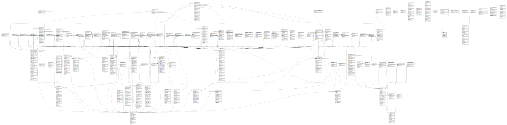

# db

## Tables

| Name | Columns | Comment | Type |
| ---- | ------- | ------- | ---- |
| [assets](assets.md) | 29 |  | BASE TABLE |
| [asset_downloads](asset_downloads.md) | 11 |  | BASE TABLE |
| [audit_log](audit_log.md) | 10 |  | BASE TABLE |
| [bundle_grapesjsbuilder](bundle_grapesjsbuilder.md) | 3 |  | BASE TABLE |
| [cache_items](cache_items.md) | 4 |  | BASE TABLE |
| [campaigns](campaigns.md) | 18 |  | BASE TABLE |
| [campaign_events](campaign_events.md) | 21 |  | BASE TABLE |
| [campaign_form_xref](campaign_form_xref.md) | 2 |  | BASE TABLE |
| [campaign_leadlist_xref](campaign_leadlist_xref.md) | 2 |  | BASE TABLE |
| [campaign_leads](campaign_leads.md) | 7 |  | BASE TABLE |
| [campaign_lead_event_failed_log](campaign_lead_event_failed_log.md) | 3 |  | BASE TABLE |
| [campaign_lead_event_log](campaign_lead_event_log.md) | 14 |  | BASE TABLE |
| [categories](categories.md) | 16 |  | BASE TABLE |
| [channel_url_trackables](channel_url_trackables.md) | 5 |  | BASE TABLE |
| [companies](companies.md) | 29 |  | BASE TABLE |
| [companies_leads](companies_leads.md) | 4 |  | BASE TABLE |
| [contact_merge_records](contact_merge_records.md) | 5 |  | BASE TABLE |
| [dynamic_content](dynamic_content.md) | 27 |  | BASE TABLE |
| [dynamic_content_lead_data](dynamic_content_lead_data.md) | 5 |  | BASE TABLE |
| [dynamic_content_stats](dynamic_content_stats.md) | 10 |  | BASE TABLE |
| [emails](emails.md) | 43 |  | BASE TABLE |
| [email_assets_xref](email_assets_xref.md) | 2 |  | BASE TABLE |
| [email_copies](email_copies.md) | 4 |  | BASE TABLE |
| [email_list_xref](email_list_xref.md) | 2 |  | BASE TABLE |
| [email_stats](email_stats.md) | 21 |  | BASE TABLE |
| [email_stats_devices](email_stats_devices.md) | 5 |  | BASE TABLE |
| [email_stat_replies](email_stat_replies.md) | 4 |  | BASE TABLE |
| [focus](focus.md) | 26 |  | BASE TABLE |
| [focus_stats](focus_stats.md) | 6 |  | BASE TABLE |
| [forms](forms.md) | 27 |  | BASE TABLE |
| [form_actions](form_actions.md) | 7 |  | BASE TABLE |
| [form_fields](form_fields.md) | 24 |  | BASE TABLE |
| [form_submissions](form_submissions.md) | 8 |  | BASE TABLE |
| [hello_world](hello_world.md) | 3 |  | BASE TABLE |
| [imports](imports.md) | 24 |  | BASE TABLE |
| [integration_entity](integration_entity.md) | 9 |  | BASE TABLE |
| [ip_addresses](ip_addresses.md) | 3 |  | BASE TABLE |
| [leads](leads.md) | 45 |  | BASE TABLE |
| [lead_categories](lead_categories.md) | 6 |  | BASE TABLE |
| [lead_companies_change_log](lead_companies_change_log.md) | 7 |  | BASE TABLE |
| [lead_devices](lead_devices.md) | 12 |  | BASE TABLE |
| [lead_donotcontact](lead_donotcontact.md) | 7 |  | BASE TABLE |
| [lead_event_log](lead_event_log.md) | 10 |  | BASE TABLE |
| [lead_fields](lead_fields.md) | 28 |  | BASE TABLE |
| [lead_frequencyrules](lead_frequencyrules.md) | 9 |  | BASE TABLE |
| [lead_ips_xref](lead_ips_xref.md) | 2 |  | BASE TABLE |
| [lead_lists](lead_lists.md) | 19 |  | BASE TABLE |
| [lead_lists_leads](lead_lists_leads.md) | 5 |  | BASE TABLE |
| [lead_notes](lead_notes.md) | 15 |  | BASE TABLE |
| [lead_points_change_log](lead_points_change_log.md) | 8 |  | BASE TABLE |
| [lead_stages_change_log](lead_stages_change_log.md) | 6 |  | BASE TABLE |
| [lead_tags](lead_tags.md) | 2 |  | BASE TABLE |
| [lead_tags_xref](lead_tags_xref.md) | 2 |  | BASE TABLE |
| [lead_utmtags](lead_utmtags.md) | 13 |  | BASE TABLE |
| [messages](messages.md) | 16 |  | BASE TABLE |
| [message_channels](message_channels.md) | 6 |  | BASE TABLE |
| [message_queue](message_queue.md) | 15 |  | BASE TABLE |
| [migrations](migrations.md) | 2 |  | BASE TABLE |
| [monitoring](monitoring.md) | 21 |  | BASE TABLE |
| [monitoring_leads](monitoring_leads.md) | 3 |  | BASE TABLE |
| [monitor_post_count](monitor_post_count.md) | 4 |  | BASE TABLE |
| [notifications](notifications.md) | 8 |  | BASE TABLE |
| [oauth2_accesstokens](oauth2_accesstokens.md) | 6 |  | BASE TABLE |
| [oauth2_authcodes](oauth2_authcodes.md) | 7 |  | BASE TABLE |
| [oauth2_clients](oauth2_clients.md) | 7 |  | BASE TABLE |
| [oauth2_refreshtokens](oauth2_refreshtokens.md) | 6 |  | BASE TABLE |
| [oauth2_user_client_xref](oauth2_user_client_xref.md) | 2 |  | BASE TABLE |
| [pages](pages.md) | 33 |  | BASE TABLE |
| [page_hits](page_hits.md) | 26 |  | BASE TABLE |
| [page_redirects](page_redirects.md) | 15 |  | BASE TABLE |
| [permissions](permissions.md) | 5 |  | BASE TABLE |
| [plugins](plugins.md) | 7 |  | BASE TABLE |
| [plugin_citrix_events](plugin_citrix_events.md) | 8 |  | BASE TABLE |
| [plugin_crm_pipedrive_owners](plugin_crm_pipedrive_owners.md) | 3 |  | BASE TABLE |
| [plugin_integration_settings](plugin_integration_settings.md) | 7 |  | BASE TABLE |
| [points](points.md) | 20 |  | BASE TABLE |
| [point_lead_action_log](point_lead_action_log.md) | 4 |  | BASE TABLE |
| [point_lead_event_log](point_lead_event_log.md) | 4 |  | BASE TABLE |
| [point_triggers](point_triggers.md) | 19 |  | BASE TABLE |
| [point_trigger_events](point_trigger_events.md) | 7 |  | BASE TABLE |
| [push_ids](push_ids.md) | 5 |  | BASE TABLE |
| [push_notifications](push_notifications.md) | 27 |  | BASE TABLE |
| [push_notification_list_xref](push_notification_list_xref.md) | 2 |  | BASE TABLE |
| [push_notification_stats](push_notification_stats.md) | 17 |  | BASE TABLE |
| [reports](reports.md) | 27 |  | BASE TABLE |
| [reports_schedulers](reports_schedulers.md) | 3 |  | BASE TABLE |
| [roles](roles.md) | 15 |  | BASE TABLE |
| [saml_id_entry](saml_id_entry.md) | 3 |  | BASE TABLE |
| [sms_messages](sms_messages.md) | 20 |  | BASE TABLE |
| [sms_message_list_xref](sms_message_list_xref.md) | 2 |  | BASE TABLE |
| [sms_message_stats](sms_message_stats.md) | 12 |  | BASE TABLE |
| [stages](stages.md) | 17 |  | BASE TABLE |
| [stage_lead_action_log](stage_lead_action_log.md) | 4 |  | BASE TABLE |
| [sync_object_field_change_report](sync_object_field_change_report.md) | 8 |  | BASE TABLE |
| [sync_object_mapping](sync_object_mapping.md) | 11 |  | BASE TABLE |
| [tweets](tweets.md) | 23 |  | BASE TABLE |
| [tweet_stats](tweet_stats.md) | 13 |  | BASE TABLE |
| [users](users.md) | 24 |  | BASE TABLE |
| [user_tokens](user_tokens.md) | 6 |  | BASE TABLE |
| [video_hits](video_hits.md) | 23 |  | BASE TABLE |
| [webhooks](webhooks.md) | 17 |  | BASE TABLE |
| [webhook_events](webhook_events.md) | 3 |  | BASE TABLE |
| [webhook_logs](webhook_logs.md) | 6 |  | BASE TABLE |
| [webhook_queue](webhook_queue.md) | 5 |  | BASE TABLE |
| [widgets](widgets.md) | 18 |  | BASE TABLE |

## Relations

---

> Generated by [tbls](https://github.com/k1LoW/tbls)
