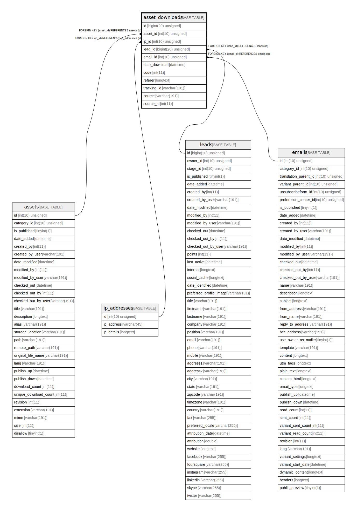

# asset_downloads

## Description

<details>
<summary><strong>Table Definition</strong></summary>

```sql
CREATE TABLE `asset_downloads` (
  `id` bigint(20) unsigned NOT NULL AUTO_INCREMENT,
  `asset_id` int(10) unsigned DEFAULT NULL,
  `ip_id` int(10) unsigned NOT NULL,
  `lead_id` bigint(20) unsigned DEFAULT NULL,
  `email_id` int(10) unsigned DEFAULT NULL,
  `date_download` datetime NOT NULL,
  `code` int(11) NOT NULL,
  `referer` longtext COLLATE utf8mb4_unicode_ci DEFAULT NULL,
  `tracking_id` varchar(191) COLLATE utf8mb4_unicode_ci NOT NULL,
  `source` varchar(191) COLLATE utf8mb4_unicode_ci DEFAULT NULL,
  `source_id` int(11) DEFAULT NULL,
  PRIMARY KEY (`id`),
  KEY `IDX_A6494C8F5DA1941` (`asset_id`),
  KEY `IDX_A6494C8FA03F5E9F` (`ip_id`),
  KEY `IDX_A6494C8F55458D` (`lead_id`),
  KEY `IDX_A6494C8FA832C1C9` (`email_id`),
  KEY `download_tracking_search` (`tracking_id`),
  KEY `download_source_search` (`source`,`source_id`),
  KEY `asset_date_download` (`date_download`),
  CONSTRAINT `FK_A6494C8F55458D` FOREIGN KEY (`lead_id`) REFERENCES `leads` (`id`) ON DELETE SET NULL,
  CONSTRAINT `FK_A6494C8F5DA1941` FOREIGN KEY (`asset_id`) REFERENCES `assets` (`id`) ON DELETE CASCADE,
  CONSTRAINT `FK_A6494C8FA03F5E9F` FOREIGN KEY (`ip_id`) REFERENCES `ip_addresses` (`id`),
  CONSTRAINT `FK_A6494C8FA832C1C9` FOREIGN KEY (`email_id`) REFERENCES `emails` (`id`) ON DELETE SET NULL
) ENGINE=InnoDB DEFAULT CHARSET=utf8mb4 COLLATE=utf8mb4_unicode_ci ROW_FORMAT=DYNAMIC
```

</details>

## Columns

| Name | Type | Default | Nullable | Extra Definition | Children | Parents | Comment |
| ---- | ---- | ------- | -------- | --------------- | -------- | ------- | ------- |
| id | bigint(20) unsigned |  | false | auto_increment |  |  |  |
| asset_id | int(10) unsigned | NULL | true |  |  | [assets](assets.md) |  |
| ip_id | int(10) unsigned |  | false |  |  | [ip_addresses](ip_addresses.md) |  |
| lead_id | bigint(20) unsigned | NULL | true |  |  | [leads](leads.md) |  |
| email_id | int(10) unsigned | NULL | true |  |  | [emails](emails.md) |  |
| date_download | datetime |  | false |  |  |  |  |
| code | int(11) |  | false |  |  |  |  |
| referer | longtext | NULL | true |  |  |  |  |
| tracking_id | varchar(191) |  | false |  |  |  |  |
| source | varchar(191) | NULL | true |  |  |  |  |
| source_id | int(11) | NULL | true |  |  |  |  |

## Constraints

| Name | Type | Definition |
| ---- | ---- | ---------- |
| FK_A6494C8F55458D | FOREIGN KEY | FOREIGN KEY (lead_id) REFERENCES leads (id) |
| FK_A6494C8F5DA1941 | FOREIGN KEY | FOREIGN KEY (asset_id) REFERENCES assets (id) |
| FK_A6494C8FA03F5E9F | FOREIGN KEY | FOREIGN KEY (ip_id) REFERENCES ip_addresses (id) |
| FK_A6494C8FA832C1C9 | FOREIGN KEY | FOREIGN KEY (email_id) REFERENCES emails (id) |
| PRIMARY | PRIMARY KEY | PRIMARY KEY (id) |

## Indexes

| Name | Definition |
| ---- | ---------- |
| asset_date_download | KEY asset_date_download (date_download) USING BTREE |
| download_source_search | KEY download_source_search (source, source_id) USING BTREE |
| download_tracking_search | KEY download_tracking_search (tracking_id) USING BTREE |
| IDX_A6494C8F55458D | KEY IDX_A6494C8F55458D (lead_id) USING BTREE |
| IDX_A6494C8F5DA1941 | KEY IDX_A6494C8F5DA1941 (asset_id) USING BTREE |
| IDX_A6494C8FA03F5E9F | KEY IDX_A6494C8FA03F5E9F (ip_id) USING BTREE |
| IDX_A6494C8FA832C1C9 | KEY IDX_A6494C8FA832C1C9 (email_id) USING BTREE |
| PRIMARY | PRIMARY KEY (id) USING BTREE |

## Relations



---

> Generated by [tbls](https://github.com/k1LoW/tbls)
