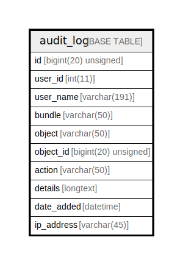

# audit_log

## Description

<details>
<summary><strong>Table Definition</strong></summary>

```sql
CREATE TABLE `audit_log` (
  `id` bigint(20) unsigned NOT NULL AUTO_INCREMENT,
  `user_id` int(11) NOT NULL,
  `user_name` varchar(191) COLLATE utf8mb4_unicode_ci NOT NULL,
  `bundle` varchar(50) COLLATE utf8mb4_unicode_ci NOT NULL,
  `object` varchar(50) COLLATE utf8mb4_unicode_ci NOT NULL,
  `object_id` bigint(20) unsigned NOT NULL,
  `action` varchar(50) COLLATE utf8mb4_unicode_ci NOT NULL,
  `details` longtext COLLATE utf8mb4_unicode_ci DEFAULT NULL COMMENT '(DC2Type:array)',
  `date_added` datetime NOT NULL,
  `ip_address` varchar(45) COLLATE utf8mb4_unicode_ci NOT NULL,
  PRIMARY KEY (`id`),
  KEY `object_search` (`object`,`object_id`),
  KEY `timeline_search` (`bundle`,`object`,`action`,`object_id`),
  KEY `date_added_index` (`date_added`)
) ENGINE=InnoDB AUTO_INCREMENT=[Redacted by tbls] DEFAULT CHARSET=utf8mb4 COLLATE=utf8mb4_unicode_ci ROW_FORMAT=DYNAMIC
```

</details>

## Columns

| Name | Type | Default | Nullable | Extra Definition | Children | Parents | Comment |
| ---- | ---- | ------- | -------- | --------------- | -------- | ------- | ------- |
| id | bigint(20) unsigned |  | false | auto_increment |  |  |  |
| user_id | int(11) |  | false |  |  |  |  |
| user_name | varchar(191) |  | false |  |  |  |  |
| bundle | varchar(50) |  | false |  |  |  |  |
| object | varchar(50) |  | false |  |  |  |  |
| object_id | bigint(20) unsigned |  | false |  |  |  |  |
| action | varchar(50) |  | false |  |  |  |  |
| details | longtext | NULL | true |  |  |  | (DC2Type:array) |
| date_added | datetime |  | false |  |  |  |  |
| ip_address | varchar(45) |  | false |  |  |  |  |

## Constraints

| Name | Type | Definition |
| ---- | ---- | ---------- |
| PRIMARY | PRIMARY KEY | PRIMARY KEY (id) |

## Indexes

| Name | Definition |
| ---- | ---------- |
| date_added_index | KEY date_added_index (date_added) USING BTREE |
| object_search | KEY object_search (object, object_id) USING BTREE |
| timeline_search | KEY timeline_search (bundle, object, action, object_id) USING BTREE |
| PRIMARY | PRIMARY KEY (id) USING BTREE |

## Relations



---

> Generated by [tbls](https://github.com/k1LoW/tbls)
