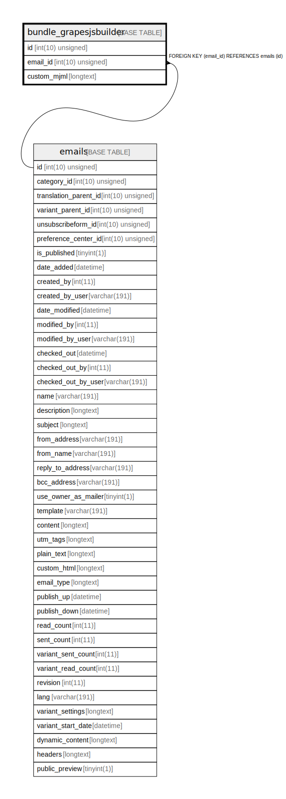

# bundle_grapesjsbuilder

## Description

<details>
<summary><strong>Table Definition</strong></summary>

```sql
CREATE TABLE `bundle_grapesjsbuilder` (
  `id` int(10) unsigned NOT NULL AUTO_INCREMENT,
  `email_id` int(10) unsigned DEFAULT NULL,
  `custom_mjml` longtext COLLATE utf8mb4_unicode_ci DEFAULT NULL,
  PRIMARY KEY (`id`),
  KEY `IDX_56A1EB07A832C1C9` (`email_id`),
  CONSTRAINT `FK_56A1EB07A832C1C9` FOREIGN KEY (`email_id`) REFERENCES `emails` (`id`) ON DELETE CASCADE
) ENGINE=InnoDB DEFAULT CHARSET=utf8mb4 COLLATE=utf8mb4_unicode_ci ROW_FORMAT=DYNAMIC
```

</details>

## Columns

| Name | Type | Default | Nullable | Extra Definition | Children | Parents | Comment |
| ---- | ---- | ------- | -------- | --------------- | -------- | ------- | ------- |
| id | int(10) unsigned |  | false | auto_increment |  |  |  |
| email_id | int(10) unsigned | NULL | true |  |  | [emails](emails.md) |  |
| custom_mjml | longtext | NULL | true |  |  |  |  |

## Constraints

| Name | Type | Definition |
| ---- | ---- | ---------- |
| FK_56A1EB07A832C1C9 | FOREIGN KEY | FOREIGN KEY (email_id) REFERENCES emails (id) |
| PRIMARY | PRIMARY KEY | PRIMARY KEY (id) |

## Indexes

| Name | Definition |
| ---- | ---------- |
| IDX_56A1EB07A832C1C9 | KEY IDX_56A1EB07A832C1C9 (email_id) USING BTREE |
| PRIMARY | PRIMARY KEY (id) USING BTREE |

## Relations



---

> Generated by [tbls](https://github.com/k1LoW/tbls)
