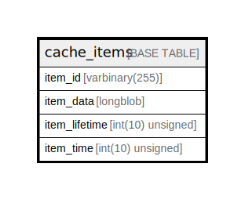

# cache_items

## Description

<details>
<summary><strong>Table Definition</strong></summary>

```sql
CREATE TABLE `cache_items` (
  `item_id` varbinary(255) NOT NULL,
  `item_data` longblob NOT NULL,
  `item_lifetime` int(10) unsigned DEFAULT NULL,
  `item_time` int(10) unsigned NOT NULL,
  PRIMARY KEY (`item_id`)
) ENGINE=InnoDB DEFAULT CHARSET=utf8mb4 COLLATE=utf8mb4_unicode_ci ROW_FORMAT=DYNAMIC
```

</details>

## Columns

| Name | Type | Default | Nullable | Children | Parents | Comment |
| ---- | ---- | ------- | -------- | -------- | ------- | ------- |
| item_id | varbinary(255) |  | false |  |  |  |
| item_data | longblob |  | false |  |  |  |
| item_lifetime | int(10) unsigned | NULL | true |  |  |  |
| item_time | int(10) unsigned |  | false |  |  |  |

## Constraints

| Name | Type | Definition |
| ---- | ---- | ---------- |
| PRIMARY | PRIMARY KEY | PRIMARY KEY (item_id) |

## Indexes

| Name | Definition |
| ---- | ---------- |
| PRIMARY | PRIMARY KEY (item_id) USING BTREE |

## Relations



---

> Generated by [tbls](https://github.com/k1LoW/tbls)
