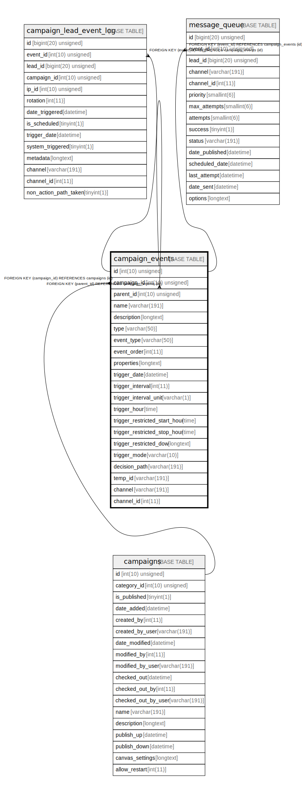

# campaign_events

## Description

<details>
<summary><strong>Table Definition</strong></summary>

```sql
CREATE TABLE `campaign_events` (
  `id` int(10) unsigned NOT NULL AUTO_INCREMENT,
  `campaign_id` int(10) unsigned NOT NULL,
  `parent_id` int(10) unsigned DEFAULT NULL,
  `name` varchar(191) COLLATE utf8mb4_unicode_ci NOT NULL,
  `description` longtext COLLATE utf8mb4_unicode_ci DEFAULT NULL,
  `type` varchar(50) COLLATE utf8mb4_unicode_ci NOT NULL,
  `event_type` varchar(50) COLLATE utf8mb4_unicode_ci NOT NULL,
  `event_order` int(11) NOT NULL,
  `properties` longtext COLLATE utf8mb4_unicode_ci NOT NULL COMMENT '(DC2Type:array)',
  `trigger_date` datetime DEFAULT NULL,
  `trigger_interval` int(11) DEFAULT NULL,
  `trigger_interval_unit` varchar(1) COLLATE utf8mb4_unicode_ci DEFAULT NULL,
  `trigger_hour` time DEFAULT NULL,
  `trigger_restricted_start_hour` time DEFAULT NULL,
  `trigger_restricted_stop_hour` time DEFAULT NULL,
  `trigger_restricted_dow` longtext COLLATE utf8mb4_unicode_ci DEFAULT NULL COMMENT '(DC2Type:array)',
  `trigger_mode` varchar(10) COLLATE utf8mb4_unicode_ci DEFAULT NULL,
  `decision_path` varchar(191) COLLATE utf8mb4_unicode_ci DEFAULT NULL,
  `temp_id` varchar(191) COLLATE utf8mb4_unicode_ci DEFAULT NULL,
  `channel` varchar(191) COLLATE utf8mb4_unicode_ci DEFAULT NULL,
  `channel_id` int(11) DEFAULT NULL,
  PRIMARY KEY (`id`),
  KEY `IDX_8EC42EE7F639F774` (`campaign_id`),
  KEY `IDX_8EC42EE7727ACA70` (`parent_id`),
  KEY `campaign_event_search` (`type`,`event_type`),
  KEY `campaign_event_type` (`event_type`),
  KEY `campaign_event_channel` (`channel`,`channel_id`),
  CONSTRAINT `FK_8EC42EE7727ACA70` FOREIGN KEY (`parent_id`) REFERENCES `campaign_events` (`id`),
  CONSTRAINT `FK_8EC42EE7F639F774` FOREIGN KEY (`campaign_id`) REFERENCES `campaigns` (`id`) ON DELETE CASCADE
) ENGINE=InnoDB DEFAULT CHARSET=utf8mb4 COLLATE=utf8mb4_unicode_ci ROW_FORMAT=DYNAMIC
```

</details>

## Columns

| Name | Type | Default | Nullable | Extra Definition | Children | Parents | Comment |
| ---- | ---- | ------- | -------- | --------------- | -------- | ------- | ------- |
| id | int(10) unsigned |  | false | auto_increment | [campaign_events](campaign_events.md) [campaign_lead_event_log](campaign_lead_event_log.md) [message_queue](message_queue.md) |  |  |
| campaign_id | int(10) unsigned |  | false |  |  | [campaigns](campaigns.md) |  |
| parent_id | int(10) unsigned | NULL | true |  |  | [campaign_events](campaign_events.md) |  |
| name | varchar(191) |  | false |  |  |  |  |
| description | longtext | NULL | true |  |  |  |  |
| type | varchar(50) |  | false |  |  |  |  |
| event_type | varchar(50) |  | false |  |  |  |  |
| event_order | int(11) |  | false |  |  |  |  |
| properties | longtext |  | false |  |  |  | (DC2Type:array) |
| trigger_date | datetime | NULL | true |  |  |  |  |
| trigger_interval | int(11) | NULL | true |  |  |  |  |
| trigger_interval_unit | varchar(1) | NULL | true |  |  |  |  |
| trigger_hour | time | NULL | true |  |  |  |  |
| trigger_restricted_start_hour | time | NULL | true |  |  |  |  |
| trigger_restricted_stop_hour | time | NULL | true |  |  |  |  |
| trigger_restricted_dow | longtext | NULL | true |  |  |  | (DC2Type:array) |
| trigger_mode | varchar(10) | NULL | true |  |  |  |  |
| decision_path | varchar(191) | NULL | true |  |  |  |  |
| temp_id | varchar(191) | NULL | true |  |  |  |  |
| channel | varchar(191) | NULL | true |  |  |  |  |
| channel_id | int(11) | NULL | true |  |  |  |  |

## Constraints

| Name | Type | Definition |
| ---- | ---- | ---------- |
| FK_8EC42EE7727ACA70 | FOREIGN KEY | FOREIGN KEY (parent_id) REFERENCES campaign_events (id) |
| FK_8EC42EE7F639F774 | FOREIGN KEY | FOREIGN KEY (campaign_id) REFERENCES campaigns (id) |
| PRIMARY | PRIMARY KEY | PRIMARY KEY (id) |

## Indexes

| Name | Definition |
| ---- | ---------- |
| campaign_event_channel | KEY campaign_event_channel (channel, channel_id) USING BTREE |
| campaign_event_search | KEY campaign_event_search (type, event_type) USING BTREE |
| campaign_event_type | KEY campaign_event_type (event_type) USING BTREE |
| IDX_8EC42EE7727ACA70 | KEY IDX_8EC42EE7727ACA70 (parent_id) USING BTREE |
| IDX_8EC42EE7F639F774 | KEY IDX_8EC42EE7F639F774 (campaign_id) USING BTREE |
| PRIMARY | PRIMARY KEY (id) USING BTREE |

## Relations



---

> Generated by [tbls](https://github.com/k1LoW/tbls)
