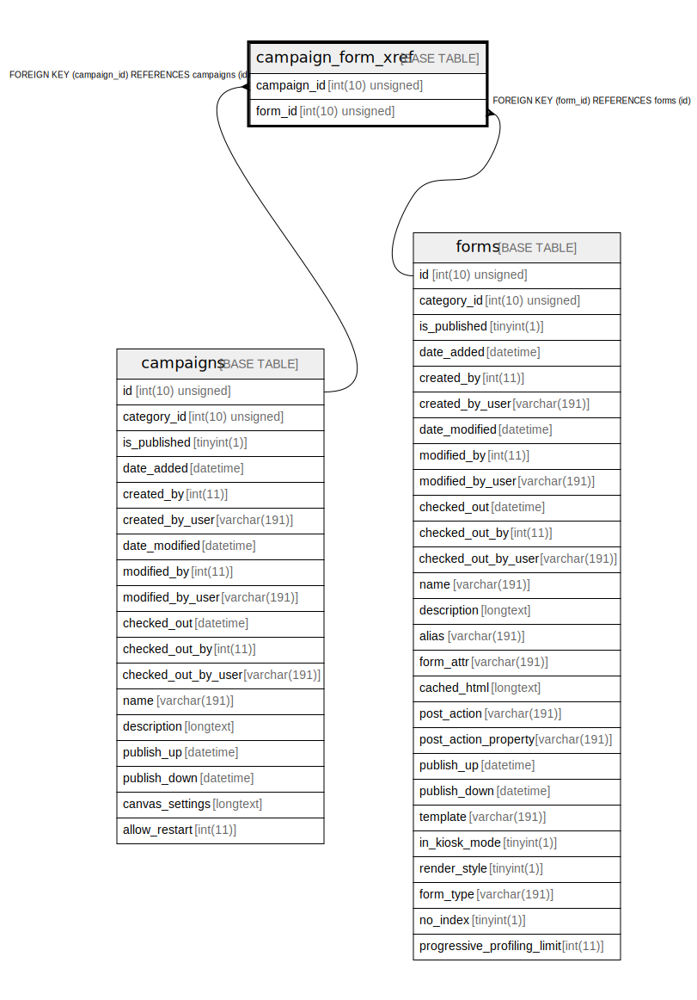

# campaign_form_xref

## Description

<details>
<summary><strong>Table Definition</strong></summary>

```sql
CREATE TABLE `campaign_form_xref` (
  `campaign_id` int(10) unsigned NOT NULL,
  `form_id` int(10) unsigned NOT NULL,
  PRIMARY KEY (`campaign_id`,`form_id`),
  KEY `IDX_3048A8B2F639F774` (`campaign_id`),
  KEY `IDX_3048A8B25FF69B7D` (`form_id`),
  CONSTRAINT `FK_3048A8B25FF69B7D` FOREIGN KEY (`form_id`) REFERENCES `forms` (`id`) ON DELETE CASCADE,
  CONSTRAINT `FK_3048A8B2F639F774` FOREIGN KEY (`campaign_id`) REFERENCES `campaigns` (`id`) ON DELETE CASCADE
) ENGINE=InnoDB DEFAULT CHARSET=utf8mb4 COLLATE=utf8mb4_unicode_ci ROW_FORMAT=DYNAMIC
```

</details>

## Columns

| Name | Type | Default | Nullable | Children | Parents | Comment |
| ---- | ---- | ------- | -------- | -------- | ------- | ------- |
| campaign_id | int(10) unsigned |  | false |  | [campaigns](campaigns.md) |  |
| form_id | int(10) unsigned |  | false |  | [forms](forms.md) |  |

## Constraints

| Name | Type | Definition |
| ---- | ---- | ---------- |
| FK_3048A8B25FF69B7D | FOREIGN KEY | FOREIGN KEY (form_id) REFERENCES forms (id) |
| FK_3048A8B2F639F774 | FOREIGN KEY | FOREIGN KEY (campaign_id) REFERENCES campaigns (id) |
| PRIMARY | PRIMARY KEY | PRIMARY KEY (campaign_id, form_id) |

## Indexes

| Name | Definition |
| ---- | ---------- |
| IDX_3048A8B25FF69B7D | KEY IDX_3048A8B25FF69B7D (form_id) USING BTREE |
| IDX_3048A8B2F639F774 | KEY IDX_3048A8B2F639F774 (campaign_id) USING BTREE |
| PRIMARY | PRIMARY KEY (campaign_id, form_id) USING BTREE |

## Relations



---

> Generated by [tbls](https://github.com/k1LoW/tbls)
