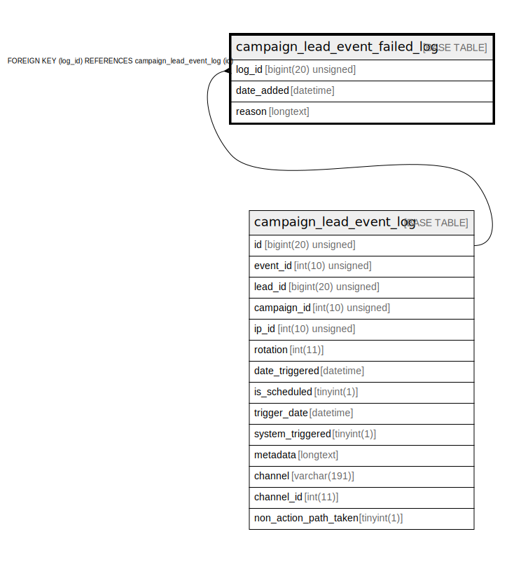

# campaign_lead_event_failed_log

## Description

<details>
<summary><strong>Table Definition</strong></summary>

```sql
CREATE TABLE `campaign_lead_event_failed_log` (
  `log_id` bigint(20) unsigned NOT NULL,
  `date_added` datetime NOT NULL,
  `reason` longtext COLLATE utf8mb4_unicode_ci DEFAULT NULL,
  PRIMARY KEY (`log_id`),
  KEY `campaign_event_failed_date` (`date_added`),
  CONSTRAINT `FK_E50614D2EA675D86` FOREIGN KEY (`log_id`) REFERENCES `campaign_lead_event_log` (`id`) ON DELETE CASCADE
) ENGINE=InnoDB DEFAULT CHARSET=utf8mb4 COLLATE=utf8mb4_unicode_ci ROW_FORMAT=DYNAMIC
```

</details>

## Columns

| Name | Type | Default | Nullable | Children | Parents | Comment |
| ---- | ---- | ------- | -------- | -------- | ------- | ------- |
| log_id | bigint(20) unsigned |  | false |  | [campaign_lead_event_log](campaign_lead_event_log.md) |  |
| date_added | datetime |  | false |  |  |  |
| reason | longtext | NULL | true |  |  |  |

## Constraints

| Name | Type | Definition |
| ---- | ---- | ---------- |
| FK_E50614D2EA675D86 | FOREIGN KEY | FOREIGN KEY (log_id) REFERENCES campaign_lead_event_log (id) |
| PRIMARY | PRIMARY KEY | PRIMARY KEY (log_id) |

## Indexes

| Name | Definition |
| ---- | ---------- |
| campaign_event_failed_date | KEY campaign_event_failed_date (date_added) USING BTREE |
| PRIMARY | PRIMARY KEY (log_id) USING BTREE |

## Relations



---

> Generated by [tbls](https://github.com/k1LoW/tbls)
