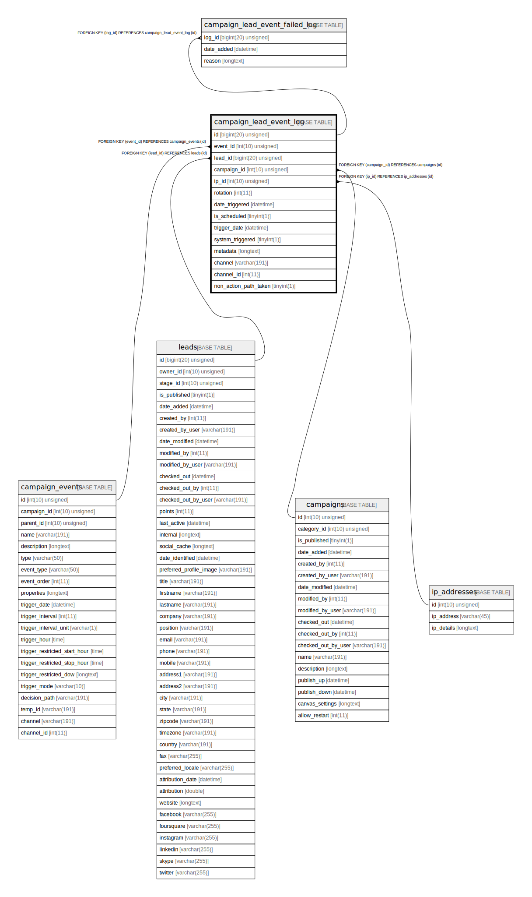

# campaign_lead_event_log

## Description

<details>
<summary><strong>Table Definition</strong></summary>

```sql
CREATE TABLE `campaign_lead_event_log` (
  `id` bigint(20) unsigned NOT NULL AUTO_INCREMENT,
  `event_id` int(10) unsigned NOT NULL,
  `lead_id` bigint(20) unsigned NOT NULL,
  `campaign_id` int(10) unsigned DEFAULT NULL,
  `ip_id` int(10) unsigned DEFAULT NULL,
  `rotation` int(11) NOT NULL,
  `date_triggered` datetime DEFAULT NULL,
  `is_scheduled` tinyint(1) NOT NULL,
  `trigger_date` datetime DEFAULT NULL,
  `system_triggered` tinyint(1) NOT NULL,
  `metadata` longtext COLLATE utf8mb4_unicode_ci DEFAULT NULL COMMENT '(DC2Type:array)',
  `channel` varchar(191) COLLATE utf8mb4_unicode_ci DEFAULT NULL,
  `channel_id` int(11) DEFAULT NULL,
  `non_action_path_taken` tinyint(1) DEFAULT NULL,
  PRIMARY KEY (`id`),
  UNIQUE KEY `campaign_rotation` (`event_id`,`lead_id`,`rotation`),
  KEY `IDX_B7420BA171F7E88B` (`event_id`),
  KEY `IDX_B7420BA155458D` (`lead_id`),
  KEY `IDX_B7420BA1F639F774` (`campaign_id`),
  KEY `IDX_B7420BA1A03F5E9F` (`ip_id`),
  KEY `campaign_event_upcoming_search` (`is_scheduled`,`lead_id`),
  KEY `campaign_event_schedule_counts` (`campaign_id`,`is_scheduled`,`trigger_date`),
  KEY `campaign_date_triggered` (`date_triggered`),
  KEY `campaign_leads` (`lead_id`,`campaign_id`,`rotation`),
  KEY `campaign_log_channel` (`channel`,`channel_id`,`lead_id`),
  KEY `campaign_actions` (`campaign_id`,`event_id`,`date_triggered`),
  KEY `campaign_stats` (`campaign_id`,`date_triggered`,`event_id`,`non_action_path_taken`),
  KEY `campaign_trigger_date_order` (`trigger_date`),
  CONSTRAINT `FK_B7420BA155458D` FOREIGN KEY (`lead_id`) REFERENCES `leads` (`id`) ON DELETE CASCADE,
  CONSTRAINT `FK_B7420BA171F7E88B` FOREIGN KEY (`event_id`) REFERENCES `campaign_events` (`id`) ON DELETE CASCADE,
  CONSTRAINT `FK_B7420BA1A03F5E9F` FOREIGN KEY (`ip_id`) REFERENCES `ip_addresses` (`id`),
  CONSTRAINT `FK_B7420BA1F639F774` FOREIGN KEY (`campaign_id`) REFERENCES `campaigns` (`id`)
) ENGINE=InnoDB DEFAULT CHARSET=utf8mb4 COLLATE=utf8mb4_unicode_ci ROW_FORMAT=DYNAMIC
```

</details>

## Columns

| Name | Type | Default | Nullable | Extra Definition | Children | Parents | Comment |
| ---- | ---- | ------- | -------- | --------------- | -------- | ------- | ------- |
| id | bigint(20) unsigned |  | false | auto_increment | [campaign_lead_event_failed_log](campaign_lead_event_failed_log.md) |  |  |
| event_id | int(10) unsigned |  | false |  |  | [campaign_events](campaign_events.md) |  |
| lead_id | bigint(20) unsigned |  | false |  |  | [leads](leads.md) |  |
| campaign_id | int(10) unsigned | NULL | true |  |  | [campaigns](campaigns.md) |  |
| ip_id | int(10) unsigned | NULL | true |  |  | [ip_addresses](ip_addresses.md) |  |
| rotation | int(11) |  | false |  |  |  |  |
| date_triggered | datetime | NULL | true |  |  |  |  |
| is_scheduled | tinyint(1) |  | false |  |  |  |  |
| trigger_date | datetime | NULL | true |  |  |  |  |
| system_triggered | tinyint(1) |  | false |  |  |  |  |
| metadata | longtext | NULL | true |  |  |  | (DC2Type:array) |
| channel | varchar(191) | NULL | true |  |  |  |  |
| channel_id | int(11) | NULL | true |  |  |  |  |
| non_action_path_taken | tinyint(1) | NULL | true |  |  |  |  |

## Constraints

| Name | Type | Definition |
| ---- | ---- | ---------- |
| campaign_rotation | UNIQUE | UNIQUE KEY campaign_rotation (event_id, lead_id, rotation) |
| FK_B7420BA155458D | FOREIGN KEY | FOREIGN KEY (lead_id) REFERENCES leads (id) |
| FK_B7420BA171F7E88B | FOREIGN KEY | FOREIGN KEY (event_id) REFERENCES campaign_events (id) |
| FK_B7420BA1A03F5E9F | FOREIGN KEY | FOREIGN KEY (ip_id) REFERENCES ip_addresses (id) |
| FK_B7420BA1F639F774 | FOREIGN KEY | FOREIGN KEY (campaign_id) REFERENCES campaigns (id) |
| PRIMARY | PRIMARY KEY | PRIMARY KEY (id) |

## Indexes

| Name | Definition |
| ---- | ---------- |
| campaign_actions | KEY campaign_actions (campaign_id, event_id, date_triggered) USING BTREE |
| campaign_date_triggered | KEY campaign_date_triggered (date_triggered) USING BTREE |
| campaign_event_schedule_counts | KEY campaign_event_schedule_counts (campaign_id, is_scheduled, trigger_date) USING BTREE |
| campaign_event_upcoming_search | KEY campaign_event_upcoming_search (is_scheduled, lead_id) USING BTREE |
| campaign_leads | KEY campaign_leads (lead_id, campaign_id, rotation) USING BTREE |
| campaign_log_channel | KEY campaign_log_channel (channel, channel_id, lead_id) USING BTREE |
| campaign_stats | KEY campaign_stats (campaign_id, date_triggered, event_id, non_action_path_taken) USING BTREE |
| campaign_trigger_date_order | KEY campaign_trigger_date_order (trigger_date) USING BTREE |
| IDX_B7420BA155458D | KEY IDX_B7420BA155458D (lead_id) USING BTREE |
| IDX_B7420BA171F7E88B | KEY IDX_B7420BA171F7E88B (event_id) USING BTREE |
| IDX_B7420BA1A03F5E9F | KEY IDX_B7420BA1A03F5E9F (ip_id) USING BTREE |
| IDX_B7420BA1F639F774 | KEY IDX_B7420BA1F639F774 (campaign_id) USING BTREE |
| PRIMARY | PRIMARY KEY (id) USING BTREE |
| campaign_rotation | UNIQUE KEY campaign_rotation (event_id, lead_id, rotation) USING BTREE |

## Relations



---

> Generated by [tbls](https://github.com/k1LoW/tbls)
