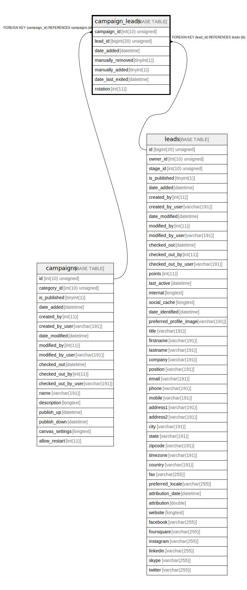

# campaign_leads

## Description

<details>
<summary><strong>Table Definition</strong></summary>

```sql
CREATE TABLE `campaign_leads` (
  `campaign_id` int(10) unsigned NOT NULL,
  `lead_id` bigint(20) unsigned NOT NULL,
  `date_added` datetime NOT NULL,
  `manually_removed` tinyint(1) NOT NULL,
  `manually_added` tinyint(1) NOT NULL,
  `date_last_exited` datetime DEFAULT NULL,
  `rotation` int(11) NOT NULL,
  PRIMARY KEY (`campaign_id`,`lead_id`),
  KEY `IDX_5995213DF639F774` (`campaign_id`),
  KEY `IDX_5995213D55458D` (`lead_id`),
  KEY `campaign_leads_date_added` (`date_added`),
  KEY `campaign_leads_date_exited` (`date_last_exited`),
  KEY `campaign_leads` (`campaign_id`,`manually_removed`,`lead_id`,`rotation`),
  CONSTRAINT `FK_5995213D55458D` FOREIGN KEY (`lead_id`) REFERENCES `leads` (`id`) ON DELETE CASCADE,
  CONSTRAINT `FK_5995213DF639F774` FOREIGN KEY (`campaign_id`) REFERENCES `campaigns` (`id`) ON DELETE CASCADE
) ENGINE=InnoDB DEFAULT CHARSET=utf8mb4 COLLATE=utf8mb4_unicode_ci ROW_FORMAT=DYNAMIC
```

</details>

## Columns

| Name | Type | Default | Nullable | Children | Parents | Comment |
| ---- | ---- | ------- | -------- | -------- | ------- | ------- |
| campaign_id | int(10) unsigned |  | false |  | [campaigns](campaigns.md) |  |
| lead_id | bigint(20) unsigned |  | false |  | [leads](leads.md) |  |
| date_added | datetime |  | false |  |  |  |
| manually_removed | tinyint(1) |  | false |  |  |  |
| manually_added | tinyint(1) |  | false |  |  |  |
| date_last_exited | datetime | NULL | true |  |  |  |
| rotation | int(11) |  | false |  |  |  |

## Constraints

| Name | Type | Definition |
| ---- | ---- | ---------- |
| FK_5995213D55458D | FOREIGN KEY | FOREIGN KEY (lead_id) REFERENCES leads (id) |
| FK_5995213DF639F774 | FOREIGN KEY | FOREIGN KEY (campaign_id) REFERENCES campaigns (id) |
| PRIMARY | PRIMARY KEY | PRIMARY KEY (campaign_id, lead_id) |

## Indexes

| Name | Definition |
| ---- | ---------- |
| campaign_leads | KEY campaign_leads (campaign_id, manually_removed, lead_id, rotation) USING BTREE |
| campaign_leads_date_added | KEY campaign_leads_date_added (date_added) USING BTREE |
| campaign_leads_date_exited | KEY campaign_leads_date_exited (date_last_exited) USING BTREE |
| IDX_5995213D55458D | KEY IDX_5995213D55458D (lead_id) USING BTREE |
| IDX_5995213DF639F774 | KEY IDX_5995213DF639F774 (campaign_id) USING BTREE |
| PRIMARY | PRIMARY KEY (campaign_id, lead_id) USING BTREE |

## Relations



---

> Generated by [tbls](https://github.com/k1LoW/tbls)
