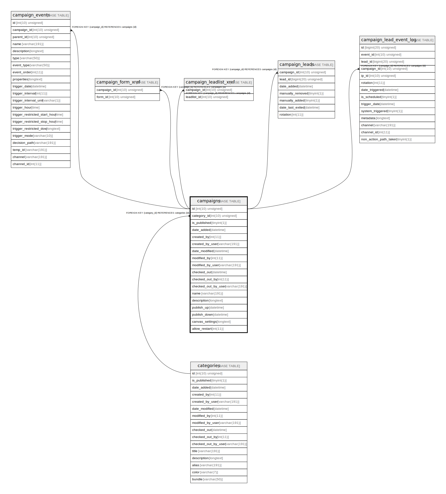

# campaigns

## Description

<details>
<summary><strong>Table Definition</strong></summary>

```sql
CREATE TABLE `campaigns` (
  `id` int(10) unsigned NOT NULL AUTO_INCREMENT,
  `category_id` int(10) unsigned DEFAULT NULL,
  `is_published` tinyint(1) NOT NULL,
  `date_added` datetime DEFAULT NULL,
  `created_by` int(11) DEFAULT NULL,
  `created_by_user` varchar(191) COLLATE utf8mb4_unicode_ci DEFAULT NULL,
  `date_modified` datetime DEFAULT NULL,
  `modified_by` int(11) DEFAULT NULL,
  `modified_by_user` varchar(191) COLLATE utf8mb4_unicode_ci DEFAULT NULL,
  `checked_out` datetime DEFAULT NULL,
  `checked_out_by` int(11) DEFAULT NULL,
  `checked_out_by_user` varchar(191) COLLATE utf8mb4_unicode_ci DEFAULT NULL,
  `name` varchar(191) COLLATE utf8mb4_unicode_ci NOT NULL,
  `description` longtext COLLATE utf8mb4_unicode_ci DEFAULT NULL,
  `publish_up` datetime DEFAULT NULL,
  `publish_down` datetime DEFAULT NULL,
  `canvas_settings` longtext COLLATE utf8mb4_unicode_ci DEFAULT NULL COMMENT '(DC2Type:array)',
  `allow_restart` int(11) NOT NULL,
  PRIMARY KEY (`id`),
  KEY `IDX_E373747012469DE2` (`category_id`),
  CONSTRAINT `FK_E373747012469DE2` FOREIGN KEY (`category_id`) REFERENCES `categories` (`id`) ON DELETE SET NULL
) ENGINE=InnoDB DEFAULT CHARSET=utf8mb4 COLLATE=utf8mb4_unicode_ci ROW_FORMAT=DYNAMIC
```

</details>

## Columns

| Name | Type | Default | Nullable | Extra Definition | Children | Parents | Comment |
| ---- | ---- | ------- | -------- | --------------- | -------- | ------- | ------- |
| id | int(10) unsigned |  | false | auto_increment | [campaign_events](campaign_events.md) [campaign_form_xref](campaign_form_xref.md) [campaign_leadlist_xref](campaign_leadlist_xref.md) [campaign_leads](campaign_leads.md) [campaign_lead_event_log](campaign_lead_event_log.md) |  |  |
| category_id | int(10) unsigned | NULL | true |  |  | [categories](categories.md) |  |
| is_published | tinyint(1) |  | false |  |  |  |  |
| date_added | datetime | NULL | true |  |  |  |  |
| created_by | int(11) | NULL | true |  |  |  |  |
| created_by_user | varchar(191) | NULL | true |  |  |  |  |
| date_modified | datetime | NULL | true |  |  |  |  |
| modified_by | int(11) | NULL | true |  |  |  |  |
| modified_by_user | varchar(191) | NULL | true |  |  |  |  |
| checked_out | datetime | NULL | true |  |  |  |  |
| checked_out_by | int(11) | NULL | true |  |  |  |  |
| checked_out_by_user | varchar(191) | NULL | true |  |  |  |  |
| name | varchar(191) |  | false |  |  |  |  |
| description | longtext | NULL | true |  |  |  |  |
| publish_up | datetime | NULL | true |  |  |  |  |
| publish_down | datetime | NULL | true |  |  |  |  |
| canvas_settings | longtext | NULL | true |  |  |  | (DC2Type:array) |
| allow_restart | int(11) |  | false |  |  |  |  |

## Constraints

| Name | Type | Definition |
| ---- | ---- | ---------- |
| FK_E373747012469DE2 | FOREIGN KEY | FOREIGN KEY (category_id) REFERENCES categories (id) |
| PRIMARY | PRIMARY KEY | PRIMARY KEY (id) |

## Indexes

| Name | Definition |
| ---- | ---------- |
| IDX_E373747012469DE2 | KEY IDX_E373747012469DE2 (category_id) USING BTREE |
| PRIMARY | PRIMARY KEY (id) USING BTREE |

## Relations



---

> Generated by [tbls](https://github.com/k1LoW/tbls)
