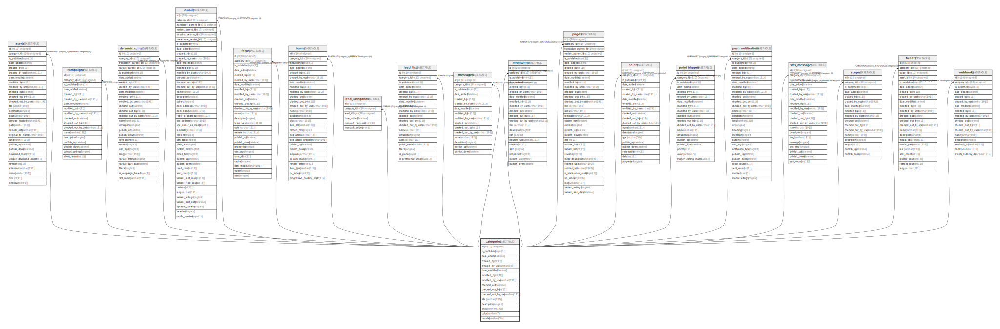

# categories

## Description

<details>
<summary><strong>Table Definition</strong></summary>

```sql
CREATE TABLE `categories` (
  `id` int(10) unsigned NOT NULL AUTO_INCREMENT,
  `is_published` tinyint(1) NOT NULL,
  `date_added` datetime DEFAULT NULL,
  `created_by` int(11) DEFAULT NULL,
  `created_by_user` varchar(191) COLLATE utf8mb4_unicode_ci DEFAULT NULL,
  `date_modified` datetime DEFAULT NULL,
  `modified_by` int(11) DEFAULT NULL,
  `modified_by_user` varchar(191) COLLATE utf8mb4_unicode_ci DEFAULT NULL,
  `checked_out` datetime DEFAULT NULL,
  `checked_out_by` int(11) DEFAULT NULL,
  `checked_out_by_user` varchar(191) COLLATE utf8mb4_unicode_ci DEFAULT NULL,
  `title` varchar(191) COLLATE utf8mb4_unicode_ci NOT NULL,
  `description` longtext COLLATE utf8mb4_unicode_ci DEFAULT NULL,
  `alias` varchar(191) COLLATE utf8mb4_unicode_ci NOT NULL,
  `color` varchar(7) COLLATE utf8mb4_unicode_ci DEFAULT NULL,
  `bundle` varchar(50) COLLATE utf8mb4_unicode_ci NOT NULL,
  PRIMARY KEY (`id`),
  KEY `category_alias_search` (`alias`)
) ENGINE=InnoDB DEFAULT CHARSET=utf8mb4 COLLATE=utf8mb4_unicode_ci ROW_FORMAT=DYNAMIC
```

</details>

## Columns

| Name | Type | Default | Nullable | Extra Definition | Children | Parents | Comment |
| ---- | ---- | ------- | -------- | --------------- | -------- | ------- | ------- |
| id | int(10) unsigned |  | false | auto_increment | [assets](assets.md) [campaigns](campaigns.md) [dynamic_content](dynamic_content.md) [emails](emails.md) [focus](focus.md) [forms](forms.md) [lead_categories](lead_categories.md) [lead_lists](lead_lists.md) [messages](messages.md) [monitoring](monitoring.md) [pages](pages.md) [points](points.md) [point_triggers](point_triggers.md) [push_notifications](push_notifications.md) [sms_messages](sms_messages.md) [stages](stages.md) [tweets](tweets.md) [webhooks](webhooks.md) |  |  |
| is_published | tinyint(1) |  | false |  |  |  |  |
| date_added | datetime | NULL | true |  |  |  |  |
| created_by | int(11) | NULL | true |  |  |  |  |
| created_by_user | varchar(191) | NULL | true |  |  |  |  |
| date_modified | datetime | NULL | true |  |  |  |  |
| modified_by | int(11) | NULL | true |  |  |  |  |
| modified_by_user | varchar(191) | NULL | true |  |  |  |  |
| checked_out | datetime | NULL | true |  |  |  |  |
| checked_out_by | int(11) | NULL | true |  |  |  |  |
| checked_out_by_user | varchar(191) | NULL | true |  |  |  |  |
| title | varchar(191) |  | false |  |  |  |  |
| description | longtext | NULL | true |  |  |  |  |
| alias | varchar(191) |  | false |  |  |  |  |
| color | varchar(7) | NULL | true |  |  |  |  |
| bundle | varchar(50) |  | false |  |  |  |  |

## Constraints

| Name | Type | Definition |
| ---- | ---- | ---------- |
| PRIMARY | PRIMARY KEY | PRIMARY KEY (id) |

## Indexes

| Name | Definition |
| ---- | ---------- |
| category_alias_search | KEY category_alias_search (alias) USING BTREE |
| PRIMARY | PRIMARY KEY (id) USING BTREE |

## Relations



---

> Generated by [tbls](https://github.com/k1LoW/tbls)
