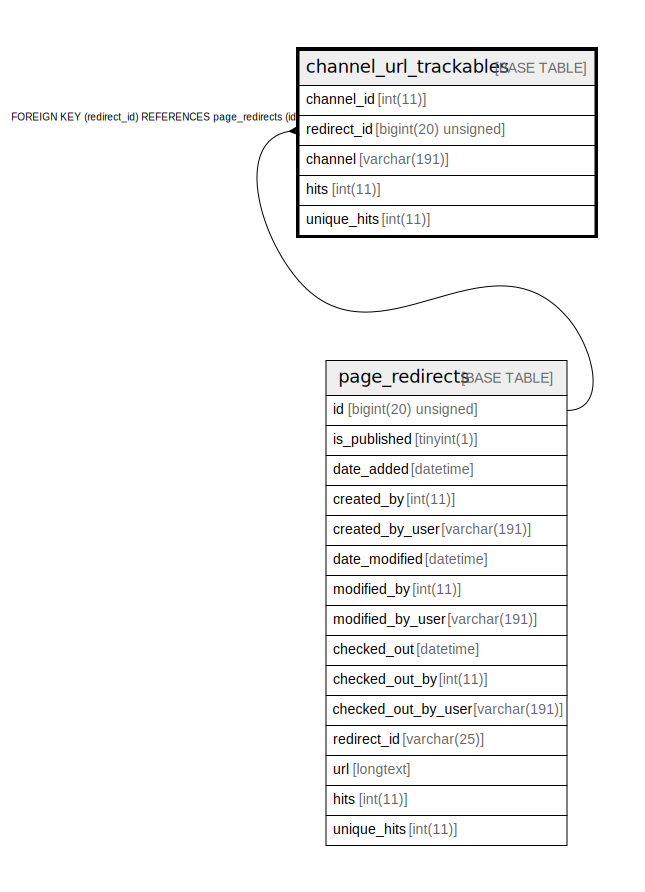

# channel_url_trackables

## Description

<details>
<summary><strong>Table Definition</strong></summary>

```sql
CREATE TABLE `channel_url_trackables` (
  `channel_id` int(11) NOT NULL,
  `redirect_id` bigint(20) unsigned NOT NULL,
  `channel` varchar(191) COLLATE utf8mb4_unicode_ci NOT NULL,
  `hits` int(11) NOT NULL,
  `unique_hits` int(11) NOT NULL,
  PRIMARY KEY (`redirect_id`,`channel_id`),
  KEY `IDX_2F81A41DB42D874D` (`redirect_id`),
  KEY `channel_url_trackable_search` (`channel`,`channel_id`),
  CONSTRAINT `FK_2F81A41DB42D874D` FOREIGN KEY (`redirect_id`) REFERENCES `page_redirects` (`id`) ON DELETE CASCADE
) ENGINE=InnoDB DEFAULT CHARSET=utf8mb4 COLLATE=utf8mb4_unicode_ci ROW_FORMAT=DYNAMIC
```

</details>

## Columns

| Name | Type | Default | Nullable | Children | Parents | Comment |
| ---- | ---- | ------- | -------- | -------- | ------- | ------- |
| channel_id | int(11) |  | false |  |  |  |
| redirect_id | bigint(20) unsigned |  | false |  | [page_redirects](page_redirects.md) |  |
| channel | varchar(191) |  | false |  |  |  |
| hits | int(11) |  | false |  |  |  |
| unique_hits | int(11) |  | false |  |  |  |

## Constraints

| Name | Type | Definition |
| ---- | ---- | ---------- |
| FK_2F81A41DB42D874D | FOREIGN KEY | FOREIGN KEY (redirect_id) REFERENCES page_redirects (id) |
| PRIMARY | PRIMARY KEY | PRIMARY KEY (redirect_id, channel_id) |

## Indexes

| Name | Definition |
| ---- | ---------- |
| channel_url_trackable_search | KEY channel_url_trackable_search (channel, channel_id) USING BTREE |
| IDX_2F81A41DB42D874D | KEY IDX_2F81A41DB42D874D (redirect_id) USING BTREE |
| PRIMARY | PRIMARY KEY (redirect_id, channel_id) USING BTREE |

## Relations



---

> Generated by [tbls](https://github.com/k1LoW/tbls)
