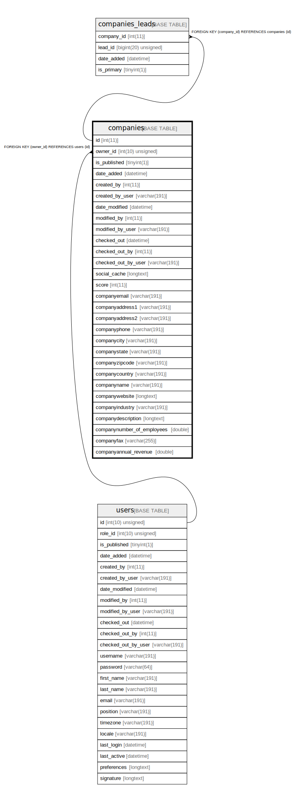

# companies

## Description

<details>
<summary><strong>Table Definition</strong></summary>

```sql
CREATE TABLE `companies` (
  `id` int(11) NOT NULL AUTO_INCREMENT,
  `owner_id` int(10) unsigned DEFAULT NULL,
  `is_published` tinyint(1) NOT NULL,
  `date_added` datetime DEFAULT NULL,
  `created_by` int(11) DEFAULT NULL,
  `created_by_user` varchar(191) COLLATE utf8mb4_unicode_ci DEFAULT NULL,
  `date_modified` datetime DEFAULT NULL,
  `modified_by` int(11) DEFAULT NULL,
  `modified_by_user` varchar(191) COLLATE utf8mb4_unicode_ci DEFAULT NULL,
  `checked_out` datetime DEFAULT NULL,
  `checked_out_by` int(11) DEFAULT NULL,
  `checked_out_by_user` varchar(191) COLLATE utf8mb4_unicode_ci DEFAULT NULL,
  `social_cache` longtext COLLATE utf8mb4_unicode_ci DEFAULT NULL COMMENT '(DC2Type:array)',
  `score` int(11) DEFAULT NULL,
  `companyemail` varchar(191) COLLATE utf8mb4_unicode_ci DEFAULT NULL,
  `companyaddress1` varchar(191) COLLATE utf8mb4_unicode_ci DEFAULT NULL,
  `companyaddress2` varchar(191) COLLATE utf8mb4_unicode_ci DEFAULT NULL,
  `companyphone` varchar(191) COLLATE utf8mb4_unicode_ci DEFAULT NULL,
  `companycity` varchar(191) COLLATE utf8mb4_unicode_ci DEFAULT NULL,
  `companystate` varchar(191) COLLATE utf8mb4_unicode_ci DEFAULT NULL,
  `companyzipcode` varchar(191) COLLATE utf8mb4_unicode_ci DEFAULT NULL,
  `companycountry` varchar(191) COLLATE utf8mb4_unicode_ci DEFAULT NULL,
  `companyname` varchar(191) COLLATE utf8mb4_unicode_ci DEFAULT NULL,
  `companywebsite` longtext COLLATE utf8mb4_unicode_ci DEFAULT NULL,
  `companyindustry` varchar(191) COLLATE utf8mb4_unicode_ci DEFAULT NULL,
  `companydescription` longtext COLLATE utf8mb4_unicode_ci DEFAULT NULL,
  `companynumber_of_employees` double DEFAULT NULL,
  `companyfax` varchar(255) COLLATE utf8mb4_unicode_ci DEFAULT NULL,
  `companyannual_revenue` double DEFAULT NULL,
  PRIMARY KEY (`id`),
  KEY `IDX_8244AA3A7E3C61F9` (`owner_id`),
  KEY `companyaddress1_search` (`companyaddress1`),
  KEY `companyaddress2_search` (`companyaddress2`),
  KEY `companyemail_search` (`companyemail`),
  KEY `companyphone_search` (`companyphone`),
  KEY `companycity_search` (`companycity`),
  KEY `companystate_search` (`companystate`),
  KEY `companyzipcode_search` (`companyzipcode`),
  KEY `companycountry_search` (`companycountry`),
  KEY `companyname_search` (`companyname`),
  KEY `companynumber_of_employees_search` (`companynumber_of_employees`),
  KEY `companyfax_search` (`companyfax`),
  KEY `companyannual_revenue_search` (`companyannual_revenue`),
  KEY `companyindustry_search` (`companyindustry`),
  KEY `company_filter` (`companyname`,`companyemail`),
  KEY `company_match` (`companyname`,`companycity`,`companycountry`,`companystate`),
  CONSTRAINT `FK_8244AA3A7E3C61F9` FOREIGN KEY (`owner_id`) REFERENCES `users` (`id`) ON DELETE SET NULL
) ENGINE=InnoDB DEFAULT CHARSET=utf8mb4 COLLATE=utf8mb4_unicode_ci ROW_FORMAT=DYNAMIC
```

</details>

## Columns

| Name | Type | Default | Nullable | Extra Definition | Children | Parents | Comment |
| ---- | ---- | ------- | -------- | --------------- | -------- | ------- | ------- |
| id | int(11) |  | false | auto_increment | [companies_leads](companies_leads.md) |  |  |
| owner_id | int(10) unsigned | NULL | true |  |  | [users](users.md) |  |
| is_published | tinyint(1) |  | false |  |  |  |  |
| date_added | datetime | NULL | true |  |  |  |  |
| created_by | int(11) | NULL | true |  |  |  |  |
| created_by_user | varchar(191) | NULL | true |  |  |  |  |
| date_modified | datetime | NULL | true |  |  |  |  |
| modified_by | int(11) | NULL | true |  |  |  |  |
| modified_by_user | varchar(191) | NULL | true |  |  |  |  |
| checked_out | datetime | NULL | true |  |  |  |  |
| checked_out_by | int(11) | NULL | true |  |  |  |  |
| checked_out_by_user | varchar(191) | NULL | true |  |  |  |  |
| social_cache | longtext | NULL | true |  |  |  | (DC2Type:array) |
| score | int(11) | NULL | true |  |  |  |  |
| companyemail | varchar(191) | NULL | true |  |  |  |  |
| companyaddress1 | varchar(191) | NULL | true |  |  |  |  |
| companyaddress2 | varchar(191) | NULL | true |  |  |  |  |
| companyphone | varchar(191) | NULL | true |  |  |  |  |
| companycity | varchar(191) | NULL | true |  |  |  |  |
| companystate | varchar(191) | NULL | true |  |  |  |  |
| companyzipcode | varchar(191) | NULL | true |  |  |  |  |
| companycountry | varchar(191) | NULL | true |  |  |  |  |
| companyname | varchar(191) | NULL | true |  |  |  |  |
| companywebsite | longtext | NULL | true |  |  |  |  |
| companyindustry | varchar(191) | NULL | true |  |  |  |  |
| companydescription | longtext | NULL | true |  |  |  |  |
| companynumber_of_employees | double | NULL | true |  |  |  |  |
| companyfax | varchar(255) | NULL | true |  |  |  |  |
| companyannual_revenue | double | NULL | true |  |  |  |  |

## Constraints

| Name | Type | Definition |
| ---- | ---- | ---------- |
| FK_8244AA3A7E3C61F9 | FOREIGN KEY | FOREIGN KEY (owner_id) REFERENCES users (id) |
| PRIMARY | PRIMARY KEY | PRIMARY KEY (id) |

## Indexes

| Name | Definition |
| ---- | ---------- |
| companyaddress1_search | KEY companyaddress1_search (companyaddress1) USING BTREE |
| companyaddress2_search | KEY companyaddress2_search (companyaddress2) USING BTREE |
| companyannual_revenue_search | KEY companyannual_revenue_search (companyannual_revenue) USING BTREE |
| companycity_search | KEY companycity_search (companycity) USING BTREE |
| companycountry_search | KEY companycountry_search (companycountry) USING BTREE |
| companyemail_search | KEY companyemail_search (companyemail) USING BTREE |
| companyfax_search | KEY companyfax_search (companyfax) USING BTREE |
| companyindustry_search | KEY companyindustry_search (companyindustry) USING BTREE |
| companyname_search | KEY companyname_search (companyname) USING BTREE |
| companynumber_of_employees_search | KEY companynumber_of_employees_search (companynumber_of_employees) USING BTREE |
| companyphone_search | KEY companyphone_search (companyphone) USING BTREE |
| companystate_search | KEY companystate_search (companystate) USING BTREE |
| companyzipcode_search | KEY companyzipcode_search (companyzipcode) USING BTREE |
| company_filter | KEY company_filter (companyname, companyemail) USING BTREE |
| company_match | KEY company_match (companyname, companycity, companycountry, companystate) USING BTREE |
| IDX_8244AA3A7E3C61F9 | KEY IDX_8244AA3A7E3C61F9 (owner_id) USING BTREE |
| PRIMARY | PRIMARY KEY (id) USING BTREE |

## Relations



---

> Generated by [tbls](https://github.com/k1LoW/tbls)
