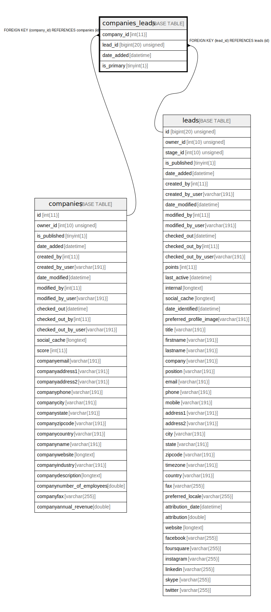

# companies_leads

## Description

<details>
<summary><strong>Table Definition</strong></summary>

```sql
CREATE TABLE `companies_leads` (
  `company_id` int(11) NOT NULL,
  `lead_id` bigint(20) unsigned NOT NULL,
  `date_added` datetime NOT NULL,
  `is_primary` tinyint(1) DEFAULT NULL,
  PRIMARY KEY (`company_id`,`lead_id`),
  KEY `IDX_F4190AB6979B1AD6` (`company_id`),
  KEY `IDX_F4190AB655458D` (`lead_id`),
  CONSTRAINT `FK_F4190AB655458D` FOREIGN KEY (`lead_id`) REFERENCES `leads` (`id`) ON DELETE CASCADE,
  CONSTRAINT `FK_F4190AB6979B1AD6` FOREIGN KEY (`company_id`) REFERENCES `companies` (`id`) ON DELETE CASCADE
) ENGINE=InnoDB DEFAULT CHARSET=utf8mb4 COLLATE=utf8mb4_unicode_ci ROW_FORMAT=DYNAMIC
```

</details>

## Columns

| Name | Type | Default | Nullable | Children | Parents | Comment |
| ---- | ---- | ------- | -------- | -------- | ------- | ------- |
| company_id | int(11) |  | false |  | [companies](companies.md) |  |
| lead_id | bigint(20) unsigned |  | false |  | [leads](leads.md) |  |
| date_added | datetime |  | false |  |  |  |
| is_primary | tinyint(1) | NULL | true |  |  |  |

## Constraints

| Name | Type | Definition |
| ---- | ---- | ---------- |
| FK_F4190AB655458D | FOREIGN KEY | FOREIGN KEY (lead_id) REFERENCES leads (id) |
| FK_F4190AB6979B1AD6 | FOREIGN KEY | FOREIGN KEY (company_id) REFERENCES companies (id) |
| PRIMARY | PRIMARY KEY | PRIMARY KEY (company_id, lead_id) |

## Indexes

| Name | Definition |
| ---- | ---------- |
| IDX_F4190AB655458D | KEY IDX_F4190AB655458D (lead_id) USING BTREE |
| IDX_F4190AB6979B1AD6 | KEY IDX_F4190AB6979B1AD6 (company_id) USING BTREE |
| PRIMARY | PRIMARY KEY (company_id, lead_id) USING BTREE |

## Relations



---

> Generated by [tbls](https://github.com/k1LoW/tbls)
