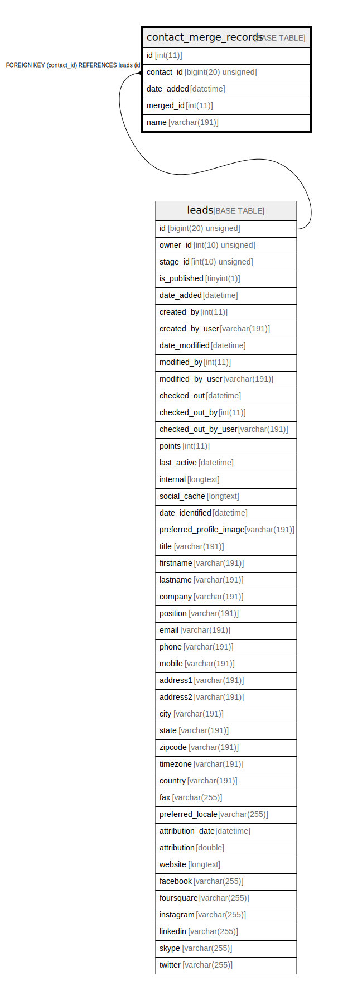

# contact_merge_records

## Description

<details>
<summary><strong>Table Definition</strong></summary>

```sql
CREATE TABLE `contact_merge_records` (
  `id` int(11) NOT NULL AUTO_INCREMENT,
  `contact_id` bigint(20) unsigned NOT NULL,
  `date_added` datetime NOT NULL,
  `merged_id` int(11) NOT NULL,
  `name` varchar(191) COLLATE utf8mb4_unicode_ci NOT NULL,
  PRIMARY KEY (`id`),
  KEY `IDX_D9B4F2BFE7A1254A` (`contact_id`),
  KEY `contact_merge_date_added` (`date_added`),
  KEY `contact_merge_ids` (`merged_id`),
  CONSTRAINT `FK_D9B4F2BFE7A1254A` FOREIGN KEY (`contact_id`) REFERENCES `leads` (`id`) ON DELETE CASCADE
) ENGINE=InnoDB DEFAULT CHARSET=utf8mb4 COLLATE=utf8mb4_unicode_ci ROW_FORMAT=DYNAMIC
```

</details>

## Columns

| Name | Type | Default | Nullable | Extra Definition | Children | Parents | Comment |
| ---- | ---- | ------- | -------- | --------------- | -------- | ------- | ------- |
| id | int(11) |  | false | auto_increment |  |  |  |
| contact_id | bigint(20) unsigned |  | false |  |  | [leads](leads.md) |  |
| date_added | datetime |  | false |  |  |  |  |
| merged_id | int(11) |  | false |  |  |  |  |
| name | varchar(191) |  | false |  |  |  |  |

## Constraints

| Name | Type | Definition |
| ---- | ---- | ---------- |
| FK_D9B4F2BFE7A1254A | FOREIGN KEY | FOREIGN KEY (contact_id) REFERENCES leads (id) |
| PRIMARY | PRIMARY KEY | PRIMARY KEY (id) |

## Indexes

| Name | Definition |
| ---- | ---------- |
| contact_merge_date_added | KEY contact_merge_date_added (date_added) USING BTREE |
| contact_merge_ids | KEY contact_merge_ids (merged_id) USING BTREE |
| IDX_D9B4F2BFE7A1254A | KEY IDX_D9B4F2BFE7A1254A (contact_id) USING BTREE |
| PRIMARY | PRIMARY KEY (id) USING BTREE |

## Relations



---

> Generated by [tbls](https://github.com/k1LoW/tbls)
