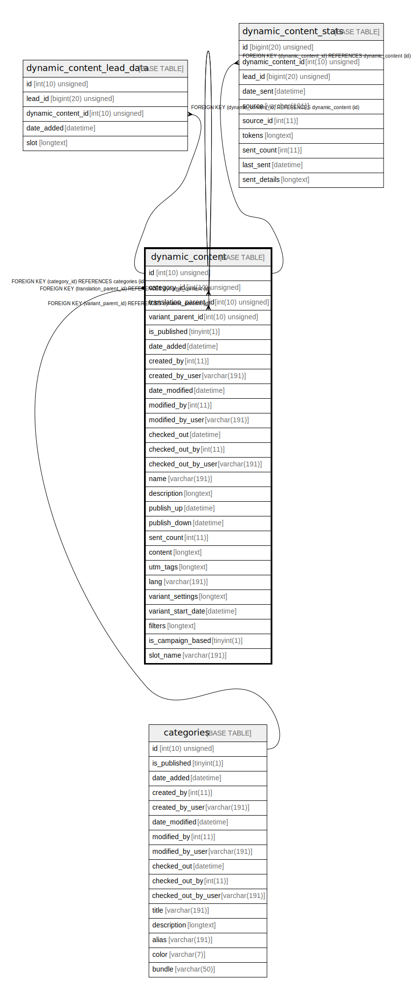

# dynamic_content

## Description

<details>
<summary><strong>Table Definition</strong></summary>

```sql
CREATE TABLE `dynamic_content` (
  `id` int(10) unsigned NOT NULL AUTO_INCREMENT,
  `category_id` int(10) unsigned DEFAULT NULL,
  `translation_parent_id` int(10) unsigned DEFAULT NULL,
  `variant_parent_id` int(10) unsigned DEFAULT NULL,
  `is_published` tinyint(1) NOT NULL,
  `date_added` datetime DEFAULT NULL,
  `created_by` int(11) DEFAULT NULL,
  `created_by_user` varchar(191) COLLATE utf8mb4_unicode_ci DEFAULT NULL,
  `date_modified` datetime DEFAULT NULL,
  `modified_by` int(11) DEFAULT NULL,
  `modified_by_user` varchar(191) COLLATE utf8mb4_unicode_ci DEFAULT NULL,
  `checked_out` datetime DEFAULT NULL,
  `checked_out_by` int(11) DEFAULT NULL,
  `checked_out_by_user` varchar(191) COLLATE utf8mb4_unicode_ci DEFAULT NULL,
  `name` varchar(191) COLLATE utf8mb4_unicode_ci NOT NULL,
  `description` longtext COLLATE utf8mb4_unicode_ci DEFAULT NULL,
  `publish_up` datetime DEFAULT NULL,
  `publish_down` datetime DEFAULT NULL,
  `sent_count` int(11) NOT NULL,
  `content` longtext COLLATE utf8mb4_unicode_ci DEFAULT NULL,
  `utm_tags` longtext COLLATE utf8mb4_unicode_ci DEFAULT NULL COMMENT '(DC2Type:json_array)',
  `lang` varchar(191) COLLATE utf8mb4_unicode_ci NOT NULL,
  `variant_settings` longtext COLLATE utf8mb4_unicode_ci DEFAULT NULL COMMENT '(DC2Type:array)',
  `variant_start_date` datetime DEFAULT NULL,
  `filters` longtext COLLATE utf8mb4_unicode_ci DEFAULT NULL COMMENT '(DC2Type:array)',
  `is_campaign_based` tinyint(1) NOT NULL DEFAULT 1,
  `slot_name` varchar(191) COLLATE utf8mb4_unicode_ci DEFAULT NULL,
  PRIMARY KEY (`id`),
  KEY `IDX_20B9DEB212469DE2` (`category_id`),
  KEY `IDX_20B9DEB29091A2FB` (`translation_parent_id`),
  KEY `IDX_20B9DEB291861123` (`variant_parent_id`),
  KEY `is_campaign_based_index` (`is_campaign_based`),
  KEY `slot_name_index` (`slot_name`),
  CONSTRAINT `FK_20B9DEB212469DE2` FOREIGN KEY (`category_id`) REFERENCES `categories` (`id`) ON DELETE SET NULL,
  CONSTRAINT `FK_20B9DEB29091A2FB` FOREIGN KEY (`translation_parent_id`) REFERENCES `dynamic_content` (`id`) ON DELETE CASCADE,
  CONSTRAINT `FK_20B9DEB291861123` FOREIGN KEY (`variant_parent_id`) REFERENCES `dynamic_content` (`id`) ON DELETE CASCADE
) ENGINE=InnoDB DEFAULT CHARSET=utf8mb4 COLLATE=utf8mb4_unicode_ci ROW_FORMAT=DYNAMIC
```

</details>

## Columns

| Name | Type | Default | Nullable | Extra Definition | Children | Parents | Comment |
| ---- | ---- | ------- | -------- | --------------- | -------- | ------- | ------- |
| id | int(10) unsigned |  | false | auto_increment | [dynamic_content](dynamic_content.md) [dynamic_content_lead_data](dynamic_content_lead_data.md) [dynamic_content_stats](dynamic_content_stats.md) |  |  |
| category_id | int(10) unsigned | NULL | true |  |  | [categories](categories.md) |  |
| translation_parent_id | int(10) unsigned | NULL | true |  |  | [dynamic_content](dynamic_content.md) |  |
| variant_parent_id | int(10) unsigned | NULL | true |  |  | [dynamic_content](dynamic_content.md) |  |
| is_published | tinyint(1) |  | false |  |  |  |  |
| date_added | datetime | NULL | true |  |  |  |  |
| created_by | int(11) | NULL | true |  |  |  |  |
| created_by_user | varchar(191) | NULL | true |  |  |  |  |
| date_modified | datetime | NULL | true |  |  |  |  |
| modified_by | int(11) | NULL | true |  |  |  |  |
| modified_by_user | varchar(191) | NULL | true |  |  |  |  |
| checked_out | datetime | NULL | true |  |  |  |  |
| checked_out_by | int(11) | NULL | true |  |  |  |  |
| checked_out_by_user | varchar(191) | NULL | true |  |  |  |  |
| name | varchar(191) |  | false |  |  |  |  |
| description | longtext | NULL | true |  |  |  |  |
| publish_up | datetime | NULL | true |  |  |  |  |
| publish_down | datetime | NULL | true |  |  |  |  |
| sent_count | int(11) |  | false |  |  |  |  |
| content | longtext | NULL | true |  |  |  |  |
| utm_tags | longtext | NULL | true |  |  |  | (DC2Type:json_array) |
| lang | varchar(191) |  | false |  |  |  |  |
| variant_settings | longtext | NULL | true |  |  |  | (DC2Type:array) |
| variant_start_date | datetime | NULL | true |  |  |  |  |
| filters | longtext | NULL | true |  |  |  | (DC2Type:array) |
| is_campaign_based | tinyint(1) | 1 | false |  |  |  |  |
| slot_name | varchar(191) | NULL | true |  |  |  |  |

## Constraints

| Name | Type | Definition |
| ---- | ---- | ---------- |
| FK_20B9DEB212469DE2 | FOREIGN KEY | FOREIGN KEY (category_id) REFERENCES categories (id) |
| FK_20B9DEB29091A2FB | FOREIGN KEY | FOREIGN KEY (translation_parent_id) REFERENCES dynamic_content (id) |
| FK_20B9DEB291861123 | FOREIGN KEY | FOREIGN KEY (variant_parent_id) REFERENCES dynamic_content (id) |
| PRIMARY | PRIMARY KEY | PRIMARY KEY (id) |

## Indexes

| Name | Definition |
| ---- | ---------- |
| IDX_20B9DEB212469DE2 | KEY IDX_20B9DEB212469DE2 (category_id) USING BTREE |
| IDX_20B9DEB29091A2FB | KEY IDX_20B9DEB29091A2FB (translation_parent_id) USING BTREE |
| IDX_20B9DEB291861123 | KEY IDX_20B9DEB291861123 (variant_parent_id) USING BTREE |
| is_campaign_based_index | KEY is_campaign_based_index (is_campaign_based) USING BTREE |
| slot_name_index | KEY slot_name_index (slot_name) USING BTREE |
| PRIMARY | PRIMARY KEY (id) USING BTREE |

## Relations



---

> Generated by [tbls](https://github.com/k1LoW/tbls)
