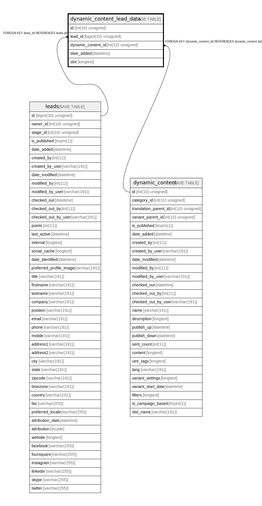

# dynamic_content_lead_data

## Description

<details>
<summary><strong>Table Definition</strong></summary>

```sql
CREATE TABLE `dynamic_content_lead_data` (
  `id` int(10) unsigned NOT NULL AUTO_INCREMENT,
  `lead_id` bigint(20) unsigned NOT NULL,
  `dynamic_content_id` int(10) unsigned DEFAULT NULL,
  `date_added` datetime DEFAULT NULL,
  `slot` longtext COLLATE utf8mb4_unicode_ci NOT NULL,
  PRIMARY KEY (`id`),
  KEY `IDX_515B221B55458D` (`lead_id`),
  KEY `IDX_515B221BD9D0CD7` (`dynamic_content_id`),
  CONSTRAINT `FK_515B221B55458D` FOREIGN KEY (`lead_id`) REFERENCES `leads` (`id`) ON DELETE CASCADE,
  CONSTRAINT `FK_515B221BD9D0CD7` FOREIGN KEY (`dynamic_content_id`) REFERENCES `dynamic_content` (`id`) ON DELETE CASCADE
) ENGINE=InnoDB DEFAULT CHARSET=utf8mb4 COLLATE=utf8mb4_unicode_ci ROW_FORMAT=DYNAMIC
```

</details>

## Columns

| Name | Type | Default | Nullable | Extra Definition | Children | Parents | Comment |
| ---- | ---- | ------- | -------- | --------------- | -------- | ------- | ------- |
| id | int(10) unsigned |  | false | auto_increment |  |  |  |
| lead_id | bigint(20) unsigned |  | false |  |  | [leads](leads.md) |  |
| dynamic_content_id | int(10) unsigned | NULL | true |  |  | [dynamic_content](dynamic_content.md) |  |
| date_added | datetime | NULL | true |  |  |  |  |
| slot | longtext |  | false |  |  |  |  |

## Constraints

| Name | Type | Definition |
| ---- | ---- | ---------- |
| FK_515B221B55458D | FOREIGN KEY | FOREIGN KEY (lead_id) REFERENCES leads (id) |
| FK_515B221BD9D0CD7 | FOREIGN KEY | FOREIGN KEY (dynamic_content_id) REFERENCES dynamic_content (id) |
| PRIMARY | PRIMARY KEY | PRIMARY KEY (id) |

## Indexes

| Name | Definition |
| ---- | ---------- |
| IDX_515B221B55458D | KEY IDX_515B221B55458D (lead_id) USING BTREE |
| IDX_515B221BD9D0CD7 | KEY IDX_515B221BD9D0CD7 (dynamic_content_id) USING BTREE |
| PRIMARY | PRIMARY KEY (id) USING BTREE |

## Relations



---

> Generated by [tbls](https://github.com/k1LoW/tbls)
