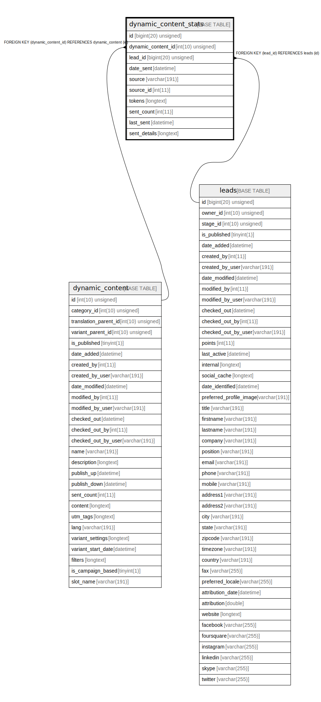

# dynamic_content_stats

## Description

<details>
<summary><strong>Table Definition</strong></summary>

```sql
CREATE TABLE `dynamic_content_stats` (
  `id` bigint(20) unsigned NOT NULL AUTO_INCREMENT,
  `dynamic_content_id` int(10) unsigned DEFAULT NULL,
  `lead_id` bigint(20) unsigned DEFAULT NULL,
  `date_sent` datetime NOT NULL,
  `source` varchar(191) COLLATE utf8mb4_unicode_ci DEFAULT NULL,
  `source_id` int(11) DEFAULT NULL,
  `tokens` longtext COLLATE utf8mb4_unicode_ci DEFAULT NULL COMMENT '(DC2Type:array)',
  `sent_count` int(11) DEFAULT NULL,
  `last_sent` datetime DEFAULT NULL,
  `sent_details` longtext COLLATE utf8mb4_unicode_ci DEFAULT NULL COMMENT '(DC2Type:array)',
  PRIMARY KEY (`id`),
  KEY `IDX_E48FBF80D9D0CD7` (`dynamic_content_id`),
  KEY `IDX_E48FBF8055458D` (`lead_id`),
  KEY `stat_dynamic_content_search` (`dynamic_content_id`,`lead_id`),
  KEY `stat_dynamic_content_source_search` (`source`,`source_id`),
  CONSTRAINT `FK_E48FBF8055458D` FOREIGN KEY (`lead_id`) REFERENCES `leads` (`id`) ON DELETE SET NULL,
  CONSTRAINT `FK_E48FBF80D9D0CD7` FOREIGN KEY (`dynamic_content_id`) REFERENCES `dynamic_content` (`id`) ON DELETE SET NULL
) ENGINE=InnoDB DEFAULT CHARSET=utf8mb4 COLLATE=utf8mb4_unicode_ci ROW_FORMAT=DYNAMIC
```

</details>

## Columns

| Name | Type | Default | Nullable | Extra Definition | Children | Parents | Comment |
| ---- | ---- | ------- | -------- | --------------- | -------- | ------- | ------- |
| id | bigint(20) unsigned |  | false | auto_increment |  |  |  |
| dynamic_content_id | int(10) unsigned | NULL | true |  |  | [dynamic_content](dynamic_content.md) |  |
| lead_id | bigint(20) unsigned | NULL | true |  |  | [leads](leads.md) |  |
| date_sent | datetime |  | false |  |  |  |  |
| source | varchar(191) | NULL | true |  |  |  |  |
| source_id | int(11) | NULL | true |  |  |  |  |
| tokens | longtext | NULL | true |  |  |  | (DC2Type:array) |
| sent_count | int(11) | NULL | true |  |  |  |  |
| last_sent | datetime | NULL | true |  |  |  |  |
| sent_details | longtext | NULL | true |  |  |  | (DC2Type:array) |

## Constraints

| Name | Type | Definition |
| ---- | ---- | ---------- |
| FK_E48FBF8055458D | FOREIGN KEY | FOREIGN KEY (lead_id) REFERENCES leads (id) |
| FK_E48FBF80D9D0CD7 | FOREIGN KEY | FOREIGN KEY (dynamic_content_id) REFERENCES dynamic_content (id) |
| PRIMARY | PRIMARY KEY | PRIMARY KEY (id) |

## Indexes

| Name | Definition |
| ---- | ---------- |
| IDX_E48FBF8055458D | KEY IDX_E48FBF8055458D (lead_id) USING BTREE |
| IDX_E48FBF80D9D0CD7 | KEY IDX_E48FBF80D9D0CD7 (dynamic_content_id) USING BTREE |
| stat_dynamic_content_search | KEY stat_dynamic_content_search (dynamic_content_id, lead_id) USING BTREE |
| stat_dynamic_content_source_search | KEY stat_dynamic_content_source_search (source, source_id) USING BTREE |
| PRIMARY | PRIMARY KEY (id) USING BTREE |

## Relations



---

> Generated by [tbls](https://github.com/k1LoW/tbls)
