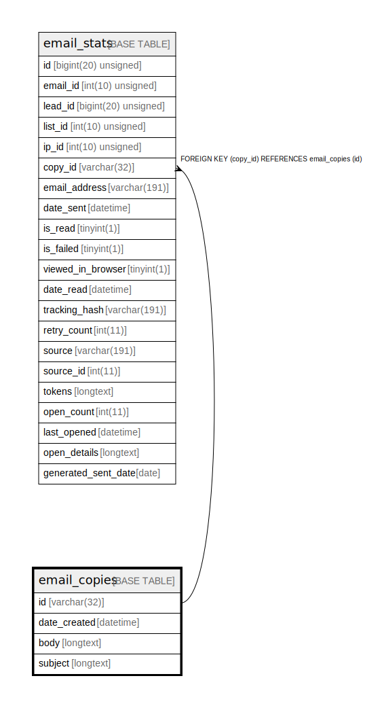

# email_copies

## Description

<details>
<summary><strong>Table Definition</strong></summary>

```sql
CREATE TABLE `email_copies` (
  `id` varchar(32) COLLATE utf8mb4_unicode_ci NOT NULL,
  `date_created` datetime NOT NULL,
  `body` longtext COLLATE utf8mb4_unicode_ci DEFAULT NULL,
  `subject` longtext COLLATE utf8mb4_unicode_ci DEFAULT NULL,
  PRIMARY KEY (`id`)
) ENGINE=InnoDB DEFAULT CHARSET=utf8mb4 COLLATE=utf8mb4_unicode_ci ROW_FORMAT=DYNAMIC
```

</details>

## Columns

| Name | Type | Default | Nullable | Children | Parents | Comment |
| ---- | ---- | ------- | -------- | -------- | ------- | ------- |
| id | varchar(32) |  | false | [email_stats](email_stats.md) |  |  |
| date_created | datetime |  | false |  |  |  |
| body | longtext | NULL | true |  |  |  |
| subject | longtext | NULL | true |  |  |  |

## Constraints

| Name | Type | Definition |
| ---- | ---- | ---------- |
| PRIMARY | PRIMARY KEY | PRIMARY KEY (id) |

## Indexes

| Name | Definition |
| ---- | ---------- |
| PRIMARY | PRIMARY KEY (id) USING BTREE |

## Relations



---

> Generated by [tbls](https://github.com/k1LoW/tbls)
