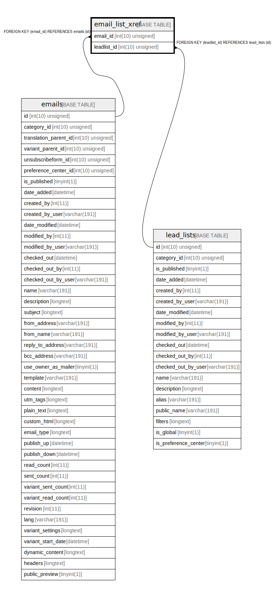

# email_list_xref

## Description

<details>
<summary><strong>Table Definition</strong></summary>

```sql
CREATE TABLE `email_list_xref` (
  `email_id` int(10) unsigned NOT NULL,
  `leadlist_id` int(10) unsigned NOT NULL,
  PRIMARY KEY (`email_id`,`leadlist_id`),
  KEY `IDX_2E24F01CB9FC8874` (`leadlist_id`),
  CONSTRAINT `FK_2E24F01CA832C1C9` FOREIGN KEY (`email_id`) REFERENCES `emails` (`id`) ON DELETE CASCADE,
  CONSTRAINT `FK_2E24F01CB9FC8874` FOREIGN KEY (`leadlist_id`) REFERENCES `lead_lists` (`id`) ON DELETE CASCADE
) ENGINE=InnoDB DEFAULT CHARSET=utf8mb4 COLLATE=utf8mb4_unicode_ci ROW_FORMAT=DYNAMIC
```

</details>

## Columns

| Name | Type | Default | Nullable | Children | Parents | Comment |
| ---- | ---- | ------- | -------- | -------- | ------- | ------- |
| email_id | int(10) unsigned |  | false |  | [emails](emails.md) |  |
| leadlist_id | int(10) unsigned |  | false |  | [lead_lists](lead_lists.md) |  |

## Constraints

| Name | Type | Definition |
| ---- | ---- | ---------- |
| FK_2E24F01CA832C1C9 | FOREIGN KEY | FOREIGN KEY (email_id) REFERENCES emails (id) |
| FK_2E24F01CB9FC8874 | FOREIGN KEY | FOREIGN KEY (leadlist_id) REFERENCES lead_lists (id) |
| PRIMARY | PRIMARY KEY | PRIMARY KEY (email_id, leadlist_id) |

## Indexes

| Name | Definition |
| ---- | ---------- |
| IDX_2E24F01CB9FC8874 | KEY IDX_2E24F01CB9FC8874 (leadlist_id) USING BTREE |
| PRIMARY | PRIMARY KEY (email_id, leadlist_id) USING BTREE |

## Relations



---

> Generated by [tbls](https://github.com/k1LoW/tbls)
