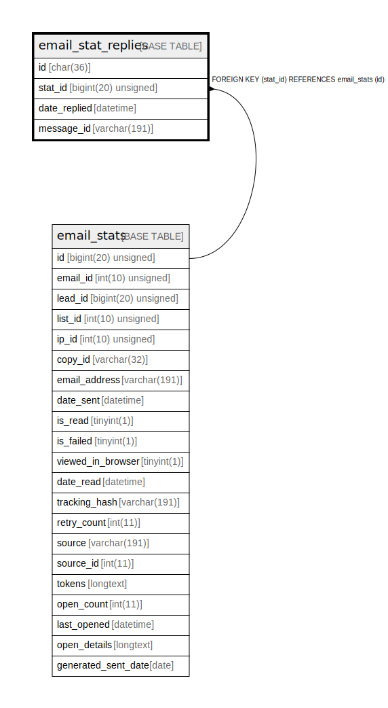

# email_stat_replies

## Description

<details>
<summary><strong>Table Definition</strong></summary>

```sql
CREATE TABLE `email_stat_replies` (
  `id` char(36) COLLATE utf8mb4_unicode_ci NOT NULL COMMENT '(DC2Type:guid)',
  `stat_id` bigint(20) unsigned NOT NULL,
  `date_replied` datetime NOT NULL,
  `message_id` varchar(191) COLLATE utf8mb4_unicode_ci NOT NULL,
  PRIMARY KEY (`id`),
  KEY `IDX_11E9F6E09502F0B` (`stat_id`),
  KEY `email_replies` (`stat_id`,`message_id`),
  KEY `date_email_replied` (`date_replied`),
  CONSTRAINT `FK_11E9F6E09502F0B` FOREIGN KEY (`stat_id`) REFERENCES `email_stats` (`id`) ON DELETE CASCADE
) ENGINE=InnoDB DEFAULT CHARSET=utf8mb4 COLLATE=utf8mb4_unicode_ci ROW_FORMAT=DYNAMIC
```

</details>

## Columns

| Name | Type | Default | Nullable | Children | Parents | Comment |
| ---- | ---- | ------- | -------- | -------- | ------- | ------- |
| id | char(36) |  | false |  |  | (DC2Type:guid) |
| stat_id | bigint(20) unsigned |  | false |  | [email_stats](email_stats.md) |  |
| date_replied | datetime |  | false |  |  |  |
| message_id | varchar(191) |  | false |  |  |  |

## Constraints

| Name | Type | Definition |
| ---- | ---- | ---------- |
| FK_11E9F6E09502F0B | FOREIGN KEY | FOREIGN KEY (stat_id) REFERENCES email_stats (id) |
| PRIMARY | PRIMARY KEY | PRIMARY KEY (id) |

## Indexes

| Name | Definition |
| ---- | ---------- |
| date_email_replied | KEY date_email_replied (date_replied) USING BTREE |
| email_replies | KEY email_replies (stat_id, message_id) USING BTREE |
| IDX_11E9F6E09502F0B | KEY IDX_11E9F6E09502F0B (stat_id) USING BTREE |
| PRIMARY | PRIMARY KEY (id) USING BTREE |

## Relations



---

> Generated by [tbls](https://github.com/k1LoW/tbls)
