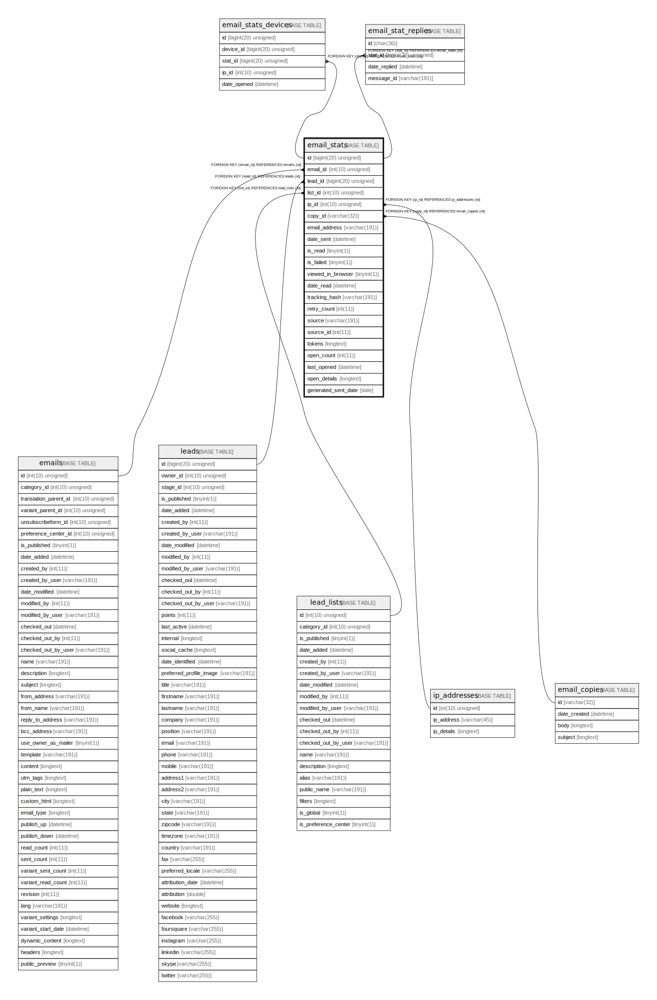

# email_stats

## Description

<details>
<summary><strong>Table Definition</strong></summary>

```sql
CREATE TABLE `email_stats` (
  `id` bigint(20) unsigned NOT NULL AUTO_INCREMENT,
  `email_id` int(10) unsigned DEFAULT NULL,
  `lead_id` bigint(20) unsigned DEFAULT NULL,
  `list_id` int(10) unsigned DEFAULT NULL,
  `ip_id` int(10) unsigned DEFAULT NULL,
  `copy_id` varchar(32) COLLATE utf8mb4_unicode_ci DEFAULT NULL,
  `email_address` varchar(191) COLLATE utf8mb4_unicode_ci NOT NULL,
  `date_sent` datetime NOT NULL,
  `is_read` tinyint(1) NOT NULL,
  `is_failed` tinyint(1) NOT NULL,
  `viewed_in_browser` tinyint(1) NOT NULL,
  `date_read` datetime DEFAULT NULL,
  `tracking_hash` varchar(191) COLLATE utf8mb4_unicode_ci DEFAULT NULL,
  `retry_count` int(11) DEFAULT NULL,
  `source` varchar(191) COLLATE utf8mb4_unicode_ci DEFAULT NULL,
  `source_id` int(11) DEFAULT NULL,
  `tokens` longtext COLLATE utf8mb4_unicode_ci DEFAULT NULL COMMENT '(DC2Type:array)',
  `open_count` int(11) DEFAULT NULL,
  `last_opened` datetime DEFAULT NULL,
  `open_details` longtext COLLATE utf8mb4_unicode_ci DEFAULT NULL COMMENT '(DC2Type:array)',
  `generated_sent_date` date GENERATED ALWAYS AS (concat(year(`date_sent`),'-',lpad(month(`date_sent`),2,'0'),'-',lpad(dayofmonth(`date_sent`),2,'0'))) VIRTUAL COMMENT '(DC2Type:generated)',
  PRIMARY KEY (`id`),
  KEY `IDX_CA0A2625A832C1C9` (`email_id`),
  KEY `IDX_CA0A262555458D` (`lead_id`),
  KEY `IDX_CA0A26253DAE168B` (`list_id`),
  KEY `IDX_CA0A2625A03F5E9F` (`ip_id`),
  KEY `IDX_CA0A2625A8752772` (`copy_id`),
  KEY `stat_email_search` (`email_id`,`lead_id`),
  KEY `stat_email_search2` (`lead_id`,`email_id`),
  KEY `stat_email_failed_search` (`is_failed`),
  KEY `is_read_date_sent` (`is_read`,`date_sent`),
  KEY `stat_email_hash_search` (`tracking_hash`),
  KEY `stat_email_source_search` (`source`,`source_id`),
  KEY `email_date_sent` (`date_sent`),
  KEY `email_date_read_lead` (`date_read`,`lead_id`),
  KEY `generated_sent_date_email_id` (`generated_sent_date`,`email_id`),
  CONSTRAINT `FK_CA0A26253DAE168B` FOREIGN KEY (`list_id`) REFERENCES `lead_lists` (`id`) ON DELETE SET NULL,
  CONSTRAINT `FK_CA0A262555458D` FOREIGN KEY (`lead_id`) REFERENCES `leads` (`id`) ON DELETE SET NULL,
  CONSTRAINT `FK_CA0A2625A03F5E9F` FOREIGN KEY (`ip_id`) REFERENCES `ip_addresses` (`id`),
  CONSTRAINT `FK_CA0A2625A832C1C9` FOREIGN KEY (`email_id`) REFERENCES `emails` (`id`) ON DELETE SET NULL,
  CONSTRAINT `FK_CA0A2625A8752772` FOREIGN KEY (`copy_id`) REFERENCES `email_copies` (`id`) ON DELETE SET NULL
) ENGINE=InnoDB DEFAULT CHARSET=utf8mb4 COLLATE=utf8mb4_unicode_ci ROW_FORMAT=DYNAMIC
```

</details>

## Columns

| Name | Type | Default | Nullable | Extra Definition | Children | Parents | Comment |
| ---- | ---- | ------- | -------- | --------------- | -------- | ------- | ------- |
| id | bigint(20) unsigned |  | false | auto_increment | [email_stats_devices](email_stats_devices.md) [email_stat_replies](email_stat_replies.md) |  |  |
| email_id | int(10) unsigned | NULL | true |  |  | [emails](emails.md) |  |
| lead_id | bigint(20) unsigned | NULL | true |  |  | [leads](leads.md) |  |
| list_id | int(10) unsigned | NULL | true |  |  | [lead_lists](lead_lists.md) |  |
| ip_id | int(10) unsigned | NULL | true |  |  | [ip_addresses](ip_addresses.md) |  |
| copy_id | varchar(32) | NULL | true |  |  | [email_copies](email_copies.md) |  |
| email_address | varchar(191) |  | false |  |  |  |  |
| date_sent | datetime |  | false |  |  |  |  |
| is_read | tinyint(1) |  | false |  |  |  |  |
| is_failed | tinyint(1) |  | false |  |  |  |  |
| viewed_in_browser | tinyint(1) |  | false |  |  |  |  |
| date_read | datetime | NULL | true |  |  |  |  |
| tracking_hash | varchar(191) | NULL | true |  |  |  |  |
| retry_count | int(11) | NULL | true |  |  |  |  |
| source | varchar(191) | NULL | true |  |  |  |  |
| source_id | int(11) | NULL | true |  |  |  |  |
| tokens | longtext | NULL | true |  |  |  | (DC2Type:array) |
| open_count | int(11) | NULL | true |  |  |  |  |
| last_opened | datetime | NULL | true |  |  |  |  |
| open_details | longtext | NULL | true |  |  |  | (DC2Type:array) |
| generated_sent_date | date | NULL | true | GENERATED ALWAYS AS concat(year(\`date_sent\`),'-',lpad(month(\`date_sent\`),2,'0'),'-',lpad(dayofmonth(\`date_sent\`),2,'0')) VIRTUAL |  |  | (DC2Type:generated) |

## Constraints

| Name | Type | Definition |
| ---- | ---- | ---------- |
| FK_CA0A26253DAE168B | FOREIGN KEY | FOREIGN KEY (list_id) REFERENCES lead_lists (id) |
| FK_CA0A262555458D | FOREIGN KEY | FOREIGN KEY (lead_id) REFERENCES leads (id) |
| FK_CA0A2625A03F5E9F | FOREIGN KEY | FOREIGN KEY (ip_id) REFERENCES ip_addresses (id) |
| FK_CA0A2625A832C1C9 | FOREIGN KEY | FOREIGN KEY (email_id) REFERENCES emails (id) |
| FK_CA0A2625A8752772 | FOREIGN KEY | FOREIGN KEY (copy_id) REFERENCES email_copies (id) |
| PRIMARY | PRIMARY KEY | PRIMARY KEY (id) |

## Indexes

| Name | Definition |
| ---- | ---------- |
| email_date_read_lead | KEY email_date_read_lead (date_read, lead_id) USING BTREE |
| email_date_sent | KEY email_date_sent (date_sent) USING BTREE |
| generated_sent_date_email_id | KEY generated_sent_date_email_id (generated_sent_date, email_id) USING BTREE |
| IDX_CA0A26253DAE168B | KEY IDX_CA0A26253DAE168B (list_id) USING BTREE |
| IDX_CA0A262555458D | KEY IDX_CA0A262555458D (lead_id) USING BTREE |
| IDX_CA0A2625A03F5E9F | KEY IDX_CA0A2625A03F5E9F (ip_id) USING BTREE |
| IDX_CA0A2625A832C1C9 | KEY IDX_CA0A2625A832C1C9 (email_id) USING BTREE |
| IDX_CA0A2625A8752772 | KEY IDX_CA0A2625A8752772 (copy_id) USING BTREE |
| is_read_date_sent | KEY is_read_date_sent (is_read, date_sent) USING BTREE |
| stat_email_failed_search | KEY stat_email_failed_search (is_failed) USING BTREE |
| stat_email_hash_search | KEY stat_email_hash_search (tracking_hash) USING BTREE |
| stat_email_search | KEY stat_email_search (email_id, lead_id) USING BTREE |
| stat_email_search2 | KEY stat_email_search2 (lead_id, email_id) USING BTREE |
| stat_email_source_search | KEY stat_email_source_search (source, source_id) USING BTREE |
| PRIMARY | PRIMARY KEY (id) USING BTREE |

## Relations



---

> Generated by [tbls](https://github.com/k1LoW/tbls)
