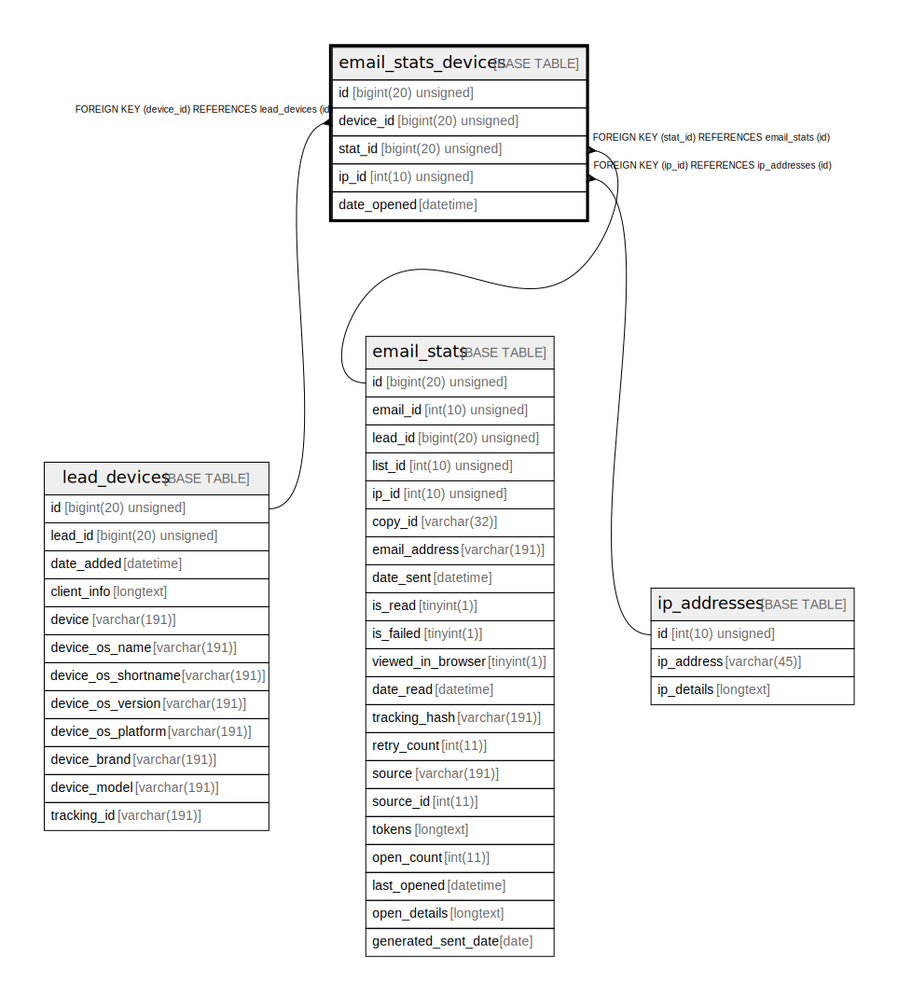

# email_stats_devices

## Description

<details>
<summary><strong>Table Definition</strong></summary>

```sql
CREATE TABLE `email_stats_devices` (
  `id` bigint(20) unsigned NOT NULL AUTO_INCREMENT,
  `device_id` bigint(20) unsigned DEFAULT NULL,
  `stat_id` bigint(20) unsigned DEFAULT NULL,
  `ip_id` int(10) unsigned DEFAULT NULL,
  `date_opened` datetime NOT NULL,
  PRIMARY KEY (`id`),
  KEY `IDX_7A8A1C6F94A4C7D4` (`device_id`),
  KEY `IDX_7A8A1C6F9502F0B` (`stat_id`),
  KEY `IDX_7A8A1C6FA03F5E9F` (`ip_id`),
  KEY `date_opened_search` (`date_opened`),
  CONSTRAINT `FK_7A8A1C6F94A4C7D4` FOREIGN KEY (`device_id`) REFERENCES `lead_devices` (`id`) ON DELETE CASCADE,
  CONSTRAINT `FK_7A8A1C6F9502F0B` FOREIGN KEY (`stat_id`) REFERENCES `email_stats` (`id`) ON DELETE CASCADE,
  CONSTRAINT `FK_7A8A1C6FA03F5E9F` FOREIGN KEY (`ip_id`) REFERENCES `ip_addresses` (`id`)
) ENGINE=InnoDB DEFAULT CHARSET=utf8mb4 COLLATE=utf8mb4_unicode_ci ROW_FORMAT=DYNAMIC
```

</details>

## Columns

| Name | Type | Default | Nullable | Extra Definition | Children | Parents | Comment |
| ---- | ---- | ------- | -------- | --------------- | -------- | ------- | ------- |
| id | bigint(20) unsigned |  | false | auto_increment |  |  |  |
| device_id | bigint(20) unsigned | NULL | true |  |  | [lead_devices](lead_devices.md) |  |
| stat_id | bigint(20) unsigned | NULL | true |  |  | [email_stats](email_stats.md) |  |
| ip_id | int(10) unsigned | NULL | true |  |  | [ip_addresses](ip_addresses.md) |  |
| date_opened | datetime |  | false |  |  |  |  |

## Constraints

| Name | Type | Definition |
| ---- | ---- | ---------- |
| FK_7A8A1C6F94A4C7D4 | FOREIGN KEY | FOREIGN KEY (device_id) REFERENCES lead_devices (id) |
| FK_7A8A1C6F9502F0B | FOREIGN KEY | FOREIGN KEY (stat_id) REFERENCES email_stats (id) |
| FK_7A8A1C6FA03F5E9F | FOREIGN KEY | FOREIGN KEY (ip_id) REFERENCES ip_addresses (id) |
| PRIMARY | PRIMARY KEY | PRIMARY KEY (id) |

## Indexes

| Name | Definition |
| ---- | ---------- |
| date_opened_search | KEY date_opened_search (date_opened) USING BTREE |
| IDX_7A8A1C6F94A4C7D4 | KEY IDX_7A8A1C6F94A4C7D4 (device_id) USING BTREE |
| IDX_7A8A1C6F9502F0B | KEY IDX_7A8A1C6F9502F0B (stat_id) USING BTREE |
| IDX_7A8A1C6FA03F5E9F | KEY IDX_7A8A1C6FA03F5E9F (ip_id) USING BTREE |
| PRIMARY | PRIMARY KEY (id) USING BTREE |

## Relations



---

> Generated by [tbls](https://github.com/k1LoW/tbls)
