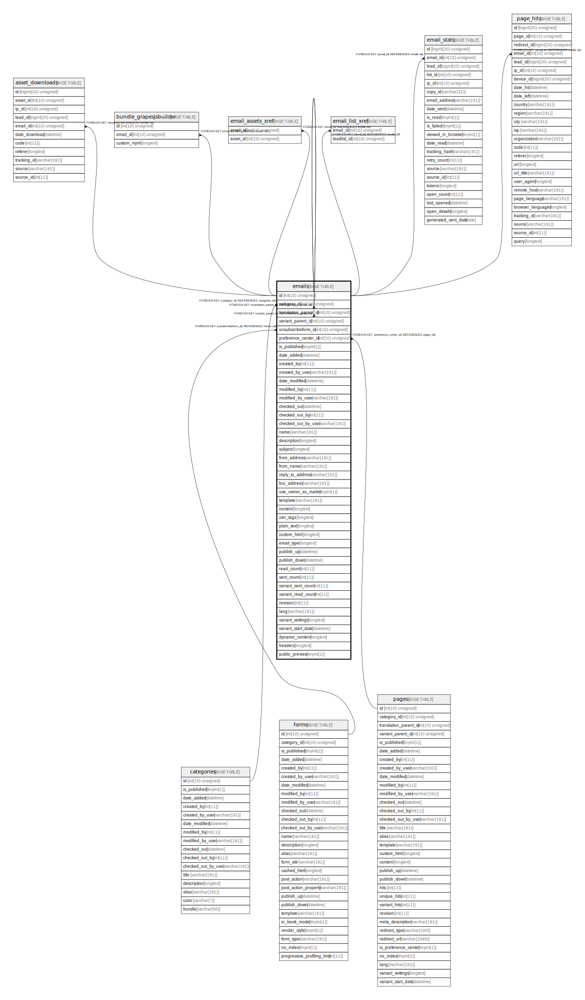

# emails

## Description

<details>
<summary><strong>Table Definition</strong></summary>

```sql
CREATE TABLE `emails` (
  `id` int(10) unsigned NOT NULL AUTO_INCREMENT,
  `category_id` int(10) unsigned DEFAULT NULL,
  `translation_parent_id` int(10) unsigned DEFAULT NULL,
  `variant_parent_id` int(10) unsigned DEFAULT NULL,
  `unsubscribeform_id` int(10) unsigned DEFAULT NULL,
  `preference_center_id` int(10) unsigned DEFAULT NULL,
  `is_published` tinyint(1) NOT NULL,
  `date_added` datetime DEFAULT NULL,
  `created_by` int(11) DEFAULT NULL,
  `created_by_user` varchar(191) COLLATE utf8mb4_unicode_ci DEFAULT NULL,
  `date_modified` datetime DEFAULT NULL,
  `modified_by` int(11) DEFAULT NULL,
  `modified_by_user` varchar(191) COLLATE utf8mb4_unicode_ci DEFAULT NULL,
  `checked_out` datetime DEFAULT NULL,
  `checked_out_by` int(11) DEFAULT NULL,
  `checked_out_by_user` varchar(191) COLLATE utf8mb4_unicode_ci DEFAULT NULL,
  `name` varchar(191) COLLATE utf8mb4_unicode_ci NOT NULL,
  `description` longtext COLLATE utf8mb4_unicode_ci DEFAULT NULL,
  `subject` longtext COLLATE utf8mb4_unicode_ci DEFAULT NULL,
  `from_address` varchar(191) COLLATE utf8mb4_unicode_ci DEFAULT NULL,
  `from_name` varchar(191) COLLATE utf8mb4_unicode_ci DEFAULT NULL,
  `reply_to_address` varchar(191) COLLATE utf8mb4_unicode_ci DEFAULT NULL,
  `bcc_address` varchar(191) COLLATE utf8mb4_unicode_ci DEFAULT NULL,
  `use_owner_as_mailer` tinyint(1) DEFAULT NULL,
  `template` varchar(191) COLLATE utf8mb4_unicode_ci DEFAULT NULL,
  `content` longtext COLLATE utf8mb4_unicode_ci DEFAULT NULL COMMENT '(DC2Type:array)',
  `utm_tags` longtext COLLATE utf8mb4_unicode_ci DEFAULT NULL COMMENT '(DC2Type:array)',
  `plain_text` longtext COLLATE utf8mb4_unicode_ci DEFAULT NULL,
  `custom_html` longtext COLLATE utf8mb4_unicode_ci DEFAULT NULL,
  `email_type` longtext COLLATE utf8mb4_unicode_ci DEFAULT NULL,
  `publish_up` datetime DEFAULT NULL,
  `publish_down` datetime DEFAULT NULL,
  `read_count` int(11) NOT NULL,
  `sent_count` int(11) NOT NULL,
  `variant_sent_count` int(11) NOT NULL,
  `variant_read_count` int(11) NOT NULL,
  `revision` int(11) NOT NULL,
  `lang` varchar(191) COLLATE utf8mb4_unicode_ci NOT NULL,
  `variant_settings` longtext COLLATE utf8mb4_unicode_ci DEFAULT NULL COMMENT '(DC2Type:array)',
  `variant_start_date` datetime DEFAULT NULL,
  `dynamic_content` longtext COLLATE utf8mb4_unicode_ci DEFAULT NULL COMMENT '(DC2Type:array)',
  `headers` longtext COLLATE utf8mb4_unicode_ci NOT NULL COMMENT '(DC2Type:json_array)',
  `public_preview` tinyint(1) DEFAULT NULL,
  PRIMARY KEY (`id`),
  KEY `IDX_4C81E85212469DE2` (`category_id`),
  KEY `IDX_4C81E8529091A2FB` (`translation_parent_id`),
  KEY `IDX_4C81E85291861123` (`variant_parent_id`),
  KEY `IDX_4C81E8522DC494F6` (`unsubscribeform_id`),
  KEY `IDX_4C81E852834F9C5B` (`preference_center_id`),
  CONSTRAINT `FK_4C81E85212469DE2` FOREIGN KEY (`category_id`) REFERENCES `categories` (`id`) ON DELETE SET NULL,
  CONSTRAINT `FK_4C81E8522DC494F6` FOREIGN KEY (`unsubscribeform_id`) REFERENCES `forms` (`id`) ON DELETE SET NULL,
  CONSTRAINT `FK_4C81E852834F9C5B` FOREIGN KEY (`preference_center_id`) REFERENCES `pages` (`id`) ON DELETE SET NULL,
  CONSTRAINT `FK_4C81E8529091A2FB` FOREIGN KEY (`translation_parent_id`) REFERENCES `emails` (`id`) ON DELETE CASCADE,
  CONSTRAINT `FK_4C81E85291861123` FOREIGN KEY (`variant_parent_id`) REFERENCES `emails` (`id`) ON DELETE CASCADE
) ENGINE=InnoDB DEFAULT CHARSET=utf8mb4 COLLATE=utf8mb4_unicode_ci ROW_FORMAT=DYNAMIC
```

</details>

## Columns

| Name | Type | Default | Nullable | Extra Definition | Children | Parents | Comment |
| ---- | ---- | ------- | -------- | --------------- | -------- | ------- | ------- |
| id | int(10) unsigned |  | false | auto_increment | [asset_downloads](asset_downloads.md) [bundle_grapesjsbuilder](bundle_grapesjsbuilder.md) [emails](emails.md) [email_assets_xref](email_assets_xref.md) [email_list_xref](email_list_xref.md) [email_stats](email_stats.md) [page_hits](page_hits.md) |  |  |
| category_id | int(10) unsigned | NULL | true |  |  | [categories](categories.md) |  |
| translation_parent_id | int(10) unsigned | NULL | true |  |  | [emails](emails.md) |  |
| variant_parent_id | int(10) unsigned | NULL | true |  |  | [emails](emails.md) |  |
| unsubscribeform_id | int(10) unsigned | NULL | true |  |  | [forms](forms.md) |  |
| preference_center_id | int(10) unsigned | NULL | true |  |  | [pages](pages.md) |  |
| is_published | tinyint(1) |  | false |  |  |  |  |
| date_added | datetime | NULL | true |  |  |  |  |
| created_by | int(11) | NULL | true |  |  |  |  |
| created_by_user | varchar(191) | NULL | true |  |  |  |  |
| date_modified | datetime | NULL | true |  |  |  |  |
| modified_by | int(11) | NULL | true |  |  |  |  |
| modified_by_user | varchar(191) | NULL | true |  |  |  |  |
| checked_out | datetime | NULL | true |  |  |  |  |
| checked_out_by | int(11) | NULL | true |  |  |  |  |
| checked_out_by_user | varchar(191) | NULL | true |  |  |  |  |
| name | varchar(191) |  | false |  |  |  |  |
| description | longtext | NULL | true |  |  |  |  |
| subject | longtext | NULL | true |  |  |  |  |
| from_address | varchar(191) | NULL | true |  |  |  |  |
| from_name | varchar(191) | NULL | true |  |  |  |  |
| reply_to_address | varchar(191) | NULL | true |  |  |  |  |
| bcc_address | varchar(191) | NULL | true |  |  |  |  |
| use_owner_as_mailer | tinyint(1) | NULL | true |  |  |  |  |
| template | varchar(191) | NULL | true |  |  |  |  |
| content | longtext | NULL | true |  |  |  | (DC2Type:array) |
| utm_tags | longtext | NULL | true |  |  |  | (DC2Type:array) |
| plain_text | longtext | NULL | true |  |  |  |  |
| custom_html | longtext | NULL | true |  |  |  |  |
| email_type | longtext | NULL | true |  |  |  |  |
| publish_up | datetime | NULL | true |  |  |  |  |
| publish_down | datetime | NULL | true |  |  |  |  |
| read_count | int(11) |  | false |  |  |  |  |
| sent_count | int(11) |  | false |  |  |  |  |
| variant_sent_count | int(11) |  | false |  |  |  |  |
| variant_read_count | int(11) |  | false |  |  |  |  |
| revision | int(11) |  | false |  |  |  |  |
| lang | varchar(191) |  | false |  |  |  |  |
| variant_settings | longtext | NULL | true |  |  |  | (DC2Type:array) |
| variant_start_date | datetime | NULL | true |  |  |  |  |
| dynamic_content | longtext | NULL | true |  |  |  | (DC2Type:array) |
| headers | longtext |  | false |  |  |  | (DC2Type:json_array) |
| public_preview | tinyint(1) | NULL | true |  |  |  |  |

## Constraints

| Name | Type | Definition |
| ---- | ---- | ---------- |
| FK_4C81E85212469DE2 | FOREIGN KEY | FOREIGN KEY (category_id) REFERENCES categories (id) |
| FK_4C81E8522DC494F6 | FOREIGN KEY | FOREIGN KEY (unsubscribeform_id) REFERENCES forms (id) |
| FK_4C81E852834F9C5B | FOREIGN KEY | FOREIGN KEY (preference_center_id) REFERENCES pages (id) |
| FK_4C81E8529091A2FB | FOREIGN KEY | FOREIGN KEY (translation_parent_id) REFERENCES emails (id) |
| FK_4C81E85291861123 | FOREIGN KEY | FOREIGN KEY (variant_parent_id) REFERENCES emails (id) |
| PRIMARY | PRIMARY KEY | PRIMARY KEY (id) |

## Indexes

| Name | Definition |
| ---- | ---------- |
| IDX_4C81E85212469DE2 | KEY IDX_4C81E85212469DE2 (category_id) USING BTREE |
| IDX_4C81E8522DC494F6 | KEY IDX_4C81E8522DC494F6 (unsubscribeform_id) USING BTREE |
| IDX_4C81E852834F9C5B | KEY IDX_4C81E852834F9C5B (preference_center_id) USING BTREE |
| IDX_4C81E8529091A2FB | KEY IDX_4C81E8529091A2FB (translation_parent_id) USING BTREE |
| IDX_4C81E85291861123 | KEY IDX_4C81E85291861123 (variant_parent_id) USING BTREE |
| PRIMARY | PRIMARY KEY (id) USING BTREE |

## Relations



---

> Generated by [tbls](https://github.com/k1LoW/tbls)
