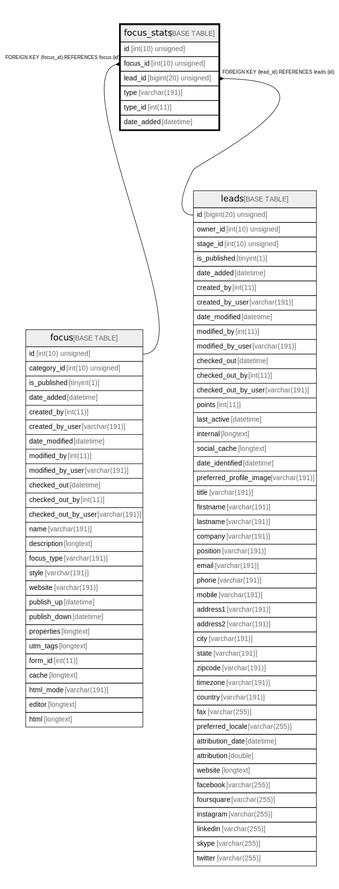

# focus_stats

## Description

<details>
<summary><strong>Table Definition</strong></summary>

```sql
CREATE TABLE `focus_stats` (
  `id` int(10) unsigned NOT NULL AUTO_INCREMENT,
  `focus_id` int(10) unsigned NOT NULL,
  `lead_id` bigint(20) unsigned DEFAULT NULL,
  `type` varchar(191) COLLATE utf8mb4_unicode_ci NOT NULL,
  `type_id` int(11) DEFAULT NULL,
  `date_added` datetime NOT NULL,
  PRIMARY KEY (`id`),
  KEY `IDX_C36970DC51804B42` (`focus_id`),
  KEY `IDX_C36970DC55458D` (`lead_id`),
  KEY `focus_type` (`type`),
  KEY `focus_type_id` (`type`,`type_id`),
  KEY `focus_date_added` (`date_added`),
  CONSTRAINT `FK_C36970DC51804B42` FOREIGN KEY (`focus_id`) REFERENCES `focus` (`id`) ON DELETE CASCADE,
  CONSTRAINT `FK_C36970DC55458D` FOREIGN KEY (`lead_id`) REFERENCES `leads` (`id`) ON DELETE SET NULL
) ENGINE=InnoDB DEFAULT CHARSET=utf8mb4 COLLATE=utf8mb4_unicode_ci ROW_FORMAT=DYNAMIC
```

</details>

## Columns

| Name | Type | Default | Nullable | Extra Definition | Children | Parents | Comment |
| ---- | ---- | ------- | -------- | --------------- | -------- | ------- | ------- |
| id | int(10) unsigned |  | false | auto_increment |  |  |  |
| focus_id | int(10) unsigned |  | false |  |  | [focus](focus.md) |  |
| lead_id | bigint(20) unsigned | NULL | true |  |  | [leads](leads.md) |  |
| type | varchar(191) |  | false |  |  |  |  |
| type_id | int(11) | NULL | true |  |  |  |  |
| date_added | datetime |  | false |  |  |  |  |

## Constraints

| Name | Type | Definition |
| ---- | ---- | ---------- |
| FK_C36970DC51804B42 | FOREIGN KEY | FOREIGN KEY (focus_id) REFERENCES focus (id) |
| FK_C36970DC55458D | FOREIGN KEY | FOREIGN KEY (lead_id) REFERENCES leads (id) |
| PRIMARY | PRIMARY KEY | PRIMARY KEY (id) |

## Indexes

| Name | Definition |
| ---- | ---------- |
| focus_date_added | KEY focus_date_added (date_added) USING BTREE |
| focus_type | KEY focus_type (type) USING BTREE |
| focus_type_id | KEY focus_type_id (type, type_id) USING BTREE |
| IDX_C36970DC51804B42 | KEY IDX_C36970DC51804B42 (focus_id) USING BTREE |
| IDX_C36970DC55458D | KEY IDX_C36970DC55458D (lead_id) USING BTREE |
| PRIMARY | PRIMARY KEY (id) USING BTREE |

## Relations



---

> Generated by [tbls](https://github.com/k1LoW/tbls)
