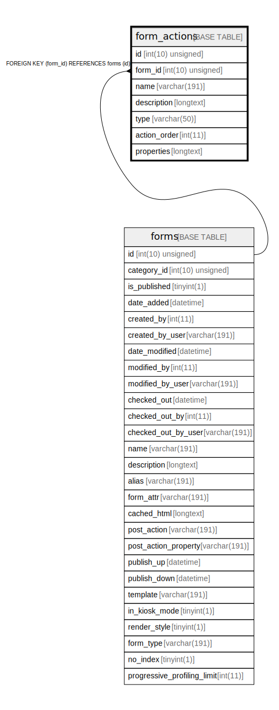

# form_actions

## Description

<details>
<summary><strong>Table Definition</strong></summary>

```sql
CREATE TABLE `form_actions` (
  `id` int(10) unsigned NOT NULL AUTO_INCREMENT,
  `form_id` int(10) unsigned NOT NULL,
  `name` varchar(191) COLLATE utf8mb4_unicode_ci NOT NULL,
  `description` longtext COLLATE utf8mb4_unicode_ci DEFAULT NULL,
  `type` varchar(50) COLLATE utf8mb4_unicode_ci NOT NULL,
  `action_order` int(11) NOT NULL,
  `properties` longtext COLLATE utf8mb4_unicode_ci NOT NULL COMMENT '(DC2Type:array)',
  PRIMARY KEY (`id`),
  KEY `IDX_342491D45FF69B7D` (`form_id`),
  KEY `form_action_type_search` (`type`),
  CONSTRAINT `FK_342491D45FF69B7D` FOREIGN KEY (`form_id`) REFERENCES `forms` (`id`) ON DELETE CASCADE
) ENGINE=InnoDB DEFAULT CHARSET=utf8mb4 COLLATE=utf8mb4_unicode_ci ROW_FORMAT=DYNAMIC
```

</details>

## Columns

| Name | Type | Default | Nullable | Extra Definition | Children | Parents | Comment |
| ---- | ---- | ------- | -------- | --------------- | -------- | ------- | ------- |
| id | int(10) unsigned |  | false | auto_increment |  |  |  |
| form_id | int(10) unsigned |  | false |  |  | [forms](forms.md) |  |
| name | varchar(191) |  | false |  |  |  |  |
| description | longtext | NULL | true |  |  |  |  |
| type | varchar(50) |  | false |  |  |  |  |
| action_order | int(11) |  | false |  |  |  |  |
| properties | longtext |  | false |  |  |  | (DC2Type:array) |

## Constraints

| Name | Type | Definition |
| ---- | ---- | ---------- |
| FK_342491D45FF69B7D | FOREIGN KEY | FOREIGN KEY (form_id) REFERENCES forms (id) |
| PRIMARY | PRIMARY KEY | PRIMARY KEY (id) |

## Indexes

| Name | Definition |
| ---- | ---------- |
| form_action_type_search | KEY form_action_type_search (type) USING BTREE |
| IDX_342491D45FF69B7D | KEY IDX_342491D45FF69B7D (form_id) USING BTREE |
| PRIMARY | PRIMARY KEY (id) USING BTREE |

## Relations



---

> Generated by [tbls](https://github.com/k1LoW/tbls)
