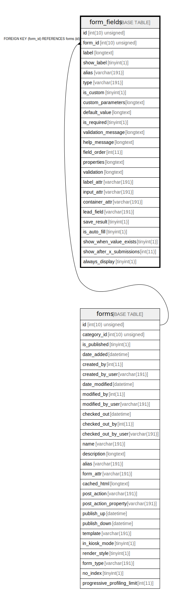

# form_fields

## Description

<details>
<summary><strong>Table Definition</strong></summary>

```sql
CREATE TABLE `form_fields` (
  `id` int(10) unsigned NOT NULL AUTO_INCREMENT,
  `form_id` int(10) unsigned NOT NULL,
  `label` longtext COLLATE utf8mb4_unicode_ci NOT NULL,
  `show_label` tinyint(1) DEFAULT NULL,
  `alias` varchar(191) COLLATE utf8mb4_unicode_ci NOT NULL,
  `type` varchar(191) COLLATE utf8mb4_unicode_ci NOT NULL,
  `is_custom` tinyint(1) NOT NULL,
  `custom_parameters` longtext COLLATE utf8mb4_unicode_ci DEFAULT NULL COMMENT '(DC2Type:array)',
  `default_value` longtext COLLATE utf8mb4_unicode_ci DEFAULT NULL,
  `is_required` tinyint(1) NOT NULL,
  `validation_message` longtext COLLATE utf8mb4_unicode_ci DEFAULT NULL,
  `help_message` longtext COLLATE utf8mb4_unicode_ci DEFAULT NULL,
  `field_order` int(11) DEFAULT NULL,
  `properties` longtext COLLATE utf8mb4_unicode_ci DEFAULT NULL COMMENT '(DC2Type:array)',
  `validation` longtext COLLATE utf8mb4_unicode_ci DEFAULT NULL COMMENT '(DC2Type:json_array)',
  `label_attr` varchar(191) COLLATE utf8mb4_unicode_ci DEFAULT NULL,
  `input_attr` varchar(191) COLLATE utf8mb4_unicode_ci DEFAULT NULL,
  `container_attr` varchar(191) COLLATE utf8mb4_unicode_ci DEFAULT NULL,
  `lead_field` varchar(191) COLLATE utf8mb4_unicode_ci DEFAULT NULL,
  `save_result` tinyint(1) DEFAULT NULL,
  `is_auto_fill` tinyint(1) DEFAULT NULL,
  `show_when_value_exists` tinyint(1) DEFAULT NULL,
  `show_after_x_submissions` int(11) DEFAULT NULL,
  `always_display` tinyint(1) DEFAULT NULL,
  PRIMARY KEY (`id`),
  KEY `IDX_7C0B37265FF69B7D` (`form_id`),
  KEY `form_field_type_search` (`type`),
  CONSTRAINT `FK_7C0B37265FF69B7D` FOREIGN KEY (`form_id`) REFERENCES `forms` (`id`) ON DELETE CASCADE
) ENGINE=InnoDB DEFAULT CHARSET=utf8mb4 COLLATE=utf8mb4_unicode_ci ROW_FORMAT=DYNAMIC
```

</details>

## Columns

| Name | Type | Default | Nullable | Extra Definition | Children | Parents | Comment |
| ---- | ---- | ------- | -------- | --------------- | -------- | ------- | ------- |
| id | int(10) unsigned |  | false | auto_increment |  |  |  |
| form_id | int(10) unsigned |  | false |  |  | [forms](forms.md) |  |
| label | longtext |  | false |  |  |  |  |
| show_label | tinyint(1) | NULL | true |  |  |  |  |
| alias | varchar(191) |  | false |  |  |  |  |
| type | varchar(191) |  | false |  |  |  |  |
| is_custom | tinyint(1) |  | false |  |  |  |  |
| custom_parameters | longtext | NULL | true |  |  |  | (DC2Type:array) |
| default_value | longtext | NULL | true |  |  |  |  |
| is_required | tinyint(1) |  | false |  |  |  |  |
| validation_message | longtext | NULL | true |  |  |  |  |
| help_message | longtext | NULL | true |  |  |  |  |
| field_order | int(11) | NULL | true |  |  |  |  |
| properties | longtext | NULL | true |  |  |  | (DC2Type:array) |
| validation | longtext | NULL | true |  |  |  | (DC2Type:json_array) |
| label_attr | varchar(191) | NULL | true |  |  |  |  |
| input_attr | varchar(191) | NULL | true |  |  |  |  |
| container_attr | varchar(191) | NULL | true |  |  |  |  |
| lead_field | varchar(191) | NULL | true |  |  |  |  |
| save_result | tinyint(1) | NULL | true |  |  |  |  |
| is_auto_fill | tinyint(1) | NULL | true |  |  |  |  |
| show_when_value_exists | tinyint(1) | NULL | true |  |  |  |  |
| show_after_x_submissions | int(11) | NULL | true |  |  |  |  |
| always_display | tinyint(1) | NULL | true |  |  |  |  |

## Constraints

| Name | Type | Definition |
| ---- | ---- | ---------- |
| FK_7C0B37265FF69B7D | FOREIGN KEY | FOREIGN KEY (form_id) REFERENCES forms (id) |
| PRIMARY | PRIMARY KEY | PRIMARY KEY (id) |

## Indexes

| Name | Definition |
| ---- | ---------- |
| form_field_type_search | KEY form_field_type_search (type) USING BTREE |
| IDX_7C0B37265FF69B7D | KEY IDX_7C0B37265FF69B7D (form_id) USING BTREE |
| PRIMARY | PRIMARY KEY (id) USING BTREE |

## Relations



---

> Generated by [tbls](https://github.com/k1LoW/tbls)
