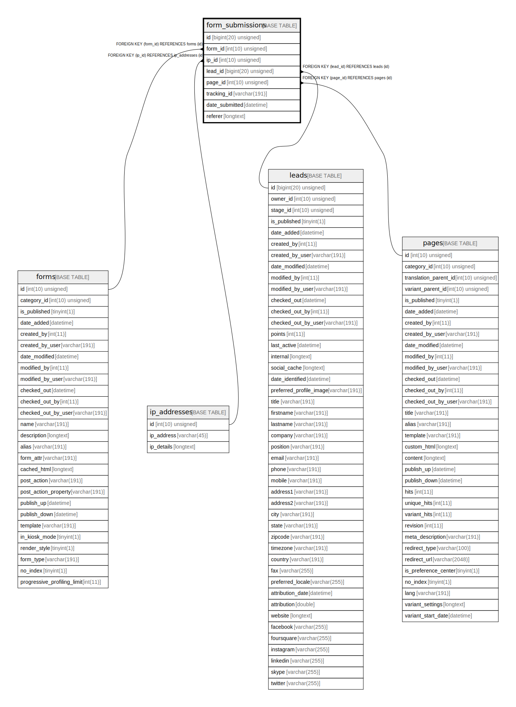

# form_submissions

## Description

<details>
<summary><strong>Table Definition</strong></summary>

```sql
CREATE TABLE `form_submissions` (
  `id` bigint(20) unsigned NOT NULL AUTO_INCREMENT,
  `form_id` int(10) unsigned NOT NULL,
  `ip_id` int(10) unsigned NOT NULL,
  `lead_id` bigint(20) unsigned DEFAULT NULL,
  `page_id` int(10) unsigned DEFAULT NULL,
  `tracking_id` varchar(191) COLLATE utf8mb4_unicode_ci DEFAULT NULL,
  `date_submitted` datetime NOT NULL,
  `referer` longtext COLLATE utf8mb4_unicode_ci NOT NULL,
  PRIMARY KEY (`id`),
  KEY `IDX_C80AF9E65FF69B7D` (`form_id`),
  KEY `IDX_C80AF9E6A03F5E9F` (`ip_id`),
  KEY `IDX_C80AF9E655458D` (`lead_id`),
  KEY `IDX_C80AF9E6C4663E4` (`page_id`),
  KEY `form_submission_tracking_search` (`tracking_id`),
  KEY `form_date_submitted` (`date_submitted`),
  CONSTRAINT `FK_C80AF9E655458D` FOREIGN KEY (`lead_id`) REFERENCES `leads` (`id`) ON DELETE SET NULL,
  CONSTRAINT `FK_C80AF9E65FF69B7D` FOREIGN KEY (`form_id`) REFERENCES `forms` (`id`) ON DELETE CASCADE,
  CONSTRAINT `FK_C80AF9E6A03F5E9F` FOREIGN KEY (`ip_id`) REFERENCES `ip_addresses` (`id`),
  CONSTRAINT `FK_C80AF9E6C4663E4` FOREIGN KEY (`page_id`) REFERENCES `pages` (`id`) ON DELETE SET NULL
) ENGINE=InnoDB DEFAULT CHARSET=utf8mb4 COLLATE=utf8mb4_unicode_ci ROW_FORMAT=DYNAMIC
```

</details>

## Columns

| Name | Type | Default | Nullable | Extra Definition | Children | Parents | Comment |
| ---- | ---- | ------- | -------- | --------------- | -------- | ------- | ------- |
| id | bigint(20) unsigned |  | false | auto_increment |  |  |  |
| form_id | int(10) unsigned |  | false |  |  | [forms](forms.md) |  |
| ip_id | int(10) unsigned |  | false |  |  | [ip_addresses](ip_addresses.md) |  |
| lead_id | bigint(20) unsigned | NULL | true |  |  | [leads](leads.md) |  |
| page_id | int(10) unsigned | NULL | true |  |  | [pages](pages.md) |  |
| tracking_id | varchar(191) | NULL | true |  |  |  |  |
| date_submitted | datetime |  | false |  |  |  |  |
| referer | longtext |  | false |  |  |  |  |

## Constraints

| Name | Type | Definition |
| ---- | ---- | ---------- |
| FK_C80AF9E655458D | FOREIGN KEY | FOREIGN KEY (lead_id) REFERENCES leads (id) |
| FK_C80AF9E65FF69B7D | FOREIGN KEY | FOREIGN KEY (form_id) REFERENCES forms (id) |
| FK_C80AF9E6A03F5E9F | FOREIGN KEY | FOREIGN KEY (ip_id) REFERENCES ip_addresses (id) |
| FK_C80AF9E6C4663E4 | FOREIGN KEY | FOREIGN KEY (page_id) REFERENCES pages (id) |
| PRIMARY | PRIMARY KEY | PRIMARY KEY (id) |

## Indexes

| Name | Definition |
| ---- | ---------- |
| form_date_submitted | KEY form_date_submitted (date_submitted) USING BTREE |
| form_submission_tracking_search | KEY form_submission_tracking_search (tracking_id) USING BTREE |
| IDX_C80AF9E655458D | KEY IDX_C80AF9E655458D (lead_id) USING BTREE |
| IDX_C80AF9E65FF69B7D | KEY IDX_C80AF9E65FF69B7D (form_id) USING BTREE |
| IDX_C80AF9E6A03F5E9F | KEY IDX_C80AF9E6A03F5E9F (ip_id) USING BTREE |
| IDX_C80AF9E6C4663E4 | KEY IDX_C80AF9E6C4663E4 (page_id) USING BTREE |
| PRIMARY | PRIMARY KEY (id) USING BTREE |

## Relations



---

> Generated by [tbls](https://github.com/k1LoW/tbls)
