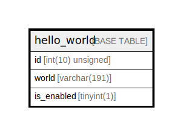

# hello_world

## Description

<details>
<summary><strong>Table Definition</strong></summary>

```sql
CREATE TABLE `hello_world` (
  `id` int(10) unsigned NOT NULL AUTO_INCREMENT,
  `world` varchar(191) COLLATE utf8mb4_unicode_ci NOT NULL,
  `is_enabled` tinyint(1) NOT NULL,
  PRIMARY KEY (`id`),
  KEY `is_enabled` (`is_enabled`)
) ENGINE=InnoDB DEFAULT CHARSET=utf8mb4 COLLATE=utf8mb4_unicode_ci ROW_FORMAT=DYNAMIC
```

</details>

## Columns

| Name | Type | Default | Nullable | Extra Definition | Children | Parents | Comment |
| ---- | ---- | ------- | -------- | --------------- | -------- | ------- | ------- |
| id | int(10) unsigned |  | false | auto_increment |  |  |  |
| world | varchar(191) |  | false |  |  |  |  |
| is_enabled | tinyint(1) |  | false |  |  |  |  |

## Constraints

| Name | Type | Definition |
| ---- | ---- | ---------- |
| PRIMARY | PRIMARY KEY | PRIMARY KEY (id) |

## Indexes

| Name | Definition |
| ---- | ---------- |
| is_enabled | KEY is_enabled (is_enabled) USING BTREE |
| PRIMARY | PRIMARY KEY (id) USING BTREE |

## Relations



---

> Generated by [tbls](https://github.com/k1LoW/tbls)
