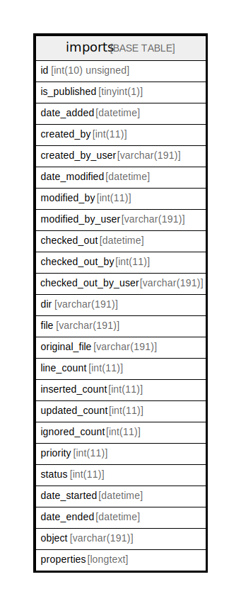

# imports

## Description

<details>
<summary><strong>Table Definition</strong></summary>

```sql
CREATE TABLE `imports` (
  `id` int(10) unsigned NOT NULL AUTO_INCREMENT,
  `is_published` tinyint(1) NOT NULL,
  `date_added` datetime DEFAULT NULL,
  `created_by` int(11) DEFAULT NULL,
  `created_by_user` varchar(191) COLLATE utf8mb4_unicode_ci DEFAULT NULL,
  `date_modified` datetime DEFAULT NULL,
  `modified_by` int(11) DEFAULT NULL,
  `modified_by_user` varchar(191) COLLATE utf8mb4_unicode_ci DEFAULT NULL,
  `checked_out` datetime DEFAULT NULL,
  `checked_out_by` int(11) DEFAULT NULL,
  `checked_out_by_user` varchar(191) COLLATE utf8mb4_unicode_ci DEFAULT NULL,
  `dir` varchar(191) COLLATE utf8mb4_unicode_ci NOT NULL,
  `file` varchar(191) COLLATE utf8mb4_unicode_ci NOT NULL,
  `original_file` varchar(191) COLLATE utf8mb4_unicode_ci DEFAULT NULL,
  `line_count` int(11) NOT NULL,
  `inserted_count` int(11) NOT NULL,
  `updated_count` int(11) NOT NULL,
  `ignored_count` int(11) NOT NULL,
  `priority` int(11) NOT NULL,
  `status` int(11) NOT NULL,
  `date_started` datetime DEFAULT NULL,
  `date_ended` datetime DEFAULT NULL,
  `object` varchar(191) COLLATE utf8mb4_unicode_ci NOT NULL,
  `properties` longtext COLLATE utf8mb4_unicode_ci DEFAULT NULL COMMENT '(DC2Type:json_array)',
  PRIMARY KEY (`id`),
  KEY `import_object` (`object`),
  KEY `import_status` (`status`),
  KEY `import_priority` (`priority`)
) ENGINE=InnoDB DEFAULT CHARSET=utf8mb4 COLLATE=utf8mb4_unicode_ci ROW_FORMAT=DYNAMIC
```

</details>

## Columns

| Name | Type | Default | Nullable | Extra Definition | Children | Parents | Comment |
| ---- | ---- | ------- | -------- | --------------- | -------- | ------- | ------- |
| id | int(10) unsigned |  | false | auto_increment |  |  |  |
| is_published | tinyint(1) |  | false |  |  |  |  |
| date_added | datetime | NULL | true |  |  |  |  |
| created_by | int(11) | NULL | true |  |  |  |  |
| created_by_user | varchar(191) | NULL | true |  |  |  |  |
| date_modified | datetime | NULL | true |  |  |  |  |
| modified_by | int(11) | NULL | true |  |  |  |  |
| modified_by_user | varchar(191) | NULL | true |  |  |  |  |
| checked_out | datetime | NULL | true |  |  |  |  |
| checked_out_by | int(11) | NULL | true |  |  |  |  |
| checked_out_by_user | varchar(191) | NULL | true |  |  |  |  |
| dir | varchar(191) |  | false |  |  |  |  |
| file | varchar(191) |  | false |  |  |  |  |
| original_file | varchar(191) | NULL | true |  |  |  |  |
| line_count | int(11) |  | false |  |  |  |  |
| inserted_count | int(11) |  | false |  |  |  |  |
| updated_count | int(11) |  | false |  |  |  |  |
| ignored_count | int(11) |  | false |  |  |  |  |
| priority | int(11) |  | false |  |  |  |  |
| status | int(11) |  | false |  |  |  |  |
| date_started | datetime | NULL | true |  |  |  |  |
| date_ended | datetime | NULL | true |  |  |  |  |
| object | varchar(191) |  | false |  |  |  |  |
| properties | longtext | NULL | true |  |  |  | (DC2Type:json_array) |

## Constraints

| Name | Type | Definition |
| ---- | ---- | ---------- |
| PRIMARY | PRIMARY KEY | PRIMARY KEY (id) |

## Indexes

| Name | Definition |
| ---- | ---------- |
| import_object | KEY import_object (object) USING BTREE |
| import_priority | KEY import_priority (priority) USING BTREE |
| import_status | KEY import_status (status) USING BTREE |
| PRIMARY | PRIMARY KEY (id) USING BTREE |

## Relations



---

> Generated by [tbls](https://github.com/k1LoW/tbls)
