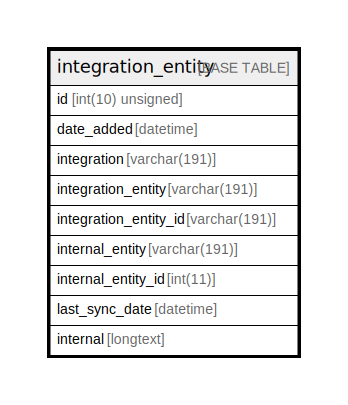

# integration_entity

## Description

<details>
<summary><strong>Table Definition</strong></summary>

```sql
CREATE TABLE `integration_entity` (
  `id` int(10) unsigned NOT NULL AUTO_INCREMENT,
  `date_added` datetime NOT NULL,
  `integration` varchar(191) COLLATE utf8mb4_unicode_ci DEFAULT NULL,
  `integration_entity` varchar(191) COLLATE utf8mb4_unicode_ci DEFAULT NULL,
  `integration_entity_id` varchar(191) COLLATE utf8mb4_unicode_ci DEFAULT NULL,
  `internal_entity` varchar(191) COLLATE utf8mb4_unicode_ci DEFAULT NULL,
  `internal_entity_id` int(11) DEFAULT NULL,
  `last_sync_date` datetime DEFAULT NULL,
  `internal` longtext COLLATE utf8mb4_unicode_ci DEFAULT NULL COMMENT '(DC2Type:array)',
  PRIMARY KEY (`id`),
  KEY `integration_external_entity` (`integration`,`integration_entity`,`integration_entity_id`),
  KEY `integration_internal_entity` (`integration`,`internal_entity`,`internal_entity_id`),
  KEY `integration_entity_match` (`integration`,`internal_entity`,`integration_entity`),
  KEY `integration_last_sync_date` (`integration`,`last_sync_date`),
  KEY `internal_integration_entity` (`internal_entity_id`,`integration_entity_id`,`internal_entity`,`integration_entity`)
) ENGINE=InnoDB DEFAULT CHARSET=utf8mb4 COLLATE=utf8mb4_unicode_ci ROW_FORMAT=DYNAMIC
```

</details>

## Columns

| Name | Type | Default | Nullable | Extra Definition | Children | Parents | Comment |
| ---- | ---- | ------- | -------- | --------------- | -------- | ------- | ------- |
| id | int(10) unsigned |  | false | auto_increment |  |  |  |
| date_added | datetime |  | false |  |  |  |  |
| integration | varchar(191) | NULL | true |  |  |  |  |
| integration_entity | varchar(191) | NULL | true |  |  |  |  |
| integration_entity_id | varchar(191) | NULL | true |  |  |  |  |
| internal_entity | varchar(191) | NULL | true |  |  |  |  |
| internal_entity_id | int(11) | NULL | true |  |  |  |  |
| last_sync_date | datetime | NULL | true |  |  |  |  |
| internal | longtext | NULL | true |  |  |  | (DC2Type:array) |

## Constraints

| Name | Type | Definition |
| ---- | ---- | ---------- |
| PRIMARY | PRIMARY KEY | PRIMARY KEY (id) |

## Indexes

| Name | Definition |
| ---- | ---------- |
| integration_entity_match | KEY integration_entity_match (integration, internal_entity, integration_entity) USING BTREE |
| integration_external_entity | KEY integration_external_entity (integration, integration_entity, integration_entity_id) USING BTREE |
| integration_internal_entity | KEY integration_internal_entity (integration, internal_entity, internal_entity_id) USING BTREE |
| integration_last_sync_date | KEY integration_last_sync_date (integration, last_sync_date) USING BTREE |
| internal_integration_entity | KEY internal_integration_entity (internal_entity_id, integration_entity_id, internal_entity, integration_entity) USING BTREE |
| PRIMARY | PRIMARY KEY (id) USING BTREE |

## Relations



---

> Generated by [tbls](https://github.com/k1LoW/tbls)
