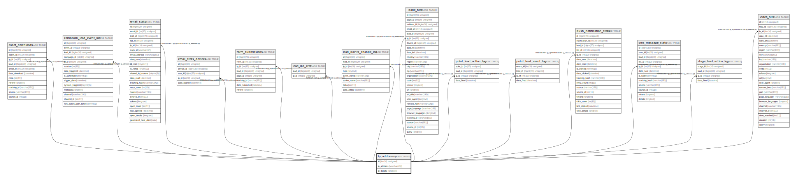

# ip_addresses

## Description

<details>
<summary><strong>Table Definition</strong></summary>

```sql
CREATE TABLE `ip_addresses` (
  `id` int(10) unsigned NOT NULL AUTO_INCREMENT,
  `ip_address` varchar(45) COLLATE utf8mb4_unicode_ci NOT NULL,
  `ip_details` longtext COLLATE utf8mb4_unicode_ci DEFAULT NULL COMMENT '(DC2Type:array)',
  PRIMARY KEY (`id`),
  KEY `ip_search` (`ip_address`)
) ENGINE=InnoDB DEFAULT CHARSET=utf8mb4 COLLATE=utf8mb4_unicode_ci ROW_FORMAT=DYNAMIC
```

</details>

## Columns

| Name | Type | Default | Nullable | Extra Definition | Children | Parents | Comment |
| ---- | ---- | ------- | -------- | --------------- | -------- | ------- | ------- |
| id | int(10) unsigned |  | false | auto_increment | [asset_downloads](asset_downloads.md) [campaign_lead_event_log](campaign_lead_event_log.md) [email_stats](email_stats.md) [email_stats_devices](email_stats_devices.md) [form_submissions](form_submissions.md) [lead_ips_xref](lead_ips_xref.md) [lead_points_change_log](lead_points_change_log.md) [page_hits](page_hits.md) [point_lead_action_log](point_lead_action_log.md) [point_lead_event_log](point_lead_event_log.md) [push_notification_stats](push_notification_stats.md) [sms_message_stats](sms_message_stats.md) [stage_lead_action_log](stage_lead_action_log.md) [video_hits](video_hits.md) |  |  |
| ip_address | varchar(45) |  | false |  |  |  |  |
| ip_details | longtext | NULL | true |  |  |  | (DC2Type:array) |

## Constraints

| Name | Type | Definition |
| ---- | ---- | ---------- |
| PRIMARY | PRIMARY KEY | PRIMARY KEY (id) |

## Indexes

| Name | Definition |
| ---- | ---------- |
| ip_search | KEY ip_search (ip_address) USING BTREE |
| PRIMARY | PRIMARY KEY (id) USING BTREE |

## Relations



---

> Generated by [tbls](https://github.com/k1LoW/tbls)
