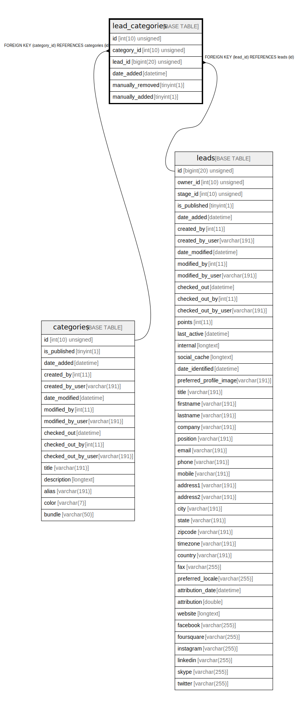

# lead_categories

## Description

<details>
<summary><strong>Table Definition</strong></summary>

```sql
CREATE TABLE `lead_categories` (
  `id` int(10) unsigned NOT NULL AUTO_INCREMENT,
  `category_id` int(10) unsigned NOT NULL,
  `lead_id` bigint(20) unsigned NOT NULL,
  `date_added` datetime NOT NULL,
  `manually_removed` tinyint(1) NOT NULL,
  `manually_added` tinyint(1) NOT NULL,
  PRIMARY KEY (`id`),
  KEY `IDX_12685DF412469DE2` (`category_id`),
  KEY `IDX_12685DF455458D` (`lead_id`),
  CONSTRAINT `FK_12685DF412469DE2` FOREIGN KEY (`category_id`) REFERENCES `categories` (`id`) ON DELETE CASCADE,
  CONSTRAINT `FK_12685DF455458D` FOREIGN KEY (`lead_id`) REFERENCES `leads` (`id`) ON DELETE CASCADE
) ENGINE=InnoDB DEFAULT CHARSET=utf8mb4 COLLATE=utf8mb4_unicode_ci ROW_FORMAT=DYNAMIC
```

</details>

## Columns

| Name | Type | Default | Nullable | Extra Definition | Children | Parents | Comment |
| ---- | ---- | ------- | -------- | --------------- | -------- | ------- | ------- |
| id | int(10) unsigned |  | false | auto_increment |  |  |  |
| category_id | int(10) unsigned |  | false |  |  | [categories](categories.md) |  |
| lead_id | bigint(20) unsigned |  | false |  |  | [leads](leads.md) |  |
| date_added | datetime |  | false |  |  |  |  |
| manually_removed | tinyint(1) |  | false |  |  |  |  |
| manually_added | tinyint(1) |  | false |  |  |  |  |

## Constraints

| Name | Type | Definition |
| ---- | ---- | ---------- |
| FK_12685DF412469DE2 | FOREIGN KEY | FOREIGN KEY (category_id) REFERENCES categories (id) |
| FK_12685DF455458D | FOREIGN KEY | FOREIGN KEY (lead_id) REFERENCES leads (id) |
| PRIMARY | PRIMARY KEY | PRIMARY KEY (id) |

## Indexes

| Name | Definition |
| ---- | ---------- |
| IDX_12685DF412469DE2 | KEY IDX_12685DF412469DE2 (category_id) USING BTREE |
| IDX_12685DF455458D | KEY IDX_12685DF455458D (lead_id) USING BTREE |
| PRIMARY | PRIMARY KEY (id) USING BTREE |

## Relations



---

> Generated by [tbls](https://github.com/k1LoW/tbls)
