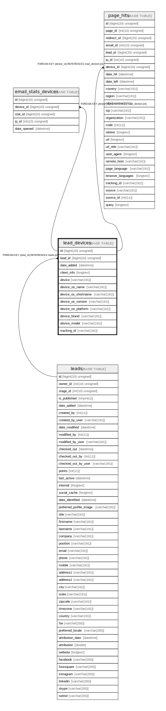

# lead_devices

## Description

<details>
<summary><strong>Table Definition</strong></summary>

```sql
CREATE TABLE `lead_devices` (
  `id` bigint(20) unsigned NOT NULL AUTO_INCREMENT,
  `lead_id` bigint(20) unsigned NOT NULL,
  `date_added` datetime NOT NULL,
  `client_info` longtext COLLATE utf8mb4_unicode_ci DEFAULT NULL COMMENT '(DC2Type:array)',
  `device` varchar(191) COLLATE utf8mb4_unicode_ci DEFAULT NULL,
  `device_os_name` varchar(191) COLLATE utf8mb4_unicode_ci DEFAULT NULL,
  `device_os_shortname` varchar(191) COLLATE utf8mb4_unicode_ci DEFAULT NULL,
  `device_os_version` varchar(191) COLLATE utf8mb4_unicode_ci DEFAULT NULL,
  `device_os_platform` varchar(191) COLLATE utf8mb4_unicode_ci DEFAULT NULL,
  `device_brand` varchar(191) COLLATE utf8mb4_unicode_ci DEFAULT NULL,
  `device_model` varchar(191) COLLATE utf8mb4_unicode_ci DEFAULT NULL,
  `tracking_id` varchar(191) COLLATE utf8mb4_unicode_ci DEFAULT NULL,
  PRIMARY KEY (`id`),
  UNIQUE KEY `UNIQ_48C912F47D05ABBE` (`tracking_id`),
  KEY `IDX_48C912F455458D` (`lead_id`),
  KEY `date_added_search` (`date_added`),
  KEY `device_search` (`device`),
  KEY `device_os_name_search` (`device_os_name`),
  KEY `device_os_shortname_search` (`device_os_shortname`),
  KEY `device_os_version_search` (`device_os_version`),
  KEY `device_os_platform_search` (`device_os_platform`),
  KEY `device_brand_search` (`device_brand`),
  KEY `device_model_search` (`device_model`),
  CONSTRAINT `FK_48C912F455458D` FOREIGN KEY (`lead_id`) REFERENCES `leads` (`id`) ON DELETE CASCADE
) ENGINE=InnoDB DEFAULT CHARSET=utf8mb4 COLLATE=utf8mb4_unicode_ci ROW_FORMAT=DYNAMIC
```

</details>

## Columns

| Name | Type | Default | Nullable | Extra Definition | Children | Parents | Comment |
| ---- | ---- | ------- | -------- | --------------- | -------- | ------- | ------- |
| id | bigint(20) unsigned |  | false | auto_increment | [email_stats_devices](email_stats_devices.md) [page_hits](page_hits.md) |  |  |
| lead_id | bigint(20) unsigned |  | false |  |  | [leads](leads.md) |  |
| date_added | datetime |  | false |  |  |  |  |
| client_info | longtext | NULL | true |  |  |  | (DC2Type:array) |
| device | varchar(191) | NULL | true |  |  |  |  |
| device_os_name | varchar(191) | NULL | true |  |  |  |  |
| device_os_shortname | varchar(191) | NULL | true |  |  |  |  |
| device_os_version | varchar(191) | NULL | true |  |  |  |  |
| device_os_platform | varchar(191) | NULL | true |  |  |  |  |
| device_brand | varchar(191) | NULL | true |  |  |  |  |
| device_model | varchar(191) | NULL | true |  |  |  |  |
| tracking_id | varchar(191) | NULL | true |  |  |  |  |

## Constraints

| Name | Type | Definition |
| ---- | ---- | ---------- |
| FK_48C912F455458D | FOREIGN KEY | FOREIGN KEY (lead_id) REFERENCES leads (id) |
| PRIMARY | PRIMARY KEY | PRIMARY KEY (id) |
| UNIQ_48C912F47D05ABBE | UNIQUE | UNIQUE KEY UNIQ_48C912F47D05ABBE (tracking_id) |

## Indexes

| Name | Definition |
| ---- | ---------- |
| date_added_search | KEY date_added_search (date_added) USING BTREE |
| device_brand_search | KEY device_brand_search (device_brand) USING BTREE |
| device_model_search | KEY device_model_search (device_model) USING BTREE |
| device_os_name_search | KEY device_os_name_search (device_os_name) USING BTREE |
| device_os_platform_search | KEY device_os_platform_search (device_os_platform) USING BTREE |
| device_os_shortname_search | KEY device_os_shortname_search (device_os_shortname) USING BTREE |
| device_os_version_search | KEY device_os_version_search (device_os_version) USING BTREE |
| device_search | KEY device_search (device) USING BTREE |
| IDX_48C912F455458D | KEY IDX_48C912F455458D (lead_id) USING BTREE |
| PRIMARY | PRIMARY KEY (id) USING BTREE |
| UNIQ_48C912F47D05ABBE | UNIQUE KEY UNIQ_48C912F47D05ABBE (tracking_id) USING BTREE |

## Relations



---

> Generated by [tbls](https://github.com/k1LoW/tbls)
