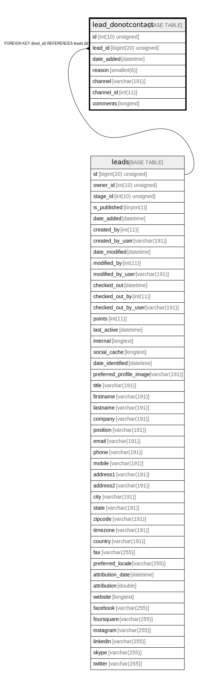

# lead_donotcontact

## Description

<details>
<summary><strong>Table Definition</strong></summary>

```sql
CREATE TABLE `lead_donotcontact` (
  `id` int(10) unsigned NOT NULL AUTO_INCREMENT,
  `lead_id` bigint(20) unsigned DEFAULT NULL,
  `date_added` datetime NOT NULL,
  `reason` smallint(6) NOT NULL,
  `channel` varchar(191) COLLATE utf8mb4_unicode_ci NOT NULL,
  `channel_id` int(11) DEFAULT NULL,
  `comments` longtext COLLATE utf8mb4_unicode_ci DEFAULT NULL,
  PRIMARY KEY (`id`),
  KEY `IDX_71DC0B1D55458D` (`lead_id`),
  KEY `dnc_reason_search` (`reason`),
  CONSTRAINT `FK_71DC0B1D55458D` FOREIGN KEY (`lead_id`) REFERENCES `leads` (`id`) ON DELETE CASCADE
) ENGINE=InnoDB DEFAULT CHARSET=utf8mb4 COLLATE=utf8mb4_unicode_ci ROW_FORMAT=DYNAMIC
```

</details>

## Columns

| Name | Type | Default | Nullable | Extra Definition | Children | Parents | Comment |
| ---- | ---- | ------- | -------- | --------------- | -------- | ------- | ------- |
| id | int(10) unsigned |  | false | auto_increment |  |  |  |
| lead_id | bigint(20) unsigned | NULL | true |  |  | [leads](leads.md) |  |
| date_added | datetime |  | false |  |  |  |  |
| reason | smallint(6) |  | false |  |  |  |  |
| channel | varchar(191) |  | false |  |  |  |  |
| channel_id | int(11) | NULL | true |  |  |  |  |
| comments | longtext | NULL | true |  |  |  |  |

## Constraints

| Name | Type | Definition |
| ---- | ---- | ---------- |
| FK_71DC0B1D55458D | FOREIGN KEY | FOREIGN KEY (lead_id) REFERENCES leads (id) |
| PRIMARY | PRIMARY KEY | PRIMARY KEY (id) |

## Indexes

| Name | Definition |
| ---- | ---------- |
| dnc_reason_search | KEY dnc_reason_search (reason) USING BTREE |
| IDX_71DC0B1D55458D | KEY IDX_71DC0B1D55458D (lead_id) USING BTREE |
| PRIMARY | PRIMARY KEY (id) USING BTREE |

## Relations



---

> Generated by [tbls](https://github.com/k1LoW/tbls)
