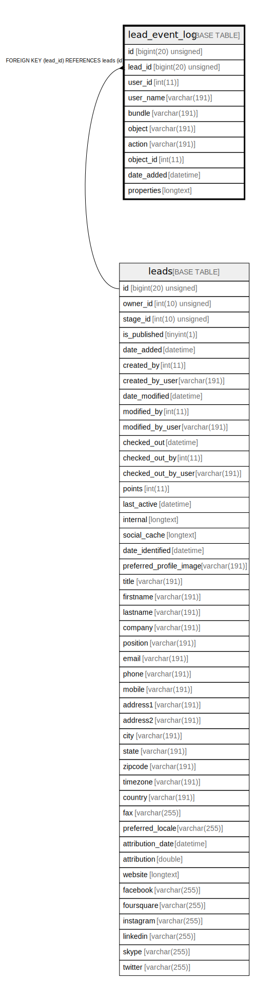

# lead_event_log

## Description

<details>
<summary><strong>Table Definition</strong></summary>

```sql
CREATE TABLE `lead_event_log` (
  `id` bigint(20) unsigned NOT NULL AUTO_INCREMENT,
  `lead_id` bigint(20) unsigned DEFAULT NULL,
  `user_id` int(11) DEFAULT NULL,
  `user_name` varchar(191) COLLATE utf8mb4_unicode_ci DEFAULT NULL,
  `bundle` varchar(191) COLLATE utf8mb4_unicode_ci DEFAULT NULL,
  `object` varchar(191) COLLATE utf8mb4_unicode_ci DEFAULT NULL,
  `action` varchar(191) COLLATE utf8mb4_unicode_ci DEFAULT NULL,
  `object_id` int(11) DEFAULT NULL,
  `date_added` datetime NOT NULL,
  `properties` longtext COLLATE utf8mb4_unicode_ci DEFAULT NULL COMMENT '(DC2Type:json_array)',
  PRIMARY KEY (`id`),
  KEY `lead_id_index` (`lead_id`),
  KEY `lead_object_index` (`object`,`object_id`),
  KEY `lead_timeline_index` (`bundle`,`object`,`action`,`object_id`),
  KEY `lead_timeline_action_index` (`action`),
  KEY `lead_date_added_index` (`date_added`),
  CONSTRAINT `FK_753AF2E55458D` FOREIGN KEY (`lead_id`) REFERENCES `leads` (`id`) ON DELETE CASCADE
) ENGINE=InnoDB DEFAULT CHARSET=utf8mb4 COLLATE=utf8mb4_unicode_ci ROW_FORMAT=DYNAMIC
```

</details>

## Columns

| Name | Type | Default | Nullable | Extra Definition | Children | Parents | Comment |
| ---- | ---- | ------- | -------- | --------------- | -------- | ------- | ------- |
| id | bigint(20) unsigned |  | false | auto_increment |  |  |  |
| lead_id | bigint(20) unsigned | NULL | true |  |  | [leads](leads.md) |  |
| user_id | int(11) | NULL | true |  |  |  |  |
| user_name | varchar(191) | NULL | true |  |  |  |  |
| bundle | varchar(191) | NULL | true |  |  |  |  |
| object | varchar(191) | NULL | true |  |  |  |  |
| action | varchar(191) | NULL | true |  |  |  |  |
| object_id | int(11) | NULL | true |  |  |  |  |
| date_added | datetime |  | false |  |  |  |  |
| properties | longtext | NULL | true |  |  |  | (DC2Type:json_array) |

## Constraints

| Name | Type | Definition |
| ---- | ---- | ---------- |
| FK_753AF2E55458D | FOREIGN KEY | FOREIGN KEY (lead_id) REFERENCES leads (id) |
| PRIMARY | PRIMARY KEY | PRIMARY KEY (id) |

## Indexes

| Name | Definition |
| ---- | ---------- |
| lead_date_added_index | KEY lead_date_added_index (date_added) USING BTREE |
| lead_id_index | KEY lead_id_index (lead_id) USING BTREE |
| lead_object_index | KEY lead_object_index (object, object_id) USING BTREE |
| lead_timeline_action_index | KEY lead_timeline_action_index (action) USING BTREE |
| lead_timeline_index | KEY lead_timeline_index (bundle, object, action, object_id) USING BTREE |
| PRIMARY | PRIMARY KEY (id) USING BTREE |

## Relations



---

> Generated by [tbls](https://github.com/k1LoW/tbls)
