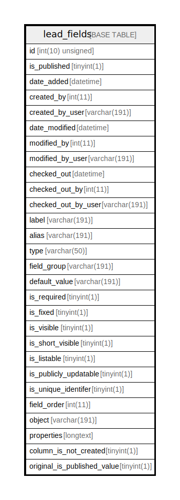

# lead_fields

## Description

<details>
<summary><strong>Table Definition</strong></summary>

```sql
CREATE TABLE `lead_fields` (
  `id` int(10) unsigned NOT NULL AUTO_INCREMENT,
  `is_published` tinyint(1) NOT NULL,
  `date_added` datetime DEFAULT NULL,
  `created_by` int(11) DEFAULT NULL,
  `created_by_user` varchar(191) COLLATE utf8mb4_unicode_ci DEFAULT NULL,
  `date_modified` datetime DEFAULT NULL,
  `modified_by` int(11) DEFAULT NULL,
  `modified_by_user` varchar(191) COLLATE utf8mb4_unicode_ci DEFAULT NULL,
  `checked_out` datetime DEFAULT NULL,
  `checked_out_by` int(11) DEFAULT NULL,
  `checked_out_by_user` varchar(191) COLLATE utf8mb4_unicode_ci DEFAULT NULL,
  `label` varchar(191) COLLATE utf8mb4_unicode_ci NOT NULL,
  `alias` varchar(191) COLLATE utf8mb4_unicode_ci NOT NULL,
  `type` varchar(50) COLLATE utf8mb4_unicode_ci NOT NULL,
  `field_group` varchar(191) COLLATE utf8mb4_unicode_ci DEFAULT NULL,
  `default_value` varchar(191) COLLATE utf8mb4_unicode_ci DEFAULT NULL,
  `is_required` tinyint(1) NOT NULL,
  `is_fixed` tinyint(1) NOT NULL,
  `is_visible` tinyint(1) NOT NULL,
  `is_short_visible` tinyint(1) NOT NULL,
  `is_listable` tinyint(1) NOT NULL,
  `is_publicly_updatable` tinyint(1) NOT NULL,
  `is_unique_identifer` tinyint(1) DEFAULT NULL,
  `field_order` int(11) DEFAULT NULL,
  `object` varchar(191) COLLATE utf8mb4_unicode_ci DEFAULT NULL,
  `properties` longtext COLLATE utf8mb4_unicode_ci DEFAULT NULL COMMENT '(DC2Type:array)',
  `column_is_not_created` tinyint(1) NOT NULL,
  `original_is_published_value` tinyint(1) NOT NULL,
  PRIMARY KEY (`id`),
  KEY `search_by_object` (`object`)
) ENGINE=InnoDB AUTO_INCREMENT=[Redacted by tbls] DEFAULT CHARSET=utf8mb4 COLLATE=utf8mb4_unicode_ci ROW_FORMAT=DYNAMIC
```

</details>

## Columns

| Name | Type | Default | Nullable | Extra Definition | Children | Parents | Comment |
| ---- | ---- | ------- | -------- | --------------- | -------- | ------- | ------- |
| id | int(10) unsigned |  | false | auto_increment |  |  |  |
| is_published | tinyint(1) |  | false |  |  |  |  |
| date_added | datetime | NULL | true |  |  |  |  |
| created_by | int(11) | NULL | true |  |  |  |  |
| created_by_user | varchar(191) | NULL | true |  |  |  |  |
| date_modified | datetime | NULL | true |  |  |  |  |
| modified_by | int(11) | NULL | true |  |  |  |  |
| modified_by_user | varchar(191) | NULL | true |  |  |  |  |
| checked_out | datetime | NULL | true |  |  |  |  |
| checked_out_by | int(11) | NULL | true |  |  |  |  |
| checked_out_by_user | varchar(191) | NULL | true |  |  |  |  |
| label | varchar(191) |  | false |  |  |  |  |
| alias | varchar(191) |  | false |  |  |  |  |
| type | varchar(50) |  | false |  |  |  |  |
| field_group | varchar(191) | NULL | true |  |  |  |  |
| default_value | varchar(191) | NULL | true |  |  |  |  |
| is_required | tinyint(1) |  | false |  |  |  |  |
| is_fixed | tinyint(1) |  | false |  |  |  |  |
| is_visible | tinyint(1) |  | false |  |  |  |  |
| is_short_visible | tinyint(1) |  | false |  |  |  |  |
| is_listable | tinyint(1) |  | false |  |  |  |  |
| is_publicly_updatable | tinyint(1) |  | false |  |  |  |  |
| is_unique_identifer | tinyint(1) | NULL | true |  |  |  |  |
| field_order | int(11) | NULL | true |  |  |  |  |
| object | varchar(191) | NULL | true |  |  |  |  |
| properties | longtext | NULL | true |  |  |  | (DC2Type:array) |
| column_is_not_created | tinyint(1) |  | false |  |  |  |  |
| original_is_published_value | tinyint(1) |  | false |  |  |  |  |

## Constraints

| Name | Type | Definition |
| ---- | ---- | ---------- |
| PRIMARY | PRIMARY KEY | PRIMARY KEY (id) |

## Indexes

| Name | Definition |
| ---- | ---------- |
| search_by_object | KEY search_by_object (object) USING BTREE |
| PRIMARY | PRIMARY KEY (id) USING BTREE |

## Relations



---

> Generated by [tbls](https://github.com/k1LoW/tbls)
