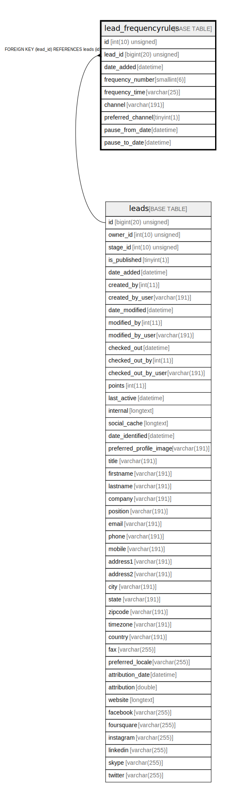

# lead_frequencyrules

## Description

<details>
<summary><strong>Table Definition</strong></summary>

```sql
CREATE TABLE `lead_frequencyrules` (
  `id` int(10) unsigned NOT NULL AUTO_INCREMENT,
  `lead_id` bigint(20) unsigned NOT NULL,
  `date_added` datetime NOT NULL,
  `frequency_number` smallint(6) DEFAULT NULL,
  `frequency_time` varchar(25) COLLATE utf8mb4_unicode_ci DEFAULT NULL,
  `channel` varchar(191) COLLATE utf8mb4_unicode_ci NOT NULL,
  `preferred_channel` tinyint(1) NOT NULL,
  `pause_from_date` datetime DEFAULT NULL,
  `pause_to_date` datetime DEFAULT NULL,
  PRIMARY KEY (`id`),
  KEY `IDX_AA8A57F455458D` (`lead_id`),
  KEY `channel_frequency` (`channel`),
  CONSTRAINT `FK_AA8A57F455458D` FOREIGN KEY (`lead_id`) REFERENCES `leads` (`id`) ON DELETE CASCADE
) ENGINE=InnoDB DEFAULT CHARSET=utf8mb4 COLLATE=utf8mb4_unicode_ci ROW_FORMAT=DYNAMIC
```

</details>

## Columns

| Name | Type | Default | Nullable | Extra Definition | Children | Parents | Comment |
| ---- | ---- | ------- | -------- | --------------- | -------- | ------- | ------- |
| id | int(10) unsigned |  | false | auto_increment |  |  |  |
| lead_id | bigint(20) unsigned |  | false |  |  | [leads](leads.md) |  |
| date_added | datetime |  | false |  |  |  |  |
| frequency_number | smallint(6) | NULL | true |  |  |  |  |
| frequency_time | varchar(25) | NULL | true |  |  |  |  |
| channel | varchar(191) |  | false |  |  |  |  |
| preferred_channel | tinyint(1) |  | false |  |  |  |  |
| pause_from_date | datetime | NULL | true |  |  |  |  |
| pause_to_date | datetime | NULL | true |  |  |  |  |

## Constraints

| Name | Type | Definition |
| ---- | ---- | ---------- |
| FK_AA8A57F455458D | FOREIGN KEY | FOREIGN KEY (lead_id) REFERENCES leads (id) |
| PRIMARY | PRIMARY KEY | PRIMARY KEY (id) |

## Indexes

| Name | Definition |
| ---- | ---------- |
| channel_frequency | KEY channel_frequency (channel) USING BTREE |
| IDX_AA8A57F455458D | KEY IDX_AA8A57F455458D (lead_id) USING BTREE |
| PRIMARY | PRIMARY KEY (id) USING BTREE |

## Relations



---

> Generated by [tbls](https://github.com/k1LoW/tbls)
