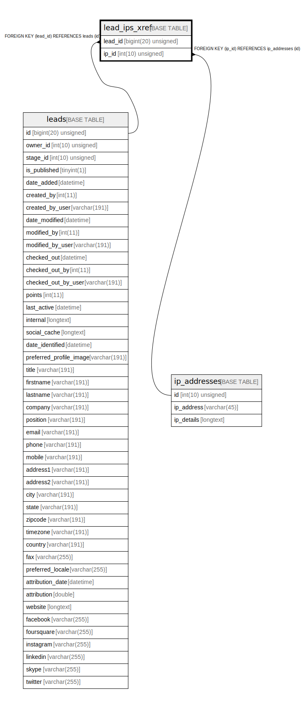

# lead_ips_xref

## Description

<details>
<summary><strong>Table Definition</strong></summary>

```sql
CREATE TABLE `lead_ips_xref` (
  `lead_id` bigint(20) unsigned NOT NULL,
  `ip_id` int(10) unsigned NOT NULL,
  PRIMARY KEY (`lead_id`,`ip_id`),
  KEY `IDX_9EED7E6655458D` (`lead_id`),
  KEY `IDX_9EED7E66A03F5E9F` (`ip_id`),
  CONSTRAINT `FK_9EED7E6655458D` FOREIGN KEY (`lead_id`) REFERENCES `leads` (`id`) ON DELETE CASCADE,
  CONSTRAINT `FK_9EED7E66A03F5E9F` FOREIGN KEY (`ip_id`) REFERENCES `ip_addresses` (`id`)
) ENGINE=InnoDB DEFAULT CHARSET=utf8mb4 COLLATE=utf8mb4_unicode_ci ROW_FORMAT=DYNAMIC
```

</details>

## Columns

| Name | Type | Default | Nullable | Children | Parents | Comment |
| ---- | ---- | ------- | -------- | -------- | ------- | ------- |
| lead_id | bigint(20) unsigned |  | false |  | [leads](leads.md) |  |
| ip_id | int(10) unsigned |  | false |  | [ip_addresses](ip_addresses.md) |  |

## Constraints

| Name | Type | Definition |
| ---- | ---- | ---------- |
| FK_9EED7E6655458D | FOREIGN KEY | FOREIGN KEY (lead_id) REFERENCES leads (id) |
| FK_9EED7E66A03F5E9F | FOREIGN KEY | FOREIGN KEY (ip_id) REFERENCES ip_addresses (id) |
| PRIMARY | PRIMARY KEY | PRIMARY KEY (lead_id, ip_id) |

## Indexes

| Name | Definition |
| ---- | ---------- |
| IDX_9EED7E6655458D | KEY IDX_9EED7E6655458D (lead_id) USING BTREE |
| IDX_9EED7E66A03F5E9F | KEY IDX_9EED7E66A03F5E9F (ip_id) USING BTREE |
| PRIMARY | PRIMARY KEY (lead_id, ip_id) USING BTREE |

## Relations



---

> Generated by [tbls](https://github.com/k1LoW/tbls)
