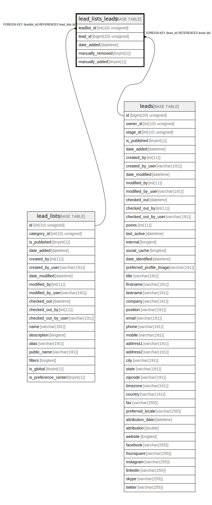

# lead_lists_leads

## Description

<details>
<summary><strong>Table Definition</strong></summary>

```sql
CREATE TABLE `lead_lists_leads` (
  `leadlist_id` int(10) unsigned NOT NULL,
  `lead_id` bigint(20) unsigned NOT NULL,
  `date_added` datetime NOT NULL,
  `manually_removed` tinyint(1) NOT NULL,
  `manually_added` tinyint(1) NOT NULL,
  PRIMARY KEY (`leadlist_id`,`lead_id`),
  KEY `IDX_F5F47C7CB9FC8874` (`leadlist_id`),
  KEY `IDX_F5F47C7C55458D` (`lead_id`),
  KEY `manually_removed` (`manually_removed`),
  CONSTRAINT `FK_F5F47C7C55458D` FOREIGN KEY (`lead_id`) REFERENCES `leads` (`id`) ON DELETE CASCADE,
  CONSTRAINT `FK_F5F47C7CB9FC8874` FOREIGN KEY (`leadlist_id`) REFERENCES `lead_lists` (`id`) ON DELETE CASCADE
) ENGINE=InnoDB DEFAULT CHARSET=utf8mb4 COLLATE=utf8mb4_unicode_ci ROW_FORMAT=DYNAMIC
```

</details>

## Columns

| Name | Type | Default | Nullable | Children | Parents | Comment |
| ---- | ---- | ------- | -------- | -------- | ------- | ------- |
| leadlist_id | int(10) unsigned |  | false |  | [lead_lists](lead_lists.md) |  |
| lead_id | bigint(20) unsigned |  | false |  | [leads](leads.md) |  |
| date_added | datetime |  | false |  |  |  |
| manually_removed | tinyint(1) |  | false |  |  |  |
| manually_added | tinyint(1) |  | false |  |  |  |

## Constraints

| Name | Type | Definition |
| ---- | ---- | ---------- |
| FK_F5F47C7C55458D | FOREIGN KEY | FOREIGN KEY (lead_id) REFERENCES leads (id) |
| FK_F5F47C7CB9FC8874 | FOREIGN KEY | FOREIGN KEY (leadlist_id) REFERENCES lead_lists (id) |
| PRIMARY | PRIMARY KEY | PRIMARY KEY (leadlist_id, lead_id) |

## Indexes

| Name | Definition |
| ---- | ---------- |
| IDX_F5F47C7C55458D | KEY IDX_F5F47C7C55458D (lead_id) USING BTREE |
| IDX_F5F47C7CB9FC8874 | KEY IDX_F5F47C7CB9FC8874 (leadlist_id) USING BTREE |
| manually_removed | KEY manually_removed (manually_removed) USING BTREE |
| PRIMARY | PRIMARY KEY (leadlist_id, lead_id) USING BTREE |

## Relations



---

> Generated by [tbls](https://github.com/k1LoW/tbls)
