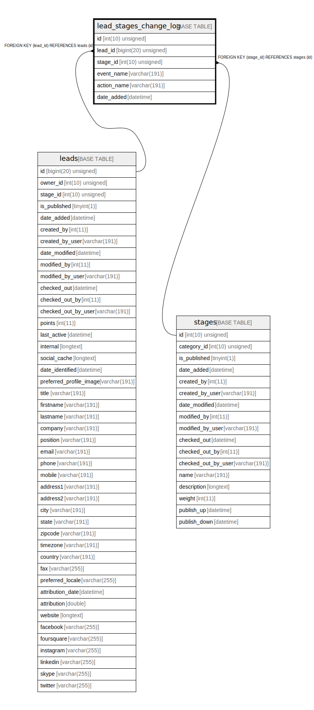

# lead_stages_change_log

## Description

<details>
<summary><strong>Table Definition</strong></summary>

```sql
CREATE TABLE `lead_stages_change_log` (
  `id` int(10) unsigned NOT NULL AUTO_INCREMENT,
  `lead_id` bigint(20) unsigned NOT NULL,
  `stage_id` int(10) unsigned DEFAULT NULL,
  `event_name` varchar(191) COLLATE utf8mb4_unicode_ci NOT NULL,
  `action_name` varchar(191) COLLATE utf8mb4_unicode_ci NOT NULL,
  `date_added` datetime NOT NULL,
  PRIMARY KEY (`id`),
  KEY `IDX_73B42EF355458D` (`lead_id`),
  KEY `IDX_73B42EF32298D193` (`stage_id`),
  CONSTRAINT `FK_73B42EF32298D193` FOREIGN KEY (`stage_id`) REFERENCES `stages` (`id`) ON DELETE CASCADE,
  CONSTRAINT `FK_73B42EF355458D` FOREIGN KEY (`lead_id`) REFERENCES `leads` (`id`) ON DELETE CASCADE
) ENGINE=InnoDB DEFAULT CHARSET=utf8mb4 COLLATE=utf8mb4_unicode_ci ROW_FORMAT=DYNAMIC
```

</details>

## Columns

| Name | Type | Default | Nullable | Extra Definition | Children | Parents | Comment |
| ---- | ---- | ------- | -------- | --------------- | -------- | ------- | ------- |
| id | int(10) unsigned |  | false | auto_increment |  |  |  |
| lead_id | bigint(20) unsigned |  | false |  |  | [leads](leads.md) |  |
| stage_id | int(10) unsigned | NULL | true |  |  | [stages](stages.md) |  |
| event_name | varchar(191) |  | false |  |  |  |  |
| action_name | varchar(191) |  | false |  |  |  |  |
| date_added | datetime |  | false |  |  |  |  |

## Constraints

| Name | Type | Definition |
| ---- | ---- | ---------- |
| FK_73B42EF32298D193 | FOREIGN KEY | FOREIGN KEY (stage_id) REFERENCES stages (id) |
| FK_73B42EF355458D | FOREIGN KEY | FOREIGN KEY (lead_id) REFERENCES leads (id) |
| PRIMARY | PRIMARY KEY | PRIMARY KEY (id) |

## Indexes

| Name | Definition |
| ---- | ---------- |
| IDX_73B42EF32298D193 | KEY IDX_73B42EF32298D193 (stage_id) USING BTREE |
| IDX_73B42EF355458D | KEY IDX_73B42EF355458D (lead_id) USING BTREE |
| PRIMARY | PRIMARY KEY (id) USING BTREE |

## Relations



---

> Generated by [tbls](https://github.com/k1LoW/tbls)
