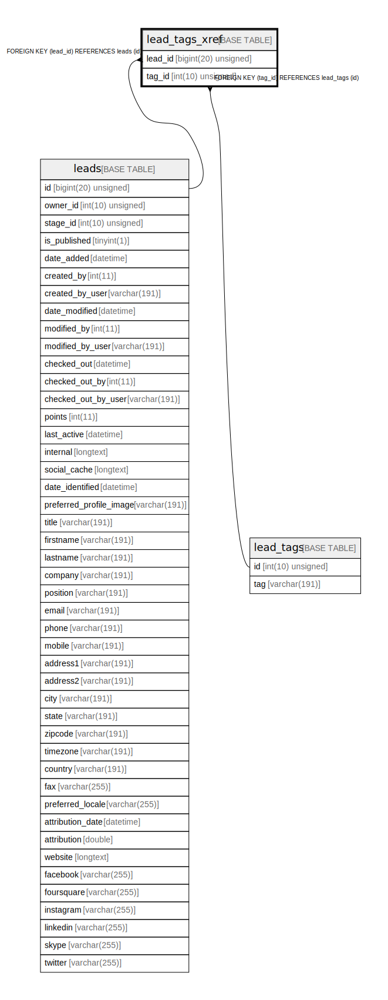

# lead_tags_xref

## Description

<details>
<summary><strong>Table Definition</strong></summary>

```sql
CREATE TABLE `lead_tags_xref` (
  `lead_id` bigint(20) unsigned NOT NULL,
  `tag_id` int(10) unsigned NOT NULL,
  PRIMARY KEY (`lead_id`,`tag_id`),
  KEY `IDX_F2E51EB655458D` (`lead_id`),
  KEY `IDX_F2E51EB6BAD26311` (`tag_id`),
  CONSTRAINT `FK_F2E51EB655458D` FOREIGN KEY (`lead_id`) REFERENCES `leads` (`id`) ON DELETE CASCADE,
  CONSTRAINT `FK_F2E51EB6BAD26311` FOREIGN KEY (`tag_id`) REFERENCES `lead_tags` (`id`)
) ENGINE=InnoDB DEFAULT CHARSET=utf8mb4 COLLATE=utf8mb4_unicode_ci ROW_FORMAT=DYNAMIC
```

</details>

## Columns

| Name | Type | Default | Nullable | Children | Parents | Comment |
| ---- | ---- | ------- | -------- | -------- | ------- | ------- |
| lead_id | bigint(20) unsigned |  | false |  | [leads](leads.md) |  |
| tag_id | int(10) unsigned |  | false |  | [lead_tags](lead_tags.md) |  |

## Constraints

| Name | Type | Definition |
| ---- | ---- | ---------- |
| FK_F2E51EB655458D | FOREIGN KEY | FOREIGN KEY (lead_id) REFERENCES leads (id) |
| FK_F2E51EB6BAD26311 | FOREIGN KEY | FOREIGN KEY (tag_id) REFERENCES lead_tags (id) |
| PRIMARY | PRIMARY KEY | PRIMARY KEY (lead_id, tag_id) |

## Indexes

| Name | Definition |
| ---- | ---------- |
| IDX_F2E51EB655458D | KEY IDX_F2E51EB655458D (lead_id) USING BTREE |
| IDX_F2E51EB6BAD26311 | KEY IDX_F2E51EB6BAD26311 (tag_id) USING BTREE |
| PRIMARY | PRIMARY KEY (lead_id, tag_id) USING BTREE |

## Relations



---

> Generated by [tbls](https://github.com/k1LoW/tbls)
