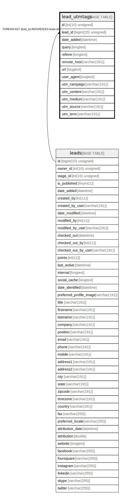

# lead_utmtags

## Description

<details>
<summary><strong>Table Definition</strong></summary>

```sql
CREATE TABLE `lead_utmtags` (
  `id` int(10) unsigned NOT NULL AUTO_INCREMENT,
  `lead_id` bigint(20) unsigned NOT NULL,
  `date_added` datetime NOT NULL,
  `query` longtext COLLATE utf8mb4_unicode_ci DEFAULT NULL COMMENT '(DC2Type:array)',
  `referer` longtext COLLATE utf8mb4_unicode_ci DEFAULT NULL,
  `remote_host` varchar(191) COLLATE utf8mb4_unicode_ci DEFAULT NULL,
  `url` longtext COLLATE utf8mb4_unicode_ci DEFAULT NULL,
  `user_agent` longtext COLLATE utf8mb4_unicode_ci DEFAULT NULL,
  `utm_campaign` varchar(191) COLLATE utf8mb4_unicode_ci DEFAULT NULL,
  `utm_content` varchar(191) COLLATE utf8mb4_unicode_ci DEFAULT NULL,
  `utm_medium` varchar(191) COLLATE utf8mb4_unicode_ci DEFAULT NULL,
  `utm_source` varchar(191) COLLATE utf8mb4_unicode_ci DEFAULT NULL,
  `utm_term` varchar(191) COLLATE utf8mb4_unicode_ci DEFAULT NULL,
  PRIMARY KEY (`id`),
  KEY `IDX_C51BCB8D55458D` (`lead_id`),
  CONSTRAINT `FK_C51BCB8D55458D` FOREIGN KEY (`lead_id`) REFERENCES `leads` (`id`) ON DELETE CASCADE
) ENGINE=InnoDB DEFAULT CHARSET=utf8mb4 COLLATE=utf8mb4_unicode_ci ROW_FORMAT=DYNAMIC
```

</details>

## Columns

| Name | Type | Default | Nullable | Extra Definition | Children | Parents | Comment |
| ---- | ---- | ------- | -------- | --------------- | -------- | ------- | ------- |
| id | int(10) unsigned |  | false | auto_increment |  |  |  |
| lead_id | bigint(20) unsigned |  | false |  |  | [leads](leads.md) |  |
| date_added | datetime |  | false |  |  |  |  |
| query | longtext | NULL | true |  |  |  | (DC2Type:array) |
| referer | longtext | NULL | true |  |  |  |  |
| remote_host | varchar(191) | NULL | true |  |  |  |  |
| url | longtext | NULL | true |  |  |  |  |
| user_agent | longtext | NULL | true |  |  |  |  |
| utm_campaign | varchar(191) | NULL | true |  |  |  |  |
| utm_content | varchar(191) | NULL | true |  |  |  |  |
| utm_medium | varchar(191) | NULL | true |  |  |  |  |
| utm_source | varchar(191) | NULL | true |  |  |  |  |
| utm_term | varchar(191) | NULL | true |  |  |  |  |

## Constraints

| Name | Type | Definition |
| ---- | ---- | ---------- |
| FK_C51BCB8D55458D | FOREIGN KEY | FOREIGN KEY (lead_id) REFERENCES leads (id) |
| PRIMARY | PRIMARY KEY | PRIMARY KEY (id) |

## Indexes

| Name | Definition |
| ---- | ---------- |
| IDX_C51BCB8D55458D | KEY IDX_C51BCB8D55458D (lead_id) USING BTREE |
| PRIMARY | PRIMARY KEY (id) USING BTREE |

## Relations



---

> Generated by [tbls](https://github.com/k1LoW/tbls)
