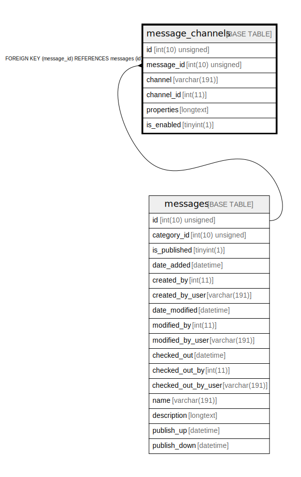

# message_channels

## Description

<details>
<summary><strong>Table Definition</strong></summary>

```sql
CREATE TABLE `message_channels` (
  `id` int(10) unsigned NOT NULL AUTO_INCREMENT,
  `message_id` int(10) unsigned NOT NULL,
  `channel` varchar(191) COLLATE utf8mb4_unicode_ci NOT NULL,
  `channel_id` int(11) DEFAULT NULL,
  `properties` longtext COLLATE utf8mb4_unicode_ci NOT NULL COMMENT '(DC2Type:json_array)',
  `is_enabled` tinyint(1) NOT NULL,
  PRIMARY KEY (`id`),
  UNIQUE KEY `channel_index` (`message_id`,`channel`),
  KEY `IDX_FA3226A7537A1329` (`message_id`),
  KEY `channel_entity_index` (`channel`,`channel_id`),
  KEY `channel_enabled_index` (`channel`,`is_enabled`),
  CONSTRAINT `FK_FA3226A7537A1329` FOREIGN KEY (`message_id`) REFERENCES `messages` (`id`) ON DELETE CASCADE
) ENGINE=InnoDB DEFAULT CHARSET=utf8mb4 COLLATE=utf8mb4_unicode_ci ROW_FORMAT=DYNAMIC
```

</details>

## Columns

| Name | Type | Default | Nullable | Extra Definition | Children | Parents | Comment |
| ---- | ---- | ------- | -------- | --------------- | -------- | ------- | ------- |
| id | int(10) unsigned |  | false | auto_increment |  |  |  |
| message_id | int(10) unsigned |  | false |  |  | [messages](messages.md) |  |
| channel | varchar(191) |  | false |  |  |  |  |
| channel_id | int(11) | NULL | true |  |  |  |  |
| properties | longtext |  | false |  |  |  | (DC2Type:json_array) |
| is_enabled | tinyint(1) |  | false |  |  |  |  |

## Constraints

| Name | Type | Definition |
| ---- | ---- | ---------- |
| channel_index | UNIQUE | UNIQUE KEY channel_index (message_id, channel) |
| FK_FA3226A7537A1329 | FOREIGN KEY | FOREIGN KEY (message_id) REFERENCES messages (id) |
| PRIMARY | PRIMARY KEY | PRIMARY KEY (id) |

## Indexes

| Name | Definition |
| ---- | ---------- |
| channel_enabled_index | KEY channel_enabled_index (channel, is_enabled) USING BTREE |
| channel_entity_index | KEY channel_entity_index (channel, channel_id) USING BTREE |
| IDX_FA3226A7537A1329 | KEY IDX_FA3226A7537A1329 (message_id) USING BTREE |
| PRIMARY | PRIMARY KEY (id) USING BTREE |
| channel_index | UNIQUE KEY channel_index (message_id, channel) USING BTREE |

## Relations



---

> Generated by [tbls](https://github.com/k1LoW/tbls)
