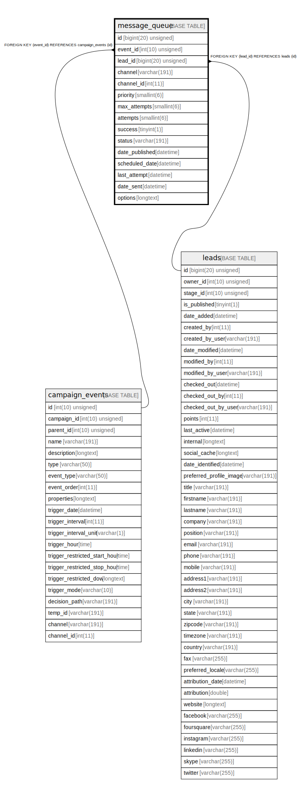

# message_queue

## Description

<details>
<summary><strong>Table Definition</strong></summary>

```sql
CREATE TABLE `message_queue` (
  `id` bigint(20) unsigned NOT NULL AUTO_INCREMENT,
  `event_id` int(10) unsigned DEFAULT NULL,
  `lead_id` bigint(20) unsigned NOT NULL,
  `channel` varchar(191) COLLATE utf8mb4_unicode_ci NOT NULL,
  `channel_id` int(11) NOT NULL,
  `priority` smallint(6) NOT NULL,
  `max_attempts` smallint(6) NOT NULL,
  `attempts` smallint(6) NOT NULL,
  `success` tinyint(1) NOT NULL,
  `status` varchar(191) COLLATE utf8mb4_unicode_ci NOT NULL,
  `date_published` datetime DEFAULT NULL,
  `scheduled_date` datetime DEFAULT NULL,
  `last_attempt` datetime DEFAULT NULL,
  `date_sent` datetime DEFAULT NULL,
  `options` longtext COLLATE utf8mb4_unicode_ci DEFAULT NULL COMMENT '(DC2Type:array)',
  PRIMARY KEY (`id`),
  KEY `IDX_805B808871F7E88B` (`event_id`),
  KEY `IDX_805B808855458D` (`lead_id`),
  KEY `message_status_search` (`status`),
  KEY `message_date_sent` (`date_sent`),
  KEY `message_scheduled_date` (`scheduled_date`),
  KEY `message_priority` (`priority`),
  KEY `message_success` (`success`),
  KEY `message_channel_search` (`channel`,`channel_id`),
  CONSTRAINT `FK_805B808855458D` FOREIGN KEY (`lead_id`) REFERENCES `leads` (`id`) ON DELETE CASCADE,
  CONSTRAINT `FK_805B808871F7E88B` FOREIGN KEY (`event_id`) REFERENCES `campaign_events` (`id`) ON DELETE CASCADE
) ENGINE=InnoDB DEFAULT CHARSET=utf8mb4 COLLATE=utf8mb4_unicode_ci ROW_FORMAT=DYNAMIC
```

</details>

## Columns

| Name | Type | Default | Nullable | Extra Definition | Children | Parents | Comment |
| ---- | ---- | ------- | -------- | --------------- | -------- | ------- | ------- |
| id | bigint(20) unsigned |  | false | auto_increment |  |  |  |
| event_id | int(10) unsigned | NULL | true |  |  | [campaign_events](campaign_events.md) |  |
| lead_id | bigint(20) unsigned |  | false |  |  | [leads](leads.md) |  |
| channel | varchar(191) |  | false |  |  |  |  |
| channel_id | int(11) |  | false |  |  |  |  |
| priority | smallint(6) |  | false |  |  |  |  |
| max_attempts | smallint(6) |  | false |  |  |  |  |
| attempts | smallint(6) |  | false |  |  |  |  |
| success | tinyint(1) |  | false |  |  |  |  |
| status | varchar(191) |  | false |  |  |  |  |
| date_published | datetime | NULL | true |  |  |  |  |
| scheduled_date | datetime | NULL | true |  |  |  |  |
| last_attempt | datetime | NULL | true |  |  |  |  |
| date_sent | datetime | NULL | true |  |  |  |  |
| options | longtext | NULL | true |  |  |  | (DC2Type:array) |

## Constraints

| Name | Type | Definition |
| ---- | ---- | ---------- |
| FK_805B808855458D | FOREIGN KEY | FOREIGN KEY (lead_id) REFERENCES leads (id) |
| FK_805B808871F7E88B | FOREIGN KEY | FOREIGN KEY (event_id) REFERENCES campaign_events (id) |
| PRIMARY | PRIMARY KEY | PRIMARY KEY (id) |

## Indexes

| Name | Definition |
| ---- | ---------- |
| IDX_805B808855458D | KEY IDX_805B808855458D (lead_id) USING BTREE |
| IDX_805B808871F7E88B | KEY IDX_805B808871F7E88B (event_id) USING BTREE |
| message_channel_search | KEY message_channel_search (channel, channel_id) USING BTREE |
| message_date_sent | KEY message_date_sent (date_sent) USING BTREE |
| message_priority | KEY message_priority (priority) USING BTREE |
| message_scheduled_date | KEY message_scheduled_date (scheduled_date) USING BTREE |
| message_status_search | KEY message_status_search (status) USING BTREE |
| message_success | KEY message_success (success) USING BTREE |
| PRIMARY | PRIMARY KEY (id) USING BTREE |

## Relations



---

> Generated by [tbls](https://github.com/k1LoW/tbls)
