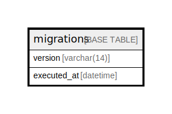

# migrations

## Description

<details>
<summary><strong>Table Definition</strong></summary>

```sql
CREATE TABLE `migrations` (
  `version` varchar(14) COLLATE utf8mb4_unicode_ci NOT NULL,
  `executed_at` datetime NOT NULL COMMENT '(DC2Type:datetime_immutable)',
  PRIMARY KEY (`version`)
) ENGINE=InnoDB DEFAULT CHARSET=utf8mb4 COLLATE=utf8mb4_unicode_ci ROW_FORMAT=DYNAMIC
```

</details>

## Columns

| Name | Type | Default | Nullable | Children | Parents | Comment |
| ---- | ---- | ------- | -------- | -------- | ------- | ------- |
| version | varchar(14) |  | false |  |  |  |
| executed_at | datetime |  | false |  |  | (DC2Type:datetime_immutable) |

## Constraints

| Name | Type | Definition |
| ---- | ---- | ---------- |
| PRIMARY | PRIMARY KEY | PRIMARY KEY (version) |

## Indexes

| Name | Definition |
| ---- | ---------- |
| PRIMARY | PRIMARY KEY (version) USING BTREE |

## Relations



---

> Generated by [tbls](https://github.com/k1LoW/tbls)
