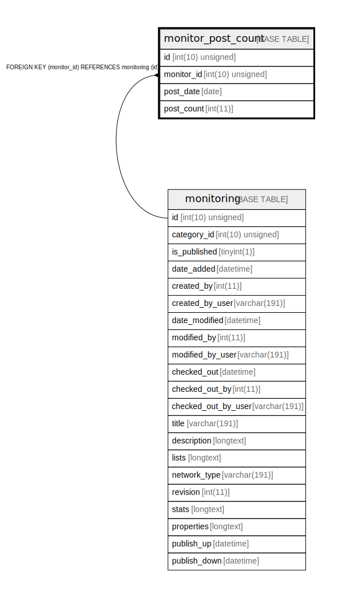

# monitor_post_count

## Description

<details>
<summary><strong>Table Definition</strong></summary>

```sql
CREATE TABLE `monitor_post_count` (
  `id` int(10) unsigned NOT NULL AUTO_INCREMENT,
  `monitor_id` int(10) unsigned DEFAULT NULL,
  `post_date` date NOT NULL,
  `post_count` int(11) NOT NULL,
  PRIMARY KEY (`id`),
  KEY `IDX_E3AC20CA4CE1C902` (`monitor_id`),
  CONSTRAINT `FK_E3AC20CA4CE1C902` FOREIGN KEY (`monitor_id`) REFERENCES `monitoring` (`id`) ON DELETE CASCADE
) ENGINE=InnoDB DEFAULT CHARSET=utf8mb4 COLLATE=utf8mb4_unicode_ci ROW_FORMAT=DYNAMIC
```

</details>

## Columns

| Name | Type | Default | Nullable | Extra Definition | Children | Parents | Comment |
| ---- | ---- | ------- | -------- | --------------- | -------- | ------- | ------- |
| id | int(10) unsigned |  | false | auto_increment |  |  |  |
| monitor_id | int(10) unsigned | NULL | true |  |  | [monitoring](monitoring.md) |  |
| post_date | date |  | false |  |  |  |  |
| post_count | int(11) |  | false |  |  |  |  |

## Constraints

| Name | Type | Definition |
| ---- | ---- | ---------- |
| FK_E3AC20CA4CE1C902 | FOREIGN KEY | FOREIGN KEY (monitor_id) REFERENCES monitoring (id) |
| PRIMARY | PRIMARY KEY | PRIMARY KEY (id) |

## Indexes

| Name | Definition |
| ---- | ---------- |
| IDX_E3AC20CA4CE1C902 | KEY IDX_E3AC20CA4CE1C902 (monitor_id) USING BTREE |
| PRIMARY | PRIMARY KEY (id) USING BTREE |

## Relations



---

> Generated by [tbls](https://github.com/k1LoW/tbls)
