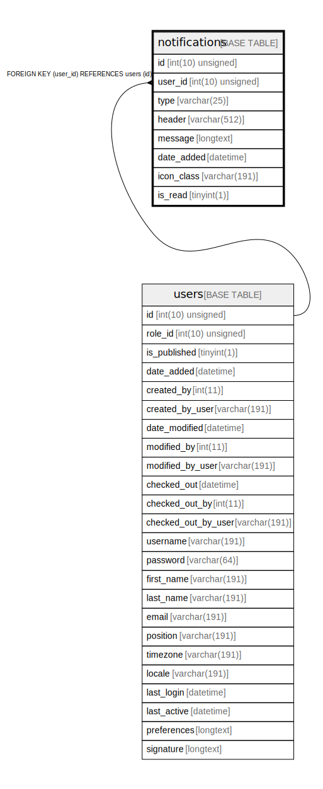

# notifications

## Description

<details>
<summary><strong>Table Definition</strong></summary>

```sql
CREATE TABLE `notifications` (
  `id` int(10) unsigned NOT NULL AUTO_INCREMENT,
  `user_id` int(10) unsigned NOT NULL,
  `type` varchar(25) COLLATE utf8mb4_unicode_ci DEFAULT NULL,
  `header` varchar(512) COLLATE utf8mb4_unicode_ci DEFAULT NULL,
  `message` longtext COLLATE utf8mb4_unicode_ci NOT NULL,
  `date_added` datetime NOT NULL,
  `icon_class` varchar(191) COLLATE utf8mb4_unicode_ci DEFAULT NULL,
  `is_read` tinyint(1) NOT NULL,
  PRIMARY KEY (`id`),
  KEY `IDX_6000B0D3A76ED395` (`user_id`),
  KEY `notification_read_status` (`is_read`),
  KEY `notification_type` (`type`),
  KEY `notification_user_read_status` (`is_read`,`user_id`),
  CONSTRAINT `FK_6000B0D3A76ED395` FOREIGN KEY (`user_id`) REFERENCES `users` (`id`) ON DELETE CASCADE
) ENGINE=InnoDB DEFAULT CHARSET=utf8mb4 COLLATE=utf8mb4_unicode_ci ROW_FORMAT=DYNAMIC
```

</details>

## Columns

| Name | Type | Default | Nullable | Extra Definition | Children | Parents | Comment |
| ---- | ---- | ------- | -------- | --------------- | -------- | ------- | ------- |
| id | int(10) unsigned |  | false | auto_increment |  |  |  |
| user_id | int(10) unsigned |  | false |  |  | [users](users.md) |  |
| type | varchar(25) | NULL | true |  |  |  |  |
| header | varchar(512) | NULL | true |  |  |  |  |
| message | longtext |  | false |  |  |  |  |
| date_added | datetime |  | false |  |  |  |  |
| icon_class | varchar(191) | NULL | true |  |  |  |  |
| is_read | tinyint(1) |  | false |  |  |  |  |

## Constraints

| Name | Type | Definition |
| ---- | ---- | ---------- |
| FK_6000B0D3A76ED395 | FOREIGN KEY | FOREIGN KEY (user_id) REFERENCES users (id) |
| PRIMARY | PRIMARY KEY | PRIMARY KEY (id) |

## Indexes

| Name | Definition |
| ---- | ---------- |
| IDX_6000B0D3A76ED395 | KEY IDX_6000B0D3A76ED395 (user_id) USING BTREE |
| notification_read_status | KEY notification_read_status (is_read) USING BTREE |
| notification_type | KEY notification_type (type) USING BTREE |
| notification_user_read_status | KEY notification_user_read_status (is_read, user_id) USING BTREE |
| PRIMARY | PRIMARY KEY (id) USING BTREE |

## Relations



---

> Generated by [tbls](https://github.com/k1LoW/tbls)
