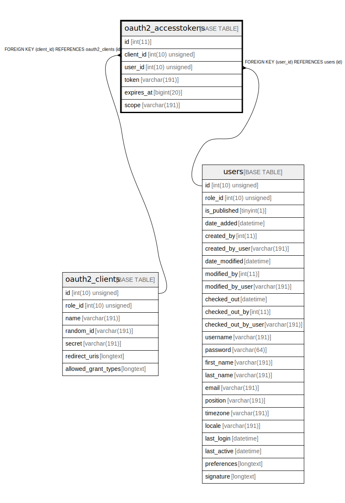

# oauth2_accesstokens

## Description

<details>
<summary><strong>Table Definition</strong></summary>

```sql
CREATE TABLE `oauth2_accesstokens` (
  `id` int(11) NOT NULL AUTO_INCREMENT,
  `client_id` int(10) unsigned NOT NULL,
  `user_id` int(10) unsigned DEFAULT NULL,
  `token` varchar(191) COLLATE utf8mb4_unicode_ci NOT NULL,
  `expires_at` bigint(20) DEFAULT NULL,
  `scope` varchar(191) COLLATE utf8mb4_unicode_ci DEFAULT NULL,
  PRIMARY KEY (`id`),
  UNIQUE KEY `UNIQ_3A18CA5A5F37A13B` (`token`),
  KEY `IDX_3A18CA5A19EB6921` (`client_id`),
  KEY `IDX_3A18CA5AA76ED395` (`user_id`),
  KEY `oauth2_access_token_search` (`token`),
  CONSTRAINT `FK_3A18CA5A19EB6921` FOREIGN KEY (`client_id`) REFERENCES `oauth2_clients` (`id`) ON DELETE CASCADE,
  CONSTRAINT `FK_3A18CA5AA76ED395` FOREIGN KEY (`user_id`) REFERENCES `users` (`id`) ON DELETE CASCADE
) ENGINE=InnoDB DEFAULT CHARSET=utf8mb4 COLLATE=utf8mb4_unicode_ci ROW_FORMAT=DYNAMIC
```

</details>

## Columns

| Name | Type | Default | Nullable | Extra Definition | Children | Parents | Comment |
| ---- | ---- | ------- | -------- | --------------- | -------- | ------- | ------- |
| id | int(11) |  | false | auto_increment |  |  |  |
| client_id | int(10) unsigned |  | false |  |  | [oauth2_clients](oauth2_clients.md) |  |
| user_id | int(10) unsigned | NULL | true |  |  | [users](users.md) |  |
| token | varchar(191) |  | false |  |  |  |  |
| expires_at | bigint(20) | NULL | true |  |  |  |  |
| scope | varchar(191) | NULL | true |  |  |  |  |

## Constraints

| Name | Type | Definition |
| ---- | ---- | ---------- |
| FK_3A18CA5A19EB6921 | FOREIGN KEY | FOREIGN KEY (client_id) REFERENCES oauth2_clients (id) |
| FK_3A18CA5AA76ED395 | FOREIGN KEY | FOREIGN KEY (user_id) REFERENCES users (id) |
| PRIMARY | PRIMARY KEY | PRIMARY KEY (id) |
| UNIQ_3A18CA5A5F37A13B | UNIQUE | UNIQUE KEY UNIQ_3A18CA5A5F37A13B (token) |

## Indexes

| Name | Definition |
| ---- | ---------- |
| IDX_3A18CA5A19EB6921 | KEY IDX_3A18CA5A19EB6921 (client_id) USING BTREE |
| IDX_3A18CA5AA76ED395 | KEY IDX_3A18CA5AA76ED395 (user_id) USING BTREE |
| oauth2_access_token_search | KEY oauth2_access_token_search (token) USING BTREE |
| PRIMARY | PRIMARY KEY (id) USING BTREE |
| UNIQ_3A18CA5A5F37A13B | UNIQUE KEY UNIQ_3A18CA5A5F37A13B (token) USING BTREE |

## Relations



---

> Generated by [tbls](https://github.com/k1LoW/tbls)
